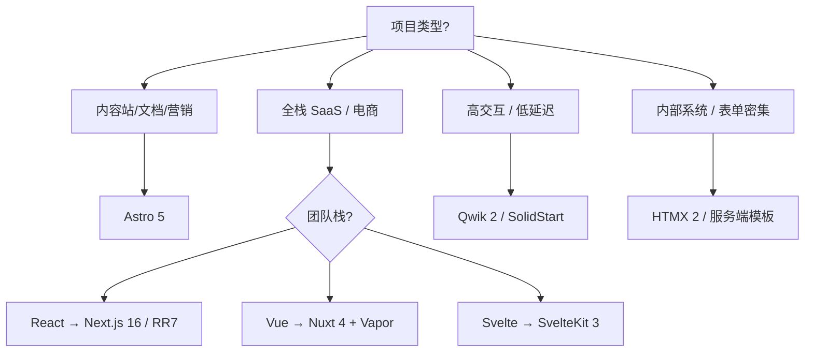

# 2026 前端新技术展望：从框架之争到渲染模型的收敛

> 发布日期：2026-06-26  
> 标签：前端 / React / Vue / Svelte / TypeScript / 架构

三年前，选技术栈往往意味着在 React、Vue、Svelte 之间站队。到了 2026 年，这种二元对立的叙事已经过时。真正值得思考的问题变成了：**你更需要哪种渲染模型？** 框架只是实现这一模型的工具。

本文梳理 2026 年前端生态中最值得关注的技术方向，并给出选型思路，供团队规划技术栈时参考。

---

## 一、核心趋势：细粒度响应式成为共识

2026 年最显著的变化，是各大框架在「响应式」这件事上走向收敛。Virtual DOM 并未消失，但 **Signals / Runes / Vapor** 等细粒度响应式方案，已经从实验特性进入生产可用阶段。

| 框架 | 响应式方案 | 特点 |
|------|-----------|------|
| SolidJS 2 | 原生 Signals | 无 VDOM，编译期优化，性能标杆 |
| Svelte 5 | Runes（`$state` / `$derived` / `$effect`） | 显式响应式，可脱离组件使用 |
| Vue 3.6 | Vapor Mode | 跳过 VDOM，编译为细粒度 DOM 更新 |
| Angular 19 | Signals API | 与 Zone.js 解耦，渐进式迁移 |
| React 19 | React Compiler | 编译期自动 memo，减少手动优化 |

### 为什么 Signals 值得关注？

传统 Virtual DOM 的更新路径是：**状态变化 → 组件重渲染 → Diff → 提交 DOM**。对于高频更新场景（实时数据、动画、协作编辑），这条路径的开销会逐渐显现。

Signals 的路径则是：**状态变化 → 仅更新订阅了该状态的 DOM 节点**。SolidJS 早在多年前就验证了这条路线；如今 Svelte、Vue、Angular 纷纷跟进，说明行业已经认可：**细粒度响应式是下一代前端性能优化的主战场**。

```javascript
// Svelte 5 Runes 示例
let count = $state(0);
let doubled = $derived(count * 2);

$effect(() => {
  console.log(`count is now ${count}`);
});
```

```javascript
// Vue 3.6 Vapor Mode — 同一 SFC 可选 VDOM 或 Vapor 编译
// <script setup>
import { ref } from 'vue'
const count = ref(0)
// </script>
```

---

## 二、React 19：编译器时代与 Server Components 常态化

React 19 在 2025–2026 年完成了几项关键落地：

### 1. React Compiler GA

React Compiler v1.0 于 2025 年 10 月正式发布。它能在构建期自动完成组件与 Hook 的 memoization，**日常开发中几乎不再需要手写 `useMemo`、`useCallback`、`React.memo`**。

这意味着：

- 性能优化从「开发者责任」转向「工具链责任」
- 代码可读性提升，业务逻辑不再被优化代码淹没
- 新团队成员的上手成本降低

### 2. Server Components 稳定可用

React Server Components（RSC）从实验特性进入稳定阶段，配合 Next.js 16 的 Partial Prerendering（PPR），形成了「静态外壳 + 动态岛屿」的默认架构：

```
┌─────────────────────────────────────┐
│  Static Shell (预渲染，边缘缓存)      │
│  ┌─────────┐  ┌─────────────────┐ │
│  │ Header  │  │ Dynamic Island  │ │
│  │ (静态)   │  │ (流式 SSR)       │ │
│  └─────────┘  └─────────────────┘ │
└─────────────────────────────────────┘
```

### 3. Actions API 与表单处理

React 19 的 Actions API 简化了服务端变更（mutation）的写法，与 Server Components 配合，让「全栈 React」的心智模型更加统一。

**React 的权衡**：生态与人才储备仍是最大优势；代价是包体积与概念复杂度（RSC、Suspense、Streaming 等）依旧高于竞品。

---

## 三、Vue 3.6：Vapor Mode 与渐进式进化

Vue 3.6 最重要的里程碑是 **Vapor Mode 稳定**。同一套 `.vue` 单文件组件，可以选择编译为传统 VDOM 或 Vapor 后端：

- **VDOM 模式**：兼容现有生态，适合渐进迁移
- **Vapor 模式**：编译为 SolidJS 风格的细粒度更新，性能接近原生操作 DOM

Vue 的优势在于 **平衡**：学习曲线平缓、官方工具链成熟（Vite、Vue Router、Pinia），同时通过 Vapor 补齐了性能短板。

对于已有 Vue 2/3 项目的团队，2026 年的建议路径是：

1. 升级到 Vue 3.6 + Vite 6
2. 对性能敏感页面（列表、仪表盘）试点 Vapor Mode
3. 配合 Nuxt 4 做全栈与边缘部署

---

## 四、Svelte 5：Runes 重塑开发体验

Svelte 5 用 **Runes** 彻底替换了 Svelte 4 的隐式 `$:` 响应式语法。这是一次 breaking change，但也是架构上的正名：

- `$state`：声明响应式状态
- `$derived`：派生值（类似 computed）
- `$effect`：副作用（类似 watch / useEffect）

Runes 的关键突破是 **响应式逻辑可以写在任意 `.js` / `.ts` 文件中**，不再局限于 `.svelte` 组件顶层。这让 Svelte 在大型项目中的可维护性大幅提升。

Krausest 等基准测试显示，Svelte 5 在启用 React Compiler 的 React 19 面前，仍有约 20–40% 的性能优势，内存占用可低 50% 左右。适合对包体积和运行时性能有硬性要求的场景。

---

## 五、元框架成为默认入口

2026 年，「裸用框架 + 自建工程化」的做法在专业项目中越来越少见。**元框架（Meta-framework）** 承担了路由、数据获取、部署、边缘运行时等横切关注点。

| 场景 | 推荐元框架 | 说明 |
|------|-----------|------|
| React 全栈 SaaS | Next.js 16 / React Router 7 | PPR、RSC、边缘中间件 |
| Vue 全栈应用 | Nuxt 4 | 约定式路由、服务端渲染、边缘部署 |
| 内容站 / 文档 / 营销页 | Astro 5 | Islands 架构，默认零 JS |
| 极致交互 / 即时加载 | Qwik 2 + QwikCity | Resumability，几乎无 hydration |
| 服务端驱动 UI | HTMX 2 / LiveView 风格 | HTML-over-the-wire，适合内部系统 |

### Astro 5 的 Islands 架构

内容优先站点的最佳实践仍是 Astro：页面主体以静态 HTML 输出，仅在需要交互的「岛屿」上加载 JavaScript。这与 Web 性能最佳实践高度一致。

### Qwik 的 Resumability

Qwik 走了一条完全不同的路：**不做 hydration，而是 resumability**——应用在服务端序列化状态，客户端按需「恢复」交互，而非重新执行整棵组件树。适合对首屏与 TTI 极度敏感的场景。

---

## 六、构建工具链：Rust 与原生工具吃掉一切

2026 年的构建层已经高度「原生化」：

- **Vite 6**：开发服务器与生产构建的事实标准
- **Turbopack / Rspack**：Webpack 生态的 Rust 替代者
- **esbuild / swc / oxc**：转译与压缩的速度基准
- **Bun / Deno**：运行时与工具链的一体化探索

「构建慢」在 2026 年不再是合理借口。团队选型时更应关注：**与元框架的集成度、插件生态、CI 缓存策略**，而非单纯的编译速度。

---

## 七、TypeScript：从可选项到基线

在专业前端项目中，**纯 JavaScript 已被视为遗留写法**。React 19、Vue 3.6、Svelte 5、Angular 19 的 CLI 均默认 TypeScript 模板。

更深层的趋势是 **端到端类型安全**：

- tRPC、Server Functions 与 Edge Runtime 让前后端边界模糊
- 数据库 Schema（如 Drizzle、Prisma）到 API 再到前端的类型链路打通
- TanStack Query、TanStack Router 等工具链的 TypeScript 优先设计

2026 年的 TypeScript 不仅是「给 JS 加类型」，而是 **全栈应用的一致性契约**。

---

## 八、AI 优先的开发工作流

AI 辅助编程在 2026 年已从「尝鲜」变为 **日常基础设施**：

- **代码生成与重构**：基于上下文的组件、测试、文档生成
- **设计稿转代码**：Figma MCP、设计系统约束下的 UI 实现
- **调试与可观测性**：错误聚类、根因分析、性能瓶颈建议

对前端团队而言，关键不是「用不用 AI」，而是：

1. 建立 **可被 AI 理解的代码规范**（目录结构、命名、组件边界）
2. 将设计系统、API 契约、语雀文档等 **结构化知识** 接入开发流程
3. 在 Code Review 中区分「AI 生成」与「人工设计」的边界

AI 不会取代架构决策，但会显著压缩重复劳动的时间。

---

## 九、CSS 与样式：Utility 与原生 CSS 并存

**Tailwind CSS 4** 在 2026 年进一步拥抱原生 CSS 能力（`@layer`、`@property`、容器查询等），同时保持 utility-first 的开发体验。

并行趋势包括：

- **CSS Modules / Vanilla Extract**：类型安全的样式方案
- **Design Tokens**：跨平台（Web、RN、小程序）的设计变量统一
- **View Transitions API**：浏览器原生页面过渡，React 实验性 View Transitions 组件与之对齐

样式选型越来越取决于 **设计系统成熟度**，而非框架绑定。

---

## 十、边缘计算与部署范式

更多应用将 **计算推到边缘**：

- Vercel Edge Functions、Cloudflare Workers、Deno Deploy
- 数据库与 Auth 的 Edge 友好方案（Turso、Neon、Clerk）
- 静态资源 + 动态 API 的混合缓存策略

前端工程师需要理解的不再只是浏览器，而是 **请求路径上的每一跳**：CDN、边缘、区域、源站。

---

## 十一、如何选型：按场景而非按热度

2026 年的选型建议可以简化为一张决策树：



**比框架名称更重要的，是理解这些概念**：

- Partial Prerendering（PPR）
- Streaming SSR
- Server Components / Server Islands
- Resumability vs Hydration
- Signals 与细粒度更新

掌握这些概念后，换框架的成本会低很多。

---

## 十二、给实践者的行动清单

如果你正在规划 2026 年的技术升级，可以按优先级考虑：

1. **TypeScript 全覆盖**：新代码禁止 `any` 泛滥，旧代码渐进迁移
2. **评估 React Compiler / Vue Vapor / Svelte Runes**：在非核心模块做 POC
3. **元框架统一**：减少自建脚手架，把精力放在业务与体验
4. **性能预算**：Core Web Vitals、包体积、边缘缓存策略写入 CI
5. **AI 工作流试点**：从组件文档、单测生成等低风险场景开始
6. **关注 Web 平台原生能力**：View Transitions、Popover、`:has()`、Container Queries

---

## 结语

2026 年的前端生态，表面上是 React 19、Vue 3.6、Svelte 5 的版本号竞赛，实质是 **渲染模型、响应式范式、全栈边界** 的收敛与分化并存。

框架会迭代，但以下能力会长期有价值：

- 理解浏览器与网络的工作原理
- 能根据业务场景做架构权衡
- 保持学习节奏，但不盲目追新

技术选型没有银弹，只有 **在约束条件下的最优解**。希望本文能为你下一季度的技术规划提供一份可用的地图。

---

## 延伸阅读

- [React 19 官方文档](https://react.dev)
- [Vue 3.6 Vapor Mode 提案](https://github.com/vuejs/core)
- [Svelte 5 Runes 介绍](https://svelte.dev/docs/svelte/what-are-runes)
- [Astro Islands 架构](https://docs.astro.build/en/concepts/islands/)
- [Web.dev — Core Web Vitals](https://web.dev/vitals/)

---

*本文基于 2025–2026 年公开资料与社区实践整理，部分版本号与特性以各框架官方发布为准。*
