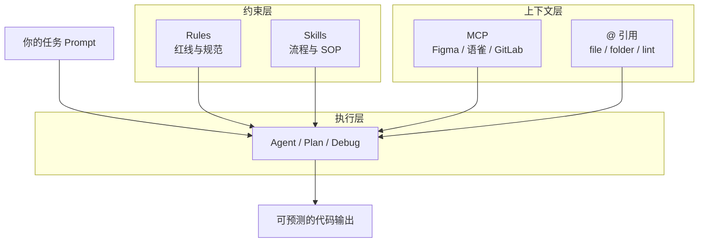
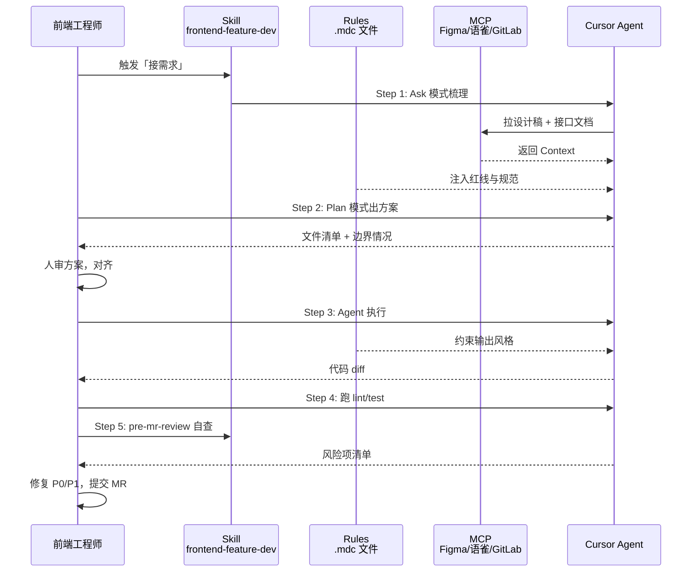

# Cursor Rules / Skills 分层设计：让 Agent 像「团队新同事」

> 发布日期：2026-07-03  
> 标签：前端 / Cursor / Rules / Skills / AI 编程 / 工程实践

我在 [Cursor 一年复盘](https://juejin.cn/post/7656751882112565275) 里写过：2025 年底到 2026 年初，最大的认知转变是从「让 AI 写一段代码」变成「让 AI 完成一个任务」。

但任务能否稳定完成，不取决于你 Prompt 写得多漂亮，而取决于你有没有给 Agent 一套 **可预期的约束体系**。

很多人把 `.cursorrules` 当成万能备忘录，500 行堆进去，Agent 照样生成 `React.FC`、照样发明项目里不存在的 API。也有人听说 Skills 很火，一口气装了十几个，结果 Agent 不知道该听谁的。

这篇文章分享我实践半年的 **Rules + Skills 分层设计**：它们各自解决什么、怎么拆、怎么配合 MCP 和 [Code Review](https://juejin.cn/post/7657475917389447194) 形成闭环，以及一套前端项目可直接复用的模板。

---

## 一、先厘清：Rules、Skills、`.cursorrules` 不是一回事

很多人把三者混用，导致配置越写越乱。先用一张表划清边界：

| 维度 | Rules（`.cursor/rules/*.mdc`） | Skills（`SKILL.md`） | `.cursorrules`（旧方案） |
|------|-------------------------------|---------------------|------------------------|
| **本质** | 持久约束：什么能写、什么不能写 | 流程指南：怎么做一件事 | 单文件全局规则（已过时） |
| **触发** | 按 `globs` 自动注入，或 `alwaysApply` | Agent 根据 `description` 判断是否启用 | 每次对话全量注入 |
| **粒度** | 短、硬、可检查 | 长、流程化、可含脚本 | 粗、难维护 |
| **适合写什么** | 技术栈版本、命名规范、禁止事项 | 多步骤工作流、领域知识、检查清单 | ——建议迁移到 Rules |
| **类比** | 员工手册里的「红线」 | 新人培训里的「SOP」 | 把手册和 SOP 糊在一起 |

一句话总结：

```
Rules 管「边界」——Agent 不能越过的线
Skills 管「路径」——Agent 完成任务的标准流程
MCP 管「眼睛」——Agent 能看到的 Context
```



这和 [MCP 工作流](https://juejin.cn/post/7657074612481261603) 里的分工一致：**MCP 是眼睛，Rules 是操作手册，Skills 是培训教材**。

---

## 二、Rules 分层设计：按职责拆，别写「万能 Rule」

### 2.1 为什么要拆文件？

单文件 Rule 的典型问题：

- Token 爆炸：无关规范也被注入
- 互相冲突：React 规则和 Vue 规则同时生效
- 难以维护：改一条规范要翻 500 行

我的做法是按 **职责 + 技术栈** 拆分，用数字前缀控制加载优先级：

```text
.cursor/rules/
├── 00-global.mdc          # 全局：语言、Git、安全红线
├── 10-react.mdc           # React 项目：组件、Hooks 规范
├── 20-api.mdc             # API 层：请求封装、错误处理
├── 30-testing.mdc         # 测试：Vitest、Testing Library
├── 40-mcp.mdc             # MCP 调用边界（可选）
└── 50-review.mdc          # Agent 生成代码的自检红线
```

### 2.2 `.mdc` 文件格式

每个 Rule 文件由 YAML frontmatter + Markdown 正文组成：

```markdown
---
description: React 组件与 Hooks 编写规范
globs: src/**/*.{tsx,ts}
alwaysApply: false
---

# React 规范

- 使用函数组件，禁止 class 组件
- 禁止 `React.FC`，Props 用 interface 定义
- 自定义 Hook 以 `use` 开头，放在 `src/hooks/`
- 复杂组件拆分为 Container + Presentational
- 样式使用 CSS Modules，禁止行内 style（动态值除外）
```

| frontmatter 字段 | 说明 |
|-----------------|------|
| `description` | 规则简介，Agent 和你在 Rule 面板里都能看到 |
| `globs` | 匹配文件时才注入（省 Token） |
| `alwaysApply: true` | 每次对话都注入，适合全局红线 |

### 2.3 三层 Rules 模型

我把 Rules 按强制程度分为三层：

| 层级 | 名称 | 示例 | 违反后果 |
|------|------|------|---------|
| L1 | **红线**（alwaysApply） | 禁止 `any`、禁止提交密钥、禁止 `dangerouslySetInnerHTML` | 直接拒绝合并 |
| L2 | **规范**（globs 匹配） | API 层必须用 `requestClient`、组件命名 PascalCase | Review 打回 |
| L3 | **建议**（写在 Skill 里） | 优先用 `useMemo` 缓存 columns | 酌情优化 |

**红线放 Rules，建议放 Skills**——这是分层设计的核心原则。

### 2.4 前端项目 L1 红线模板（可直接复制）

`00-global.mdc`：

```markdown
---
description: 全局编码红线与安全约束
alwaysApply: true
---

# 全局红线

## 技术栈（不可偏离）
- React 19 + TypeScript 5.8 + Vite 7
- 包管理器：pnpm（禁止使用 npm / yarn 命令）
- 状态管理：TanStack Query（禁止引入 Redux / MobX）

## 安全
- 禁止 `dangerouslySetInnerHTML`，除非有 DOMPurify 且 MR 说明原因
- 禁止硬编码 API Key、Token、内网地址
- 日志和上报不得包含 PII（手机号、身份证、token）

## Git / 命令
- 禁止 `git push --force`、禁止 `rm -rf`
- 改动后必须跑 `pnpm typecheck && pnpm lint`

## Agent 行为
- 大改先用 Plan 模式对齐方案，禁止跳过
- 任务描述必须写清改动范围（文件清单）
- 不得引入项目未使用的新范式（新请求库、新状态库）
```

---

## 三、Skills 分层设计：管流程，不管红线

### 3.1 Rules 和 Skills 怎么分工？

| 场景 | 放 Rules | 放 Skills |
|------|---------|----------|
| 「禁止用 `any`」 | ✅ | ❌ |
| 「接需求的完整流程：Ask → Plan → Agent → Review」 | ❌ | ✅ |
| 「API 层必须用 `requestClient`」 | ✅ | ❌ |
| 「如何根据语雀文档生成 API 类型」 | ❌ | ✅ |
| 「MCP 调用时不要拉整个 Figma 文件」 | ✅（简短） | ✅（详细步骤） |

**经验法则**：

- 能在 Code Review 里用 ✅/❌ 检查的 → **Rules**
- 需要多步推理、需要判断「先做 A 还是 B」的 → **Skills**

### 3.2 Skill 文件结构

Skills 存放在：

- **个人级**：`~/.cursor/skills/` ——跨项目通用
- **项目级**：`.cursor/skills/` ——跟仓库走，团队共享

```text
.cursor/skills/
└── frontend-feature-dev/
    ├── SKILL.md              # 主入口（Agent 读这个）
    ├── prompts/              # 可复用 Prompt 模板
    │   ├── new-page.md
    │   └── fix-bug.md
    └── checklists/
        └── pre-mr.md         # 提交前自检清单
```

`SKILL.md` 头部格式：

```markdown
---
name: frontend-feature-dev
description: >
  前端功能开发标准流程。用户要开发新页面、新组件、接需求、
  修 Bug 时触发。包含 Ask → Plan → Agent → 验证的完整 SOP。
---
```

`description` 是 Agent 判断是否启用 Skill 的**唯一依据**——写清楚触发场景，比写长正文更重要。

### 3.3 我常用的三个 Skill

#### Skill A：`frontend-feature-dev`（日常开发）

核心流程：

```
1. Ask 模式梳理上下文（@folder 限定范围）
2. Plan 模式输出方案（文件清单 + 边界情况）
3. 人审 Plan，对齐后切 Agent 执行
4. 跑 pnpm typecheck && pnpm lint
5. 对照 Code Review Checklist 自查
```

#### Skill B：`api-integration`（接口联调）

配合 [MCP 语雀](https://juejin.cn/post/7657074612481261603) 使用：

```
1. 用语雀 MCP 搜索并读取最新接口文档
2. 输出字段摘要，等人确认
3. 对照 @src/api/base.ts 既有模式写类型和请求函数
4. 贴一条真实响应样例到 MR 描述
```

#### Skill C：`pre-mr-review`（提交前自检）

把 [Code Review 文](https://juejin.cn/post/7657475917389447194) 的 Checklist 固化进 Skill：

```
1. 读 diff，按 P0/P1/P2 分级输出风险项
2. 重点检查：权限、竞态、边界态、架构一致性
3. 不修改代码，只输出审查报告
```

### 3.4 Skill 不是越多越好

| 问题 | 原因 | 对策 |
|------|------|------|
| Agent 不触发 Skill | `description` 太模糊 | 写清「什么时候用」 |
| 多个 Skill 冲突 | 职责重叠 | 合并或明确优先级 |
| Skill 太长 | 把规范都塞进去了 | 规范挪到 Rules |
| Skill 从不更新 | 项目演进后流程变了 | 每个 Sprint 复盘一次 |

我的原则：**个人 3～5 个 Skill，项目 1～2 个 Skill**，够用了。

---

## 四、一套完整的前端工作流：四层协作

把 Rules、Skills、MCP、人工审查串起来，一个中等需求的标准路径：



### 实战 Prompt 示例

**Step 1 — Ask 模式**：

```
【Ask 模式，不要改代码】

@src/features/order
需求：订单列表新增批量导出。

请先梳理目录结构、数据流、可复用实现。
如有语雀文档，用 MCP 搜索「订单导出」接口。
```

**Step 2 — Plan 模式**：

```
基于刚才的调研，给出实现方案，不要写代码。

要求：
- 涉及文件清单
- 权限与边界情况
- 参考 @src/features/report/hooks/useAsyncDownload.ts
```

**Step 3 — Agent 执行**：

```
按已对齐的方案执行。

范围：只改 src/features/order/ 和 src/api/order.ts
完成后跑 pnpm typecheck && pnpm lint
```

**Step 4 — 自检（触发 pre-mr-review Skill）**：

```
【Ask 模式】对照 Code Review Checklist 审查当前分支 diff。
按 P0/P1/P2 分级，不要改代码。
```

---

## 五、从 `.cursorrules` 迁移到分层体系

如果你还在用单文件 `.cursorrules`，建议按这个步骤迁移：

### Step 1：审计现有内容

把 `.cursorrules` 里的条目分类：

| 类型 | 迁移目标 | 示例 |
|------|---------|------|
| 禁止事项 | `00-global.mdc` | 禁止 any、禁止硬编码密钥 |
| 技术栈声明 | `00-global.mdc` | React 19、pnpm、Vite 7 |
| 组件规范 | `10-react.mdc` | 函数组件、Hooks 命名 |
| API 约定 | `20-api.mdc` | 错误处理、类型生成 |
| 多步流程 | Skill | Ask → Plan → Agent 流程 |
| 一次性备忘 | 删除 | 某次 Bug 的临时 workaround |

### Step 2：建立目录

```bash
mkdir -p .cursor/rules .cursor/skills/frontend-feature-dev
```

### Step 3：拆分并删除旧文件

```bash
# 确认 Rules 生效后
rm .cursorrules   # 或重命名为 .cursorrules.bak
```

### Step 4：验证

新开一个 Agent 对话，让它生成一个标准组件，检查：

- [ ] 是否用了项目里的请求封装（而非裸 `fetch`）
- [ ] 是否遵循命名规范
- [ ] 是否自动跑了 lint

---

## 六、踩坑指南

### 坑 1：Rules 写了但 Agent 不遵守

**原因**：Rule 太长、太模糊、或 `globs` 没匹配到当前文件。

**对策**：
- 单条 Rule 正文控制在 **50 行以内**
- 用「禁止」「必须」等硬语气，少用「建议」「尽量」
- 红线用 `alwaysApply: true`
- 生成后立刻跑 `pnpm typecheck`，用工具链兜底

### 坑 2：Skills 和 Rules 内容重复

**原因**：同一条规范两处都写了，Agent 不知道听谁的。

**对策**：**规范只在 Rules 里写一次**；Skill 里用「遵循 `.cursor/rules/` 中的 React 规范」引用，不重复粘贴。

### 坑 3：Rules 过多导致 Token 爆炸

**原因**：5 个 `alwaysApply: true` 的文件，每次对话注入上千行。

**对策**：
- 只有 **L1 红线** 用 `alwaysApply: true`（1～2 个文件）
- 其余按 `globs` 精准匹配
- 单文件不超过 50 行；超过就拆

### 坑 4：团队 Rules 没人维护

**原因**：Rules 随项目演进过时，Agent 按旧规范生成代码。

**对策**：
- Rules 纳入 Code Review 范围（「新范式是否需要更新 Rules？」）
- 每次线上 Bug 复盘：「哪条 Rule 能拦住？」
- 在 README 或 `CONTRIBUTING.md` 里链接 Rules 目录

### 坑 5：只有 Rules 没有 Skills，复杂任务还是翻车

**原因**：Rules 告诉 Agent「不要做什么」，但没告诉它「按什么顺序做」。

**对策**：至少建一个 **开发流程 Skill**（Ask → Plan → Agent → 验证），复杂任务强制走流程。

---

## 七、团队推广：从个人配置到仓库标准

### 7.1 仓库里应该提交什么

| 文件 | 是否提交 Git | 说明 |
|------|-------------|------|
| `.cursor/rules/*.mdc` | ✅ | 团队共享规范 |
| `.cursor/skills/` | ✅ | 团队共享流程 |
| `.cursor/mcp.json` | ⚠️ | 可提交模板，Token 用环境变量 |
| `~/.cursor/skills/` | ❌ | 个人级，不提交 |

### 7.2 MR 模板加一条

```markdown
## AI 辅助开发
- [ ] 本次改动是否涉及新范式？如是，是否已更新 `.cursor/rules/`？
- [ ] Agent 生成范围：<!-- 列出 AI 大改的文件 -->
- [ ] 已对照 Code Review Checklist 自查
```

### 7.3 和 CI 的配合

Rules 管不住所有事，**CI 是最后防线**：

```text
Rules/Skills（生成时约束）→ 本地 lint/test（提交前）→ CI（合并前）→ 人审（合并时）
```

我在 [Code Review 文](https://juejin.cn/post/7657475917389447194) 里写过：格式交给 CI，逻辑和安全交给人——Rules 做的是 **CI 之前的预防层**。

---

## 八、行动清单：今天就可以开始

1. **审计**现有 `.cursorrules` 或脑中「团队规范」，按 L1/L2/L3 分类
2. **创建** `.cursor/rules/00-global.mdc`，写入前 10 条红线
3. **按技术栈拆** 1～2 个 globs 规则（如 `10-react.mdc`）
4. **创建**一个 `frontend-feature-dev` Skill，固化 Ask → Plan → Agent 流程
5. **验证**：新开对话，让 Agent 生成一个组件，看是否遵守规范
6. **删除**或归档旧的 `.cursorrules`
7. **配合 MCP**：在 `40-mcp.mdc` 里写 MCP 调用边界（参考 [MCP 工作流](https://juejin.cn/post/7657074612481261603)）

---

## 结语

Cursor 的能力越来越强，但 **可预测性**不会自动到来。

Rules 是 Agent 的「红线」——告诉它什么绝对不能做；Skills 是 Agent 的「SOP」——告诉它复杂任务按什么顺序做；MCP 是 Agent 的「眼睛」——让它自己去看文档和设计稿。

三者分层协作，你才真正从「Prompt 工程师」变成 **AI 工作流架构师**——这也是 [前端转型 AI Agent 工程师](https://juejin.cn/post/7656300675648585737) 路径里「AI 编排力」的日常训练。

别追求一次写完美。先写 10 条红线 Rules，再建一个开发流程 Skill，在一次次真实需求里迭代——**就像带新同事一样：先立规矩，再教流程，最后放手让他干活**。

---

## 系列延伸阅读

- [前端工程师的 AI 副驾驶：Cursor 一整年真实体验与避坑指南](https://juejin.cn/post/7656751882112565275)
- [用 MCP 把 Figma、语雀、GitLab 串成一条前端工作流](https://juejin.cn/post/7657074612481261603)
- [AI 生成代码之后，前端 Code Review 审什么？](https://juejin.cn/post/7657475917389447194)
- [前端工程师如何转型 AI Agent 工程师](https://juejin.cn/post/7656300675648585737)

---

*本文基于 2025–2026 年 Cursor Rules / Skills 工程实践整理，具体配置格式以 [Cursor 官方文档](https://docs.cursor.com) 为准。*
