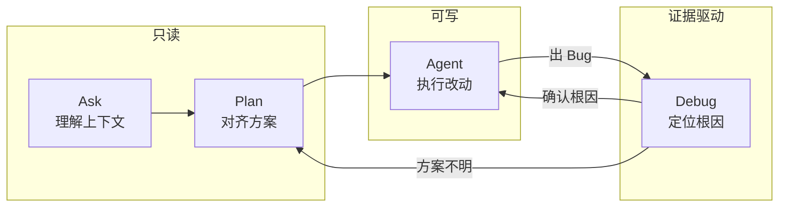
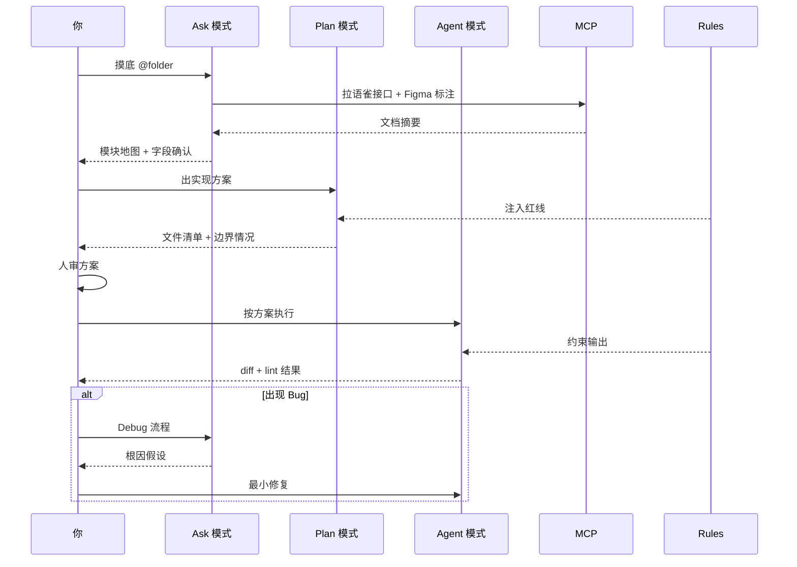

# Cursor 四模式选型指南：Ask / Plan / Agent / Debug 何时用哪个？

> 发布日期：2026-07-06  
> 标签：前端 / Cursor / Agent / Plan / Debug / AI 编程 / 工程实践

配好 [Rules / Skills 分层设计](https://jiaxiantao.github.io/blogs/post/Cursor-Rules%E4%B8%8ESkills%E5%88%86%E5%B1%82%E8%AE%BE%E8%AE%A1-%E8%AE%A9Agent%E5%83%8F%E5%9B%A2%E9%98%9F%E6%96%B0%E5%90%8C%E4%BA%8B) 之后，我收到最多的追问是：

> 「规范都写好了，但 Agent 还是经常一上来就改错文件、方案没对齐就狂写代码、Bug 修了三轮还在猜……到底该用哪个模式？」

在 [Cursor 一年复盘](https://juejin.cn/post/7656751882112565275) 里，我零散提过 Ask、Plan、Debug 的用法，但从未系统梳理过 **四种模式的边界和切换时机**。

这篇文章是一份 **前端工程师可照抄的模式选型手册**：每个模式解决什么问题、典型场景、Prompt 模板、和 Rules / Skills / MCP 怎么配合，以及我踩过的「模式用错」的坑。

---

## 一、先建立心智模型：四种模式不是「强弱等级」

很多人把 Cursor 的模式理解成「能力从低到高」：

```
Ask < Plan < Agent < Debug   ❌ 错误理解
```

实际上，它们是 **四种不同权限和目标的工具**，像手术刀、听诊器、处方、化验单——没有高低，只有合不合适。

| 模式 | 核心权限 | 一句话定位 | 类比 |
|------|---------|-----------|------|
| **Ask** | 只读，不改代码、不跑破坏性命令 | 调研与理解 | 新同事先翻代码，不动手 |
| **Plan** | 出方案，默认不写代码 | 设计与对齐 | 技术评审，画架构图 |
| **Agent** | 读写 + 终端，可改多文件 | 执行任务 | 结对编程，你审它干 |
| **Debug** | 围绕运行时证据排查 | 定位根因 | 带着化验单看病 |



**关键认知**：复杂任务的标准路径几乎永远是 **Ask → Plan → Agent**，而不是直接 Agent。这和 [Rules / Skills 分层设计](https://jiaxiantao.github.io/blogs/post/Cursor-Rules%E4%B8%8ESkills%E5%88%86%E5%B1%82%E8%AE%BE%E8%AE%A1-%E8%AE%A9Agent%E5%83%8F%E5%9B%A2%E9%98%9F%E6%96%B0%E5%90%8C%E4%BA%8B) 里的 SOP 是同构的。

---

## 二、决策树：30 秒判断该用哪个模式

接到一个任务，按这个顺序问自己：

```
1. 我还不理解这块代码 / 需求？
   └─ 是 → Ask

2. 需求清楚了，但实现路径有分歧、涉及多文件、有架构影响？
   └─ 是 → Plan

3. 方案已对齐，知道改哪些文件？
   └─ 是 → Agent

4. 有明确异常现象（报错、白屏、偶现），需要找根因？
   └─ 是 → Debug（或带证据链的 Agent）
```

### 快速对照表

| 你的状态 | 推荐模式 | 千万别 |
|---------|---------|--------|
| 刚接手陌生模块 | Ask | 直接 Agent 重构 |
| 中等以上复杂度新需求 | Plan → Agent | 跳过 Plan |
| 改一个组件样式 | Tab / Cmd+K | 开 Agent 改一行 CSS |
| 跨 3+ 文件的功能开发 | Agent | 手动一个个文件改 |
| 生产偶现 Bug | Debug | 让 Agent「猜着修」 |
| 提交前自查 | Ask + Skill | Agent 边改边审 |
| 大重构 / 实验性改动 | Agent + worktree | 直接在 main 上改 |

---

## 三、Ask 模式：先理解，再动手

### 3.1 适合什么

- 梳理陌生目录的职责和数据流
- 对比两种实现方案的优劣（**不写代码**）
- 提交前审查 diff（配合 Code Review Skill）
- 读 MCP 拉回来的文档，做字段摘要确认

### 3.2 不适合什么

- 任何需要改文件的任务（即使用户说「顺便改一下」）
- 需要跑 `pnpm test` 验证的修复

### 3.3 Prompt 模板

**模板 A：模块摸底**

```
【Ask 模式，不要改任何文件】

@src/features/order

请梳理：
1. 目录结构和各文件职责
2. 数据流（从 API 到 UI）
3. 可复用的 hooks / 组件
4. 与权限相关的逻辑在哪里

输出表格，不要写代码。
```

**模板 B：方案对比**

```
【Ask 模式】

需求：订单导出超过 1000 条走异步任务。

请对比两种方案：
A. 前端轮询任务状态
B. WebSocket 推送完成通知

从实现成本、用户体验、现有基础设施角度分析，推荐一种并说明理由。不要写代码。
```

**模板 C：提交前审查**

```
【Ask 模式，不要改代码】

对照团队 Code Review Checklist，审查当前分支 diff。
按 P0 / P1 / P2 分级输出风险项。
```

### 3.4 和 MCP 的配合

Ask 模式 + MCP 是我早上开工的固定组合：

```
【Ask 模式】

用语雀 MCP 搜索「订单批量导出」接口文档，输出字段摘要。
对照 @src/api/order.ts 现有实现，列出差异。
不要写代码。
```

Agent 自己去翻文档，你只负责 **确认摘要对不对**——这比复制粘贴语雀全文省 Token，也更不容易漏字段。

---

## 四、Plan 模式：对齐方案，比写代码更重要

### 4.1 适合什么

- 涉及 3 个以上文件的中等需求
- 有架构选择（状态放哪、接口怎么拆）
- 需要和产品 / 后端对齐技术方案
- 重构、迁移、性能优化等「一旦方向错了代价很大」的任务

### 4.2 不适合什么

- 改一行样式、补一个类型
- 你已经写过类似功能，路径完全清晰

### 4.3 我定义的「必须 Plan」阈值

| 条件 | 是否必须 Plan |
|------|-------------|
| 改动文件 ≤ 2 且模式熟悉 | 否 |
| 改动文件 ≥ 3 | 是 |
| 涉及新 API / 新状态设计 | 是 |
| 涉及权限 / 支付 / 安全 | 是 |
| 重构 / 迁移 | 是 |
| Agent 上次同模块改翻过车 | 是 |

### 4.4 Prompt 模板

```
【Plan 模式，不要写代码】

@src/features/order  @api/order.ts

需求：订单列表支持批量导出 Excel，需校验导出权限，超 1000 条走异步任务。

请输出实现方案，包含：
1. 涉及文件清单（新增 / 修改）
2. 数据流和状态设计
3. 权限校验放在哪一层
4. 边界情况（0 条选中、超 1000 条、导出中离开页面）
5. 参考 @src/features/report/hooks/useAsyncDownload.ts 的既有模式

不要写代码，等我确认后再执行。
```

### 4.5 Plan 输出后，人审这 5 件事

1. **文件范围**对不对？有没有漏改或多余改动？
2. **状态放哪**合理吗？会不会和现有 store 冲突？
3. **边界情况**是否覆盖？尤其是前端特有的空态、竞态、卸载
4. **参考实现**是否真的是项目里在用的模式？
5. **MCP 信息**是否已消化？（接口字段、设计稿尺寸）

确认后，再切 Agent，并把 Plan 结论贴进执行 Prompt——**不要让 Agent 重新发明方案**。

---

## 五、Agent 模式：方案对齐后的执行者

### 5.1 适合什么

- Plan 已对齐的多文件实现
- 批量重命名、批量迁移（配合 worktree）
- 跑 `pnpm lint` / `pnpm test` 自动验证
- 按既有模式生成重复性代码（表单、列表、API 层）

### 5.2 不适合什么

- 需求本身还没想清楚
- 你不熟悉这块代码，也没做过 Ask 摸底
- 生产紧急 Bug 还没定位根因

### 5.3 Prompt 模板

**标准执行（Plan 之后）**

```
按我们刚才对齐的方案执行。

范围：只改以下文件
- src/features/order/components/ExportButton.tsx（新增）
- src/features/order/hooks/useBatchExport.ts（新增）
- src/api/order.ts（修改）
- src/features/order/OrderList.tsx（修改）

约束：
- 遵循 .cursor/rules/ 中的规范
- 参考 @src/features/report/hooks/useAsyncDownload.ts
- 完成后跑 pnpm typecheck && pnpm lint
- 不要 git commit
```

**小任务（可跳过 Plan）**

```
@src/components/UserAvatar.tsx

把头像改成支持上传裁剪，使用项目里已有的 ImageCropper 组件。
只改这个文件和 src/hooks/useImageUpload.ts（如需要）。

完成后跑 pnpm lint。
```

### 5.4 Agent 执行时的三条安全绳

1. **范围写死**：文件清单 + 「不要改清单外的文件」
2. **Rules 兜底**：`.cursor/rules/` 里的红线自动注入
3. **终端验证**：改完必须跑 lint / test，别信「应该没问题」

我在 [Code Review 文](https://juejin.cn/post/7657475917389447194) 里强调过：**Agent 的 diff 默认当草稿，不是成品。**

---

## 六、Debug 模式：没有证据，不动刀

### 6.1 适合什么

- 有明确报错栈、监控截图、复现步骤
- 偶现问题，需要假设 → 验证 → 排除
- 性能问题（需要 Profiler、Lighthouse 数据）
- 线上回归，需要对比 git 历史

### 6.2 不适合什么

- 纯需求不清（先 Ask / Plan）
- 没有复现路径就让 AI 「看看哪里有问题」

### 6.3 前端 Debug 的「证据链」清单

| 证据类型 | 怎么提供给 Agent |
|---------|----------------|
| 报错栈 | 直接粘贴完整 stack |
| 网络请求 | DevTools Network 截图或 HAR |
| 组件状态 | React DevTools 截图 |
| 复现步骤 | 1-2-3 步骤，含环境（浏览器、账号权限） |
| 回归范围 | `@git` 查最近相关 MR |
| 监控数据 | Sentry / 自研监控的 event 链接 |

### 6.4 Prompt 模板

```
【Debug 模式】

现象：订单详情页偶现白屏，约 5% 用户，Chrome 移动端居多。

证据：
- Sentry 报错：Cannot read properties of undefined (reading 'status')
- 堆栈指向 OrderDetail.tsx:87
- 最近相关 MR：!234（上周加了异步加载优惠券）

请：
1. 列出 3 个最可能根因（按概率排序）
2. 每个假设给出最小验证方式（加 log / 写测试 / 查网络时序）
3. 不要直接改代码，等我确认根因后再修
```

根因确认后，再切 Agent 做 **最小修复**，并要求补一条防回归测试。

### 6.5 Debug 和 Ask 的区别

| | Ask | Debug |
|--|-----|-------|
| 目标 | 理解代码结构 | 定位异常根因 |
| 输入 | 目录 / 文件 | 报错 / 复现 / 监控 |
| 输出 | 地图、对比表 | 假设列表 + 验证方案 |
| 是否依赖运行时 | 否 | 是 |

---

## 七、四种模式 × Rules / Skills / MCP 协作全景

把 [Rules / Skills](https://jiaxiantao.github.io/blogs/post/Cursor-Rules%E4%B8%8ESkills%E5%88%86%E5%B1%82%E8%AE%BE%E8%AE%A1-%E8%AE%A9Agent%E5%83%8F%E5%9B%A2%E9%98%9F%E6%96%B0%E5%90%8C%E4%BA%8B)、[MCP 工作流](https://juejin.cn/post/7657074612481261603) 和四模式串起来，一个完整需求的路径：



### 各模式下的 Rules / Skills / MCP 用法

| 模式 | Rules | Skills | MCP |
|------|-------|--------|-----|
| Ask | 自动注入，约束「不改文件」 | 触发调研类 Skill | 拉文档、读 Figma |
| Plan | 约束方案不违反红线 | 触发开发流程 Skill | 核对接口字段 |
| Agent | 约束代码风格 | 按 SOP 执行 | 按需查询 |
| Debug | 约束「先证据后改动」 | 触发排查清单 | 查 GitLab MR 历史 |

---

## 八、还有两种「模式」别忽略：Tab 和 Cmd+K

四模式之外，日常编码量的大头仍是 **Tab 补全** 和 **Cmd+K 行内编辑**。

我在 [Cursor 复盘](https://juejin.cn/post/7656751882112565275) 里统计过主观比例：

| 工具 | 适用场景 | 占比（体感） |
|------|---------|------------|
| Tab | 续写 Props、补依赖数组、生成测试骨架 | ~40% |
| Cmd+K | 改样式、重命名局部、小范围重构 | ~20% |
| Agent | 跨文件任务、批量改动 | ~30% |
| Ask / Plan / Debug | 调研、设计、排查 | ~10% |

**别用大炮打蚊子**：改一个 `className` 开 Agent，往往比手写还慢。

---

## 九、踩坑复盘：模式用错的六个典型场景

### 坑 1：一上来就 Agent

**后果**：改了一堆不该改的文件，方案架构别扭。  
**对策**：陌生模块先 Ask；中等需求先 Plan。我在 [Rules/Skills 文](https://jiaxiantao.github.io/blogs/post/Cursor-Rules%E4%B8%8ESkills%E5%88%86%E5%B1%82%E8%AE%BE%E8%AE%A1-%E8%AE%A9Agent%E5%83%8F%E5%9B%A2%E9%98%9F%E6%96%B0%E5%90%8C%E4%BA%8B) 里写的 SOP 不是形式主义。

### 坑 2：Plan 完不贴结论，直接「帮我实现」

**后果**：Agent 重新发明方案，和 Plan 结论不一致。  
**对策**：执行 Prompt 里贴上 Plan 的文件清单和关键决策。

### 坑 3：Ask 模式里说「顺便改一下」

**后果**：Agent 可能仍只读，或者你切换模式后上下文断裂。  
**对策**：调研和执行分两个对话，或明确切换模式。

### 坑 4：Debug 没有证据，让 AI 猜

**后果**：改了三轮，引入新 Bug。  
**对策**：至少提供报错栈 + 复现步骤；前端 Bug 重点查竞态、闭包、依赖数组。

### 坑 5：所有事都 Plan

**后果**：改一行代码也要等方案，效率反而下降。  
**对策**：用「必须 Plan 阈值」判断，小任务直接 Agent 或 Tab。

### 坑 6：模式对了，但 `@` 引用太宽

**后果**：Token 爆炸，Agent 被无关文件干扰。  
**对策**：`@folder` 优于 `@codebase`；能 `@file` 就不 `@folder`。

---

## 十、一天工作流示例：模式怎么切换

以「订单列表批量导出」为例，展示我真实的一天：

| 时间 | 模式 | 做什么 |
|------|------|--------|
| 09:30 | **Ask** | `@src/features/order` 摸底 + 语雀 MCP 拉接口 |
| 09:45 | **Ask** | 确认字段摘要，发现导出接口是新增的 |
| 10:00 | **Plan** | 出方案：异步任务 + 轮询 + 权限校验 |
| 10:20 | 人审 | 和后端确认 1000 条阈值、任务 ID 字段名 |
| 10:30 | **Agent** | 按方案执行，跑 lint |
| 11:00 | **Ask** | 对照 Code Review Checklist 自查 diff |
| 11:15 | **Agent** | 修 P1：卸载组件时取消轮询 |
| 14:00 | Tab | 微调导出按钮 loading 样式 |
| 16:00 | **Debug** | 测试发现偶现重复下载，带 Network 时序排查 |

**全程没有一次「直接 Agent 从零开始」**——模式切换本身就是工程能力。

---

## 十一、行动清单

1. **打印决策树**（第二节），贴显示器旁边，养成条件反射
2. **定义你的「必须 Plan」阈值**，写入团队 Skill
3. **收藏 4 套 Prompt 模板**（Ask 摸底 / Plan 方案 / Agent 执行 / Debug 排查）
4. **下一次中等需求**，强制走 Ask → Plan → Agent，对比跳过 Plan 的耗时和返工率
5. **Debug 任务**先收集证据链，再开对话
6. **小改动**用 Tab / Cmd+K，别滥用 Agent

---

## 结语

Rules 和 Skills 解决的是「Agent 按什么规矩、走什么流程」；四模式解决的是 **「当前这一步，该给它多大权限」**。

Ask 是刹车，Plan 是导航，Agent 是油门，Debug 是检测仪——油门踩得越猛，越需要前面导航对准、后面检测跟上。

把模式选型练成肌肉记忆，你会明显感到：Agent 翻车次数下降，返工时间缩短，而 [Code Review](https://juejin.cn/post/7657475917389447194) 里要盯的 P0 项也会少一截。

---

## 系列延伸阅读

- [前端工程师的 AI 副驾驶：Cursor 一整年真实体验与避坑指南](https://juejin.cn/post/7656751882112565275)
- [Cursor Rules / Skills 分层设计：让 Agent 像「团队新同事」](https://jiaxiantao.github.io/blogs/post/Cursor-Rules%E4%B8%8ESkills%E5%88%86%E5%B1%82%E8%AE%BE%E8%AE%A1-%E8%AE%A9Agent%E5%83%8F%E5%9B%A2%E9%98%9F%E6%96%B0%E5%90%8C%E4%BA%8B)
- [用 MCP 把 Figma、语雀、GitLab 串成一条前端工作流](https://juejin.cn/post/7657074612481261603)
- [AI 生成代码之后，前端 Code Review 审什么？](https://juejin.cn/post/7657475917389447194)

---

*本文基于 2025–2026 年 Cursor 四模式工程实践整理，具体功能以 [Cursor 官方文档](https://docs.cursor.com) 为准。*
