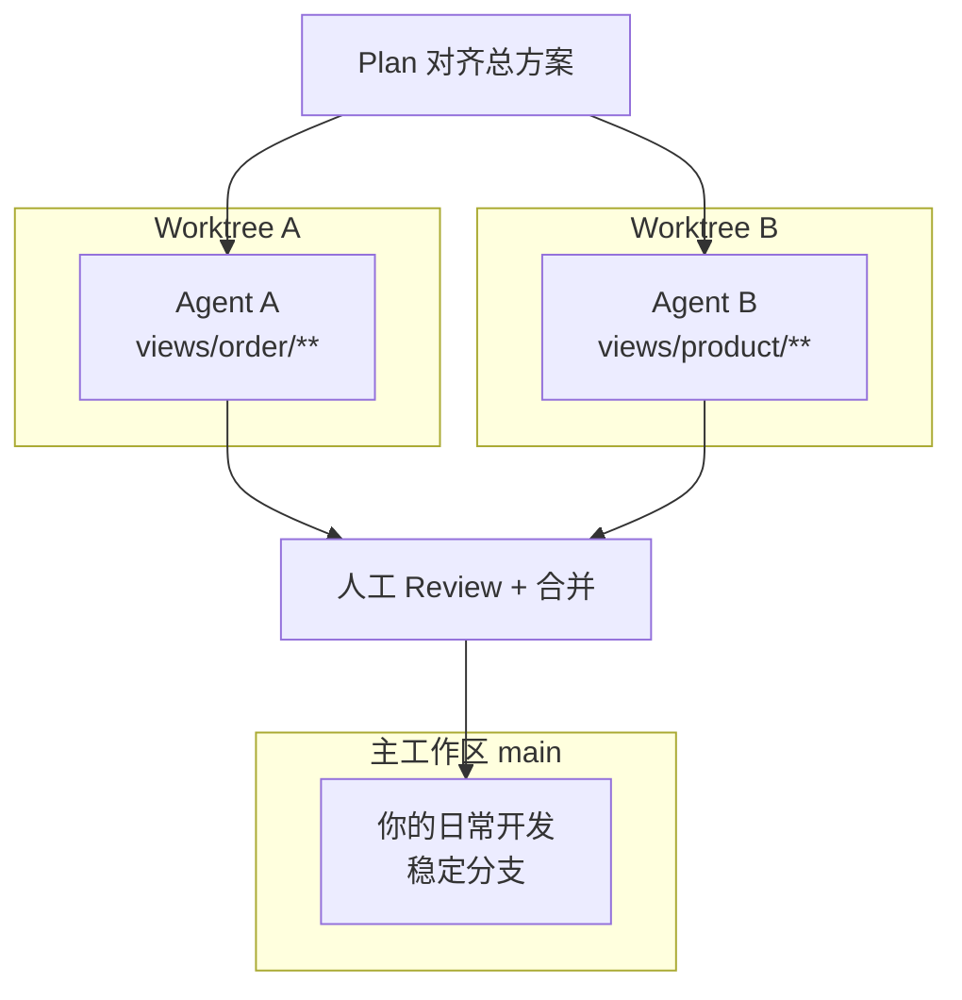
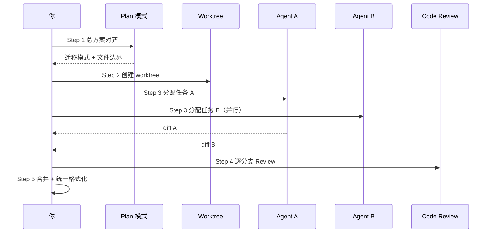
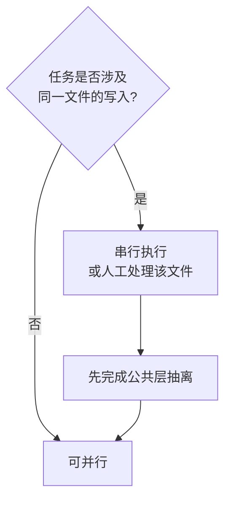

# Cursor 多 Agent 与 Worktree：大重构不再赌一把

> 发布日期：2026-07-07  
> 标签：前端 / Cursor / Agent / Worktree / 重构 / AI 编程 / 工程实践

在 [四模式选型指南](https://jiaxiantao.github.io/blogs/post/Cursor%E5%9B%9B%E6%A8%A1%E5%BC%8F%E9%80%89%E5%9E%8B%E6%8C%87%E5%8D%97-Ask-Plan-Agent-Debug%E4%BD%95%E6%97%B6%E7%94%A8%E5%93%AA%E4%B8%AA) 里，我提过：**大重构 / 实验性改动，用 Agent + worktree，别直接在 main 上改。**

但很多人追问下一层：

> 「worktree 到底怎么开？多 Agent 并行时任务怎么拆？合并冲突谁来解决？会不会两个 Agent 改同一个文件？」

在 [Cursor 一年复盘](https://juejin.cn/post/7656751882112565275) 里，我做过一次「Options API → Composition API」批量迁移：两个 Agent 并行，**核心迁移从一周压到 2～3 天**。代价也真实存在——合并冲突、风格不一致、某个 Agent 擅自改了公共组件。

这篇文章是一份 **前端大改动并行实战手册**：什么时候该开多 Agent、worktree 怎么隔离、任务怎么切、合并怎么审，以及我踩过的坑。

---

## 一、先搞清楚：Worktree 和多 Agent 各解决什么？

很多人把两者混为一谈。其实它们是 **两层隔离**：

| 能力 | 解决什么问题 | 类比 |
|------|------------|------|
| **Git Worktree** | 同一仓库多份工作目录，互不干扰 | 两个工位各干各的，不抢同一张桌子 |
| **多 Agent 并行** | 多个 Agent 会话同时跑，各自独立上下文 | 两个实习生同时接单，各写各的模块 |



**一句话**：

```
Worktree = 物理隔离（文件系统层面）
多 Agent = 执行隔离（对话和任务层面）
```

两者配合，才能放心让 Agent 「放手干」——干砸了直接删 worktree，主分支一行没动。

---

## 二、什么时候该用？什么时候别用？

### 2.1 适合多 Agent + Worktree 的场景

| 场景 | 为什么适合并行 | 拆分维度 |
|------|--------------|---------|
| 框架迁移（Options API → Composition API） | 模块间耦合低，模式统一 | 按 `views/` 子目录 |
| 批量重命名 / 路径调整 | 改动模式重复 | 按目录或文件类型 |
| 多页面 UI 统一改版 | 页面互不依赖 | 按 page / route |
| 实验性架构验证 | 可能全盘推翻 | 独立 worktree，不合并 |
| 大仓库多 feature 并行 | 减少互相等待 | 按 feature 模块 |

### 2.2 不适合的场景

| 场景 | 原因 | 替代方案 |
|------|------|---------|
| 改 1～2 个文件 | 开 worktree 比改动本身还重 | 单 Agent 或直接 Tab |
| 强耦合公共层重构 | 多 Agent 必然抢同一文件 | 单 Agent + Plan，或先抽公共层 |
| 涉及数据库迁移 | 并行难以协调顺序 | 串行 Agent，严格 Plan |
| 你不熟悉这块代码 | 拆任务都拆不对 | 先 Ask 摸底 |

### 2.3 决策清单

满足 **3 条及以上**，再开多 Agent：

- [ ] 总改动涉及 **10+ 文件** 或 **3+ 模块**
- [ ] 已在 **Plan 模式** 对齐过总体方案和迁移模式
- [ ] 任务可按 **目录 / 模块** 切分，且 **无共享文件交叉**
- [ ] 已配置 [Rules](https://jiaxiantao.github.io/blogs/post/Cursor-Rules%E4%B8%8ESkills%E5%88%86%E5%B1%82%E8%AE%BE%E8%AE%A1-%E8%AE%A9Agent%E5%83%8F%E5%9B%A2%E9%98%9F%E6%96%B0%E5%90%8C%E4%BA%8B)，约束输出风格
- [ ] 你有时间做 **合并后的人工 Review**（不是丢给 Agent 就 merge）

---

## 三、标准工作流：五步走完大重构



### Step 1：Plan 模式——先对齐「迁移模式」，再拆任务

**千万别跳过这步。** 多 Agent 翻车的第一大原因，是各 Agent 用了不同的迁移模式。

```
【Plan 模式，不要写代码】

目标：将 src/views/ 下 Options API 页面迁移到 Composition API。

请输出：
1. 统一迁移模式（script setup? 组合式函数提取?）
2. 参考实现：@src/views/dashboard/index.vue（已是 Composition API）
3. 按目录拆分的任务边界（哪些文件夹可并行、哪些有共享依赖）
4. 禁止改动的文件清单（公共组件、store、router）
5. 每个子任务的验收标准（lint 通过、页面可渲染）

不要写代码。
```

Plan 输出后，人审三件事：

1. **边界有没有重叠？** 两个 Agent 不能改同一个文件
2. **参考实现**是不是项目里真正在用的模式？
3. **禁止清单**是否包含 `components/`、`utils/`、`store/` 等公共层？

### Step 2：创建 Worktree

Cursor 支持通过 `/worktree` 命令创建隔离工作区。手动方式也常用：

```bash
# 从 main 创建两个并行 worktree
git worktree add ../project-order-migrate -b migrate/order
git worktree add ../project-product-migrate -b migrate/product
```

| 方式 | 优点 | 缺点 |
|------|------|------|
| Cursor `/worktree` | 和 Agent 集成好，一键隔离 | 需熟悉 Cursor 命令 |
| `git worktree add` | 标准 Git 操作，可控 | 需手动开 Cursor 窗口 |

**命名规范**（建议）：

```text
分支名：migrate/<模块名>
目录名：../<项目名>-<模块名>-migrate
```

### Step 3：分配任务——每个 Agent 一份「合同」

每个 Agent 的 Prompt 必须包含 **五要素**：

| 要素 | 说明 | 示例 |
|------|------|------|
| 范围 | 只改哪些目录 | `src/views/order/**` |
| 禁止 | 明确不能碰的文件 | 不要改 `components/`、`store/` |
| 模式 | 引用 Plan 对齐的迁移模式 | 按 `dashboard/index.vue` 风格 |
| 验收 | 完成标准 | `pnpm lint` 通过 |
| 约束 | Rules 引用 | 遵循 `.cursor/rules/` |

**Agent A 模板**：

```
【Agent 模式】

任务：将 src/views/order/ 下所有页面从 Options API 迁移到 Composition API。

范围：
- 只改 src/views/order/** 下的 .vue 文件
- 可新增 src/views/order/composables/ 存放提取的逻辑

禁止：
- 不要改 src/components/、src/store/、src/router/
- 不要改 src/views/order/ 以外的任何文件
- 不要 git commit

模式：
- 严格参考 @src/views/dashboard/index.vue 的写法
- 使用 <script setup lang="ts">
- 复杂逻辑提取为 composables

验收：
- 完成后跑 pnpm lint
- 列出改动文件清单和迁移要点
```

**Agent B 模板**（并行，换目录即可）：

```
任务：将 src/views/product/ 下所有页面从 Options API 迁移到 Composition API。
（其余约束同 Agent A，范围换成 src/views/product/**）
```

### Step 4：并行执行 + 人工监控

并行时你做三件事，不用盯着 Agent 写每一行：

1. **看进度**：Agent 是否卡在 lint 报错循环
2. **看越界**：有没有改到禁止清单里的文件（diff 预览）
3. **看模式**：抽样 1～2 个文件，迁移风格是否一致

**红旗信号——立刻叫停某个 Agent**：

- 开始改 `components/` 或 `utils/` 公共文件
- 单次改动超过 Plan 约定的文件数 2 倍以上
- lint 报错超过 3 轮还没收敛
- 自行「优化」了不在范围内的逻辑

### Step 5：Review + 合并

按 [Code Review 文](https://juejin.cn/post/7657475917389447194) 的标准，**每个 worktree 分支单独审**，不要一次性全 merge。

```bash
# 在对应 worktree 目录
git diff main...HEAD --stat
git diff main...HEAD

# 逐分支合并
git checkout main
git merge migrate/order --no-ff
# 解决冲突 → 跑 pnpm lint && pnpm typecheck
git merge migrate/product --no-ff
```

合并后 **统一格式化一遍**（多 Agent 最容易出现风格漂移）：

```bash
pnpm lint --fix
pnpm format   # 如有
```

---

## 四、实战案例：Vue Options API → Composition API 迁移

这是我在 [Cursor 复盘](https://juejin.cn/post/7656751882112565275) 里做过的真实项目，完整复盘如下。

### 4.1 背景

| 项 | 数据 |
|----|------|
| 项目 | Vue 3 后台管理系统 |
| 待迁移 | `src/views/` 下 47 个 Options API 页面 |
| 已迁移参考 | `src/views/dashboard/`（Composition API） |
| 人力 | 1 前端 + Cursor 多 Agent |

### 4.2 任务拆分

```text
Agent A（worktree: migrate/order）  → src/views/order/**     （12 个页面）
Agent B（worktree: migrate/product）→ src/views/product/**   （15 个页面）
Agent C（串行，A/B 完成后）         → src/views/settings/**  （8 个页面）
人工                               → src/views/report/**    （含复杂图表，不敢交给 Agent）
```

**为什么 report 没并行？** 含 ECharts 封装、自定义 Hooks，和公共层耦合重——这类模块宁可串行 + 人盯。

### 4.3 时间与质量

| 阶段 | 耗时 | 说明 |
|------|------|------|
| Plan 对齐 | 0.5 天 | 出迁移模式 + 边界 + 参考实现 |
| Agent A/B 并行 | 1 天 | 各跑 3～4 小时，人中间抽查 2 次 |
| 合并 + Review | 0.5 天 | order 分支 2 处冲突，product 0 处 |
| Agent C + 人工 report | 1 天 | 串行收尾 |
| **合计** | **~3 天** | 以前估时 1 周 |

### 4.4 出现的问题与处理

| 问题 | 原因 | 处理 |
|------|------|------|
| Agent B 改了 `components/Table.vue` | Prompt 禁止清单不够明确 | 回滚该文件，Prompt 加粗「禁止」 |
| 两个 Agent 对 `ref` 命名风格不一 | Rules 未覆盖 composable 命名 | 合并后统一 lint --fix + 补 Rule |
| order 分支合并冲突 | 共同改了 `types/order.ts` | 该文件划入「禁止清单」，人工处理 |

---

## 五、任务拆分原则：切得好，才能并行得好

### 5.1 黄金法则

```
按「目录边界」切，不按「文件数量」切
按「零共享写入」切，不按「谁写得快」切
```

### 5.2 拆分维度参考

| 拆分方式 | 适合 | 风险 |
|---------|------|------|
| 按路由 / 页面目录 | 页面型后台、多模块 SPA | 低 |
| 按 feature 模块 | `src/features/order/` 等 | 低～中 |
| 按文件类型 | 所有 `.test.ts` 批量补测试 | 低 |
| 按层级 | 「所有 API 层」「所有组件层」 | **高**——容易抢文件 |
| 按「前半 / 后半」 | 文件列表对半砍 | **高**——无逻辑边界 |

### 5.3 共享依赖怎么处理？



典型做法：

1. **Phase 0（串行）**：人工或单 Agent 抽公共 composable / 类型
2. **Phase 1（并行）**：各 Agent 迁移自己目录，引用 Phase 0 成果
3. **Phase 2（串行）**：合并、统一格式化、补测试

---

## 六、和 Rules / Skills / 四模式的配合

多 Agent 并行的前置条件，是你已经建好约束体系：

| 层级 | 作用 | 并行场景下的价值 |
|------|------|----------------|
| [Rules](https://jiaxiantao.github.io/blogs/post/Cursor-Rules%E4%B8%8ESkills%E5%88%86%E5%B1%82%E8%AE%BE%E8%AE%A1-%E8%AE%A9Agent%E5%83%8F%E5%9B%A2%E9%98%9F%E6%96%B0%E5%90%8C%E4%BA%8B) | 统一输出风格 | 减少合并后风格漂移 |
| Skills | 固化迁移 SOP | 每个 Agent 触发同一 Skill，步骤一致 |
| [四模式](https://jiaxiantao.github.io/blogs/post/Cursor%E5%9B%9B%E6%A8%A1%E5%BC%8F%E9%80%89%E5%9E%8B%E6%8C%87%E5%8D%97-Ask-Plan-Agent-Debug%E4%BD%95%E6%97%B6%E7%94%A8%E5%93%AA%E4%B8%AA) | Plan 先行、Agent 执行 | Plan 是所有 Agent 的「总合同」 |
| [MCP](https://juejin.cn/post/7657074612481261603) | 拉文档 / 查 MR | 各 Agent 对齐同一接口文档 |

建议在项目 Skill 里加一段 **并行任务专用 SOP**：

```markdown
## 多 Agent 并行迁移 SOP

1. Plan 模式输出总方案和任务边界
2. 人审边界，确认无文件交叉
3. 每个 worktree 开独立 Agent，粘贴标准任务 Prompt
4. 禁止清单必须包含：components/、store/、router/、types/
5. 各分支完成后单独 Review，再合并
6. 合并后统一 pnpm lint --fix
```

---

## 七、踩坑指南

### 坑 1：没 Plan 直接开两个 Agent

**后果**：A 用 `script setup`，B 用 `defineComponent`；合并后像两个人写的代码。  
**对策**：Plan 输出「唯一迁移模式」，写入每个 Agent Prompt。

### 坑 2：禁止清单太模糊

**后果**：Agent 改了公共组件，两个分支都受影响。  
**对策**：用 **目录级** 禁止（`不要改 src/components/**`），不只写「不要改公共文件」。

### 坑 3：并行粒度太细

**后果**：开了 5 个 Agent 迁 5 个页面，合并和 Review 比串行还累。  
**对策**：每个 Agent 至少覆盖 **8～15 个文件** 或 **一个完整子模块**。

### 坑 4：不做中间抽查

**后果**：Agent 跑了 2 小时，方向全错，worktree 白干。  
**对策**：启动后 15～20 分钟看一次 diff，确认模式正确再继续。

### 坑 5：合并时不跑验证

**后果**：分支各自 lint 通过，合并后类型冲突。  
**对策**：每个 merge 节点跑 `pnpm typecheck && pnpm lint && pnpm test`。

### 坑 6：worktree 忘了清理

**后果**：磁盘占满、分支混乱、不确定哪个目录是最新的。  
**对策**：合并完成后立刻清理：

```bash
git worktree remove ../project-order-migrate
git branch -d migrate/order
```

---

## 八、Worktree 单 Agent 场景：不一定非要并行

多 Agent 是 worktree 的 **进阶用法**。日常实验性改动，**单 Agent + 单 worktree** 就够用：

| 场景 | 做法 |
|------|------|
| 试验新状态管理方案 | 开 worktree，Agent 随便改，不满意删目录 |
| 评估大版本升级 | worktree 里跑 `pnpm upgrade`，主分支不动 |
| 给同事演示 Agent 改动 | worktree 隔离，演示完丢弃 |

```bash
git worktree add ../project-experiment -b experiment/new-state
# Cursor 在 experiment 目录打开 Agent 折腾
# 不行就：git worktree remove ../project-experiment
```

**这比 `git stash` + 切分支更适合 Agent 场景**——Agent 改动量大，stash 容易乱。

---

## 九、行动清单

1. **下一次 10+ 文件的大改动**，先 Plan 出任务边界，判断能否并行
2. **创建 2 个 worktree**，用标准 Prompt 模板分配 Agent
3. **在 Rules 里补一条** composable / 组件命名规范，防风格漂移
4. **合并前**对每个分支单独做 [Code Review 自查](https://juejin.cn/post/7657475917389447194)
5. **合并后**跑全量 `typecheck + lint + test`
6. **清理 worktree** 和临时分支，保持仓库整洁
7. 把本次并行的 Prompt 和踩坑记入项目 Skill，下次复制即用

---

## 结语

[四模式选型](https://jiaxiantao.github.io/blogs/post/Cursor%E5%9B%9B%E6%A8%A1%E5%BC%8F%E9%80%89%E5%9E%8B%E6%8C%87%E5%8D%97-Ask-Plan-Agent-Debug%E4%BD%95%E6%97%B6%E7%94%A8%E5%93%AA%E4%B8%AA) 解决的是「这一步用什么模式」；[Rules / Skills](https://jiaxiantao.github.io/blogs/post/Cursor-Rules%E4%B8%8ESkills%E5%88%86%E5%B1%82%E8%AE%BE%E8%AE%A1-%E8%AE%A9Agent%E5%83%8F%E5%9B%A2%E9%98%9F%E6%96%B0%E5%90%8C%E4%BA%8B) 解决的是「按什么规矩做」；**多 Agent + Worktree 解决的是「大活怎么提速且不把 main 分支赌进去」**。

它不是日常开发的默认选项，而是前端工程师的 **「重型设备」**——任务够大、边界够清、Review 跟得上的时候，收益非常明显。

记住三个关键词：**Plan 定模式、目录切边界、合并必审查**。做到这三点，大重构不用再赌一把。

---

## 系列延伸阅读

- [前端工程师的 AI 副驾驶：Cursor 一整年真实体验与避坑指南](https://juejin.cn/post/7656751882112565275)
- [Cursor Rules / Skills 分层设计：让 Agent 像「团队新同事」](https://jiaxiantao.github.io/blogs/post/Cursor-Rules%E4%B8%8ESkills%E5%88%86%E5%B1%82%E8%AE%BE%E8%AE%A1-%E8%AE%A9Agent%E5%83%8F%E5%9B%A2%E9%98%9F%E6%96%B0%E5%90%8C%E4%BA%8B)
- [Cursor 四模式选型指南：Ask / Plan / Agent / Debug 何时用哪个？](https://jiaxiantao.github.io/blogs/post/Cursor%E5%9B%9B%E6%A8%A1%E5%BC%8F%E9%80%89%E5%9E%8B%E6%8C%87%E5%8D%97-Ask-Plan-Agent-Debug%E4%BD%95%E6%97%B6%E7%94%A8%E5%93%AA%E4%B8%AA)
- [AI 生成代码之后，前端 Code Review 审什么？](https://juejin.cn/post/7657475917389447194)
- [用 MCP 把 Figma、语雀、GitLab 串成一条前端工作流](https://juejin.cn/post/7657074612481261603)

---

*本文基于 2025–2026 年 Cursor 多 Agent 与 Worktree 工程实践整理，具体命令与功能以 [Cursor 官方文档](https://docs.cursor.com) 为准。*
