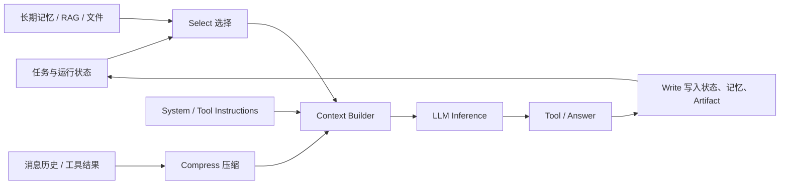
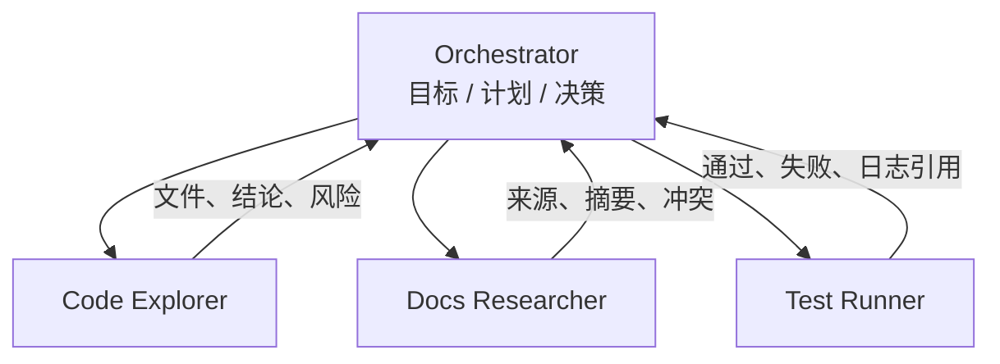

<!-- post-id: 577666966ba346cb -->

# Context Engineering：从 Prompt 到 Agent 上下文系统

> 发布日期：2026-07-30  
> 标签：前端 / AI 全栈 / Agent / Context Engineering / Memory / RAG / Tool Calling / 工程实践

写一个好 Prompt，可以让模型把**一次回答**做得更好。

但 Agent 不是一次回答。它会规划、查资料、调用工具、读取文件、处理错误，再把结果带到下一轮。运行十几步后，真正决定质量的往往不再是 System Prompt 里那几句话，而是：

- 当前目标还在不在上下文里？
- 工具刚返回的 5 万字，该保留多少？
- 历史对话、用户偏好、项目规则，哪些现在相关？
- 搜索结果何时加载，何时丢掉？
- 子 Agent 应该拿到完整历史，还是一个干净任务包？

这就是 **Context Engineering（上下文工程）**。

在 [Tool Calling 工程化](https://jiaxiantao.github.io/blogs/post/%E4%BB%8EChat%E5%88%B0Agent-Tool-Calling%E5%85%A8%E6%A0%88%E5%B7%A5%E7%A8%8B%E5%8C%96%E5%AE%9E%E8%B7%B5) 里，我解决的是「Agent 怎么安全地做事」；在 [MCP Server](https://jiaxiantao.github.io/blogs/post/%E4%BB%8ETool-Calling%E5%88%B0MCP-Server-%E6%8A%8A%E4%B8%9A%E5%8A%A1%E8%83%BD%E5%8A%9B%E5%81%9A%E6%88%90Agent%E5%8F%AF%E5%A4%8D%E7%94%A8%E6%8E%A5%E5%8F%A3) 里，我解决的是「能力怎么跨 Host 复用」。这一篇继续往 Agent 内部走：

> **工具解决 Agent 能做什么；上下文工程解决 Agent 此刻知道什么。**

---

## 一、Prompt Engineering 与 Context Engineering 有什么区别？

Anthropic 将 Context Engineering 视为 Prompt Engineering 的自然演进：后者关注如何写好指令，前者关注在每次推理时，如何策划并维护进入模型的**完整 token 集合**。

| 维度 | Prompt Engineering | Context Engineering |
|------|--------------------|---------------------|
| 关注点 | 指令怎么写 | 模型这一步能看到什么 |
| 典型对象 | System Prompt、Few-shot | 指令、工具、历史、状态、检索、记忆、工具结果 |
| 生命周期 | 多为静态或单次调用 | Agent 每一步都动态变化 |
| 优化目标 | 输出符合格式与语气 | 长任务保持目标、证据与决策一致 |
| 常见失败 | 指令模糊、格式错误 | 上下文污染、信息丢失、成本膨胀、注意力分散 |

一句话：

```text
Prompt Engineering = 写好说明书
Context Engineering = 每一步把正确的说明书、资料、进度和工具放到桌面上
```

一个 Agent 的有效上下文，通常至少包含：

```text
Context
├── Instructions     系统指令、边界、输出要求
├── Tool definitions 工具名称、描述、参数 schema
├── Runtime state    当前目标、计划、进度、权限
├── Message history  用户与 Agent 的近期对话
├── Retrieved data   RAG、文件、网页、数据库结果
├── Tool results     本轮工具调用结果
├── Memory           用户偏好、项目约定、跨会话经验
└── Artifacts        已生成文件、报告、代码、检查点
```

Prompt 只是其中一块。

---

## 二、为什么上下文越大，Agent 不一定越聪明？

直觉上，模型窗口越来越大，把所有信息都塞进去似乎最稳。

实际不是。

### 2.1 Context Window 是注意力预算，不是网盘

长窗口解决的是「装得下」，不等于「找得准」。随着无关 token 增加，重要信息会被工具日志、重复对话和过期状态稀释。Anthropic 将这种现象称为 **context rot**：上下文越长，模型对其中信息的精确召回和长距离推理可能逐渐下降。

因此目标不是：

```text
把可能相关的信息全部塞进去
```

而是：

```text
用最少的高信号 token，提高当前步骤成功的概率
```

### 2.2 Agent 会自己制造上下文垃圾

一个普通对话主要增长用户消息与回答；Agent 还会不断产生：

- 搜索返回的几十条结果；
- 文件全文和终端日志；
- 工具调用参数与原始 JSON；
- 重试错误、堆栈、重复状态；
- 中间计划和已完成 Todo；
- 子任务探索过但最终没采用的路径。

假设一次工具平均返回 4,000 tokens，循环 20 步就是 80,000 tokens。真正对最终答案关键的，可能只有几千。

### 2.3 大上下文还会放大三种成本

| 成本 | 表现 |
|------|------|
| 延迟 | 每轮都重复处理历史内容 |
| 金钱 | 输入 token 随循环持续增长 |
| 可靠性 | 旧指令、旧数据和新状态相互冲突 |

所以 Context Engineering 不是「窗口不够大时的补丁」，而是 Agent 架构的一部分。

---

## 三、先建立一个上下文生命周期

我更愿意把 Agent 的每一步看成一次**上下文编译**：



不是把 `messages.push(...)` 一路追加到底，而是每轮重新回答四个问题：

1. **Write**：哪些信息应移出窗口，写到外部？
2. **Select**：这一步该取回哪些信息？
3. **Compress**：哪些内容可以更短，但不能丢语义？
4. **Isolate**：哪些复杂信息应该放到另一个上下文中处理？

这四类策略来自 LangChain 对 Agent Context Engineering 的归纳，也与 Anthropic 的 compaction、structured note-taking、multi-agent 实践高度吻合。

---

## 四、Write：不要强迫模型一直记着，让 Agent 会记笔记

Write 的目标，是把有价值的信息存到上下文窗口之外。

### 4.1 Scratchpad：单次任务的工作记忆

适合保存：

- 当前目标与完成标准；
- 已确认的事实；
- 做过的关键决策；
- 未解决问题；
- 下一步行动。

```ts
interface TaskScratchpad {
  goal: string;
  constraints: string[];
  decisions: Array<{
    decision: string;
    reason: string;
  }>;
  facts: Array<{
    content: string;
    source?: string;
  }>;
  openQuestions: string[];
  nextActions: string[];
}
```

关键不是格式多漂亮，而是让它成为**唯一可信的任务状态**。例如已经确认使用 PostgreSQL，就不要只让这个事实躺在 30 轮之前的聊天里。

### 4.2 Artifact：把大结果留在环境中

Agent 生成的代码、报告、SQL 结果、图片，不应该全文常驻消息历史。更好的方式是：

```json
{
  "artifactId": "report-20260730",
  "type": "markdown",
  "path": "artifacts/context-audit.md",
  "summary": "Agent 上下文审计报告，共 6 项问题",
  "size": 18240
}
```

上下文只保留轻量引用；需要细节时再读取。

这和人类工作很像：我们记住「报告放在哪里、结论是什么」，而不是背下报告每一行。

### 4.3 Long-term Memory：跨会话保留稳定信息

长期记忆适合：

- 用户稳定偏好；
- 团队编码规范；
- 项目架构事实；
- 多次验证过的工作流经验。

不适合：

- 一次接口报错；
- 尚未确认的推测；
- 很快过期的构建日志；
- 包含敏感信息的原始工具结果。

可以给每条记忆加上来源和有效期：

```ts
interface MemoryItem {
  id: string;
  scope: 'user' | 'project' | 'team';
  content: string;
  source: string;
  confidence: number;
  createdAt: string;
  expiresAt?: string;
  lastVerifiedAt?: string;
}
```

**记忆不是事实数据库的替代品。** 当前代码、实时 API 和数据库结果应优先于旧记忆。

---

## 五、Select：只把当前步骤需要的信息拉进来

Write 解决存哪里；Select 解决何时取。

### 5.1 从「预加载一切」转向 Just-in-Time

传统 RAG 常在调用模型前，一次检索 Top K 文档并全部塞入 Prompt。Agent 更适合 **Just-in-Time Retrieval**：

```text
先给目录、文件名、资源摘要
  → Agent 判断需要什么
  → 用搜索工具缩小范围
  → 读取命中片段
  → 必要时再展开全文
```

例如代码 Agent 不需要启动时扫描整个仓库。先拿到目录结构，再用 Glob / Search 定位，最后只读相关文件。

这叫 **Progressive Disclosure（渐进披露）**：先给索引，再按需要展开细节。

### 5.2 检索不仅要算相似度，还要看任务状态

只用 embedding 相似度，经常会召回「词很像但此刻没用」的内容。一个更实用的打分：

```ts
score =
  semanticSimilarity * 0.45 +
  taskRelevance      * 0.25 +
  recency            * 0.15 +
  authority          * 0.15;
```

其中：

- `semanticSimilarity`：文本语义相似；
- `taskRelevance`：是否支持当前计划步骤；
- `recency`：是否新鲜；
- `authority`：官方文档、当前源码应高于旧笔记。

### 5.3 工具也需要动态选择

工具定义本身同样占上下文。几十个 MCP Tool 全量暴露，会让模型面对大量重叠决策。

可以先做能力路由：

```ts
const toolGroups = {
  code: ['search_code', 'read_file', 'run_tests'],
  docs: ['search_docs', 'read_page'],
  data: ['query_database', 'export_csv'],
  communication: ['search_messages', 'send_message']
};

function selectTools(intent: Intent): ToolDefinition[] {
  return toolGroups[intent.domain].map(resolveTool);
}
```

原则是：**让当前 Agent 只看到完成当前任务所需的最小工具集。**

---

## 六、Compress：保留决策，不保留所有过程

长任务不可避免会逼近窗口上限。Compress 不是简单截断，而是把低密度上下文改成高密度状态。

### 6.1 优先清理旧 Tool Result

最安全、收益最高的第一步，通常是清掉很久以前的原始工具结果，同时保留：

- 调过什么工具；
- 为什么调；
- 得到什么结论；
- 原始结果保存在哪里。

```ts
interface CompressedToolCall {
  tool: string;
  purpose: string;
  outcome: string;
  artifactRef?: string;
  error?: string;
}
```

例如把 3 万行测试日志压成：

```json
{
  "tool": "run_tests",
  "purpose": "验证订单模块回归",
  "outcome": "142 passed, 2 failed",
  "error": "coupon.spec.ts: expired coupon; checkout.spec.ts: timeout",
  "artifactRef": "artifacts/test-run-42.log"
}
```

### 6.2 按阶段做 Checkpoint，而不是等爆窗

一个可靠的压缩时机不是只有「token 快满了」，还包括：

- 调研阶段 → 方案阶段；
- 方案阶段 → 实现阶段；
- 实现阶段 → 验证阶段；
- 完成一个独立子任务后。

每次 Checkpoint 固化：

```text
目标
已完成
关键证据
架构决策与原因
修改过的文件
测试结果
未解决风险
下一步
```

这样即使后续发生上下文重置，Agent 也能继续。

### 6.3 压缩最怕丢掉「暂时看似不重要」的信息

摘要器常见错误：

- 留下结论，丢掉证据来源；
- 留下改了什么，丢掉为什么改；
- 留下成功状态，丢掉尚未验证的假设；
- 把用户明确要求概括成模糊偏好。

所以 Compaction Prompt 应先追求**召回率**，再追求短：

```text
必须保留：
1. 用户原始目标与显式约束
2. 已确认事实及来源
3. 关键决策、替代方案与原因
4. 文件/API/资源标识
5. 未解决问题、失败尝试与下一步
6. 任何安全、权限或不可逆风险
```

---

## 七、Isolate：复杂探索不要污染主 Agent

有些上下文不是该压缩，而是从一开始就不该进入主窗口。

### 7.1 子 Agent 的价值首先是上下文隔离

多 Agent 不只是为了并行。它还可以让：

- 主 Agent 保留目标、计划与最终决策；
- 探索 Agent 大量搜索源码；
- 测试 Agent 消化长日志；
- 文档 Agent 阅读外部资料；
- 每个 Agent 最终只返回结构化摘要。



关键是定义好返回契约：

```ts
interface SubAgentResult {
  summary: string;
  evidence: Array<{
    source: string;
    finding: string;
  }>;
  risks: string[];
  unresolved: string[];
  artifacts: string[];
}
```

不要让子 Agent 把完整轨迹原封不动倒回主 Agent，否则只是把污染搬了个家。

### 7.2 运行时状态与 LLM 上下文也要隔离

OpenAI Agents SDK 文档明确区分：

1. **本地应用 Context**：数据库连接、用户 ID、权限、依赖对象，供代码和工具使用；
2. **LLM Context**：真正进入消息历史、能被模型看到的信息。

例如 API Token、内部数据库连接、完整权限对象，不需要也不应该交给模型：

```ts
interface RuntimeContext {
  userId: string;
  permissions: Set<string>;
  db: DatabaseClient;
  secrets: SecretStore;
}

interface LLMVisibleContext {
  role: 'viewer' | 'editor';
  allowedActions: string[];
}
```

**能在代码层判断的权限，不要靠 Prompt 提醒模型自觉。**

---

## 八、实现一个 TypeScript Context Builder

框架可以不同，但核心接口应该显式。不要在业务代码里到处拼接 `messages`。

### 8.1 定义输入与预算

```ts
interface ContextBudget {
  maxInputTokens: number;
  reserveForOutput: number;
  instructions: number;
  recentHistory: number;
  retrievedContext: number;
  toolResults: number;
  memory: number;
}

interface BuildContextInput {
  task: TaskState;
  recentMessages: Message[];
  memories: MemoryItem[];
  retrievedChunks: RetrievedChunk[];
  toolResults: ToolResult[];
  availableTools: ToolDefinition[];
}
```

预算不要只设一个总数。分区后，检索结果暴涨时才不会挤掉用户目标。

一个起步比例可以是：

| 分区 | 建议占比 |
|------|----------|
| Instructions + 当前目标 | 15% |
| 最近对话 | 20% |
| 检索上下文 | 30% |
| 工具结果 | 20% |
| 记忆 / 示例 | 10% |
| 安全余量 | 5% |

比例不是标准答案，应通过任务评测调整。

### 8.2 组装流程

```ts
async function buildAgentContext(
  input: BuildContextInput,
  budget: ContextBudget
): Promise<ModelInput> {
  const instructions = buildInstructions(input.task);
  const tools = selectRelevantTools(input.task, input.availableTools);

  const memories = rankMemories(input.task, input.memories)
    .filter(isFreshAndAuthorized)
    .slice(0, 8);

  const retrieved = rerankChunks(input.task, input.retrievedChunks);
  const toolResults = compressOldToolResults(input.toolResults);
  const history = await compactHistoryIfNeeded(input.recentMessages);

  return fitToBudget(
    {
      instructions,
      tools,
      messages: history,
      state: summarizeTaskState(input.task),
      memories,
      retrieved,
      toolResults
    },
    budget
  );
}
```

`fitToBudget` 的裁剪优先级要明确：

```text
不可裁：安全规则、用户目标、显式约束、当前步骤
谨慎裁：近期对话、关键证据、失败原因
优先裁：重复内容、旧工具原文、低分检索、已完成过程
```

### 8.3 每轮不是追加，而是重新编译

```ts
while (!state.done && state.step < MAX_STEPS) {
  const modelInput = await buildAgentContext(state.snapshot(), budget);
  const decision = await model.generate(modelInput);
  const observation = await executeDecision(decision, runtimeContext);

  await state.apply(decision, observation);
  await checkpointIfNeeded(state);
}
```

这就是上下文工程从「技巧」变成「系统」的分界线。

---

## 九、工具输出也要按上下文标准设计

在 MCP / Tool Calling 中，我们经常关注参数 Schema，却忽略返回值会直接吞掉 Agent 的注意力预算。

### 9.1 默认摘要，按需展开

不推荐：

```json
{
  "rows": ["... 5000 条完整数据 ..."]
}
```

推荐：

```json
{
  "summary": "命中 5,284 条订单，退款率 3.7%",
  "topItems": ["...前 20 条..."],
  "nextCursor": "order_20260730_0020",
  "artifactRef": "artifacts/orders-20260730.json"
}
```

### 9.2 搜索工具必须支持渐进探索

一个上下文友好的搜索工具应支持：

- `query`
- `scope`
- `limit`
- `cursor`
- `fields`
- `includeContent`

Agent 先查标题与摘要，确认相关后再拉正文。

### 9.3 错误返回要短，但可行动

```json
{
  "ok": false,
  "code": "RATE_LIMITED",
  "message": "请求频率超限",
  "retryable": true,
  "retryAfterMs": 3000
}
```

不要把 200 行 SDK 堆栈塞给模型，再期待它自己找关键句。

---

## 十、RAG、Memory、History 到底怎么分？

这三者经常被混在一个向量库里。

| 类型 | 回答的问题 | 生命周期 | 示例 |
|------|------------|----------|------|
| History | 刚才聊了什么？ | 当前会话 | 用户上一轮补充条件 |
| Task State | 任务做到哪了？ | 当前任务 | 已完成 3/5，待跑测试 |
| RAG | 外部事实是什么？ | 随知识源更新 | 产品文档、代码、制度 |
| Memory | 以后还应记住什么？ | 跨会话 | 用户偏好 pnpm、项目禁用某库 |
| Artifact | 大结果存在哪里？ | 按项目/任务保留 | 报告、日志、生成文件 |

判断口诀：

```text
刚发生的 → History
正推进的 → Task State
外部可查的 → RAG
未来复用的 → Memory
体积很大的 → Artifact
```

---

## 十一、如何评测上下文工程？

只看「最终回答像不像」不够。上下文系统应独立观测。

### 11.1 每轮记录 Context Manifest

```ts
interface ContextManifest {
  runId: string;
  step: number;
  totalTokens: number;
  sections: Array<{
    type: string;
    tokens: number;
    sourceIds: string[];
  }>;
  dropped: Array<{
    sourceId: string;
    reason: string;
  }>;
  compactionVersion?: string;
}
```

注意不要把敏感正文直接写进 Trace；记录来源 ID、token 数、选择原因即可。

### 11.2 四类核心指标

| 指标 | 要回答什么 |
|------|------------|
| Context Precision | 放进去的内容有多少真正被任务需要？ |
| Context Recall | 关键事实是否被漏掉？ |
| Token Efficiency | 每完成一个任务用了多少输入 token？ |
| Long-horizon Coherence | 压缩或多步后是否仍遵守原目标与决策？ |

### 11.3 用「消融测试」找真正有效的上下文

同一组任务，分别测试：

1. 只用基础 Prompt；
2. + Recent History；
3. + RAG；
4. + Memory；
5. + Compaction；
6. + 动态工具选择。

如果加了某类上下文，token 涨了 40%，成功率没变，甚至变差，它就不是资产。

---

## 十二、六个常见反模式

### 1. 全量知识库预加载

把「可能相关」当成「必须出现」，最终重要证据被淹没。

### 2. 永久保留所有 Tool Result

原始日志适合 Artifact，不适合永久待在消息历史。

### 3. 把 Summary 当事实源

摘要可能丢细节。关键结论必须保留 source 引用，必要时回读原文。

### 4. Memory 只写不更新

过期记忆比没有记忆更危险。要有更新时间、置信度、作用域与删除机制。

### 5. 子 Agent 返回完整轨迹

主窗口最后仍被填满。子 Agent 应返回证据化摘要，而非聊天记录。

### 6. 把敏感 Runtime Context 暴露给 LLM

用户 ID、Token、数据库客户端属于代码执行环境，不属于模型上下文。

---

## 十三、一个可落地的分层方案

对于中小型 Agent 项目，不需要一开始就上复杂框架。可以按四层演进：

```text
┌───────────────────────────────────────────────┐
│ L4 Isolation                                 │
│ 子 Agent / Sandbox / 独立任务上下文             │
├───────────────────────────────────────────────┤
│ L3 Long-horizon                              │
│ Compaction / Checkpoint / Long-term Memory   │
├───────────────────────────────────────────────┤
│ L2 Dynamic Retrieval                        │
│ RAG / 文件搜索 / Tool Routing / JIT 加载       │
├───────────────────────────────────────────────┤
│ L1 Context Builder                           │
│ Instructions / Budget / Recent History / State│
└───────────────────────────────────────────────┘
```

建议顺序：

1. 先做显式 `ContextBuilder`，别在各处拼 messages；
2. 给工具结果加摘要、分页与 Artifact 引用；
3. 加 Context Manifest，能看见每轮放了什么；
4. 长任务再加 Checkpoint / Compaction；
5. 有稳定跨会话需求，再加 Memory；
6. 单 Agent 已明显被复杂探索拖累，再拆子 Agent。

**Do the simplest thing that works**，但要让架构保留演进接口。

---

## 十四、上线前检查清单

### 输入

- [ ] System Prompt 是否只保留稳定规则？
- [ ] 用户当前目标和显式约束是否不可被裁剪？
- [ ] Runtime Context 与 LLM-visible Context 是否分离？

### 检索

- [ ] 是否支持 JIT 与渐进披露？
- [ ] 是否有权限过滤、时效性和来源权重？
- [ ] 检索结果是否带 source ID，能回读原文？

### 工具

- [ ] 工具集合是否按任务动态缩小？
- [ ] 返回值是否默认摘要、支持分页和 Artifact？
- [ ] 错误是否短、结构化、可行动？

### 长任务

- [ ] 是否按阶段 Checkpoint？
- [ ] Compaction 是否保留目标、决策、证据、风险？
- [ ] 是否优先清理旧 Tool Result？

### 记忆

- [ ] 是否区分 History / State / RAG / Memory？
- [ ] 记忆是否有来源、作用域、置信度和过期策略？
- [ ] 当前环境是否优先于历史记忆？

### 观测与评测

- [ ] 是否记录每轮 Context Manifest？
- [ ] 是否统计各分区 token？
- [ ] 是否做过上下文消融测试？

---

## 十五、今天就能做的五件事

1. 把现有 `messages.push()` 封装成一个 `buildAgentContext()`；  
2. 将旧工具原始结果改成「摘要 + artifactRef」；  
3. 在 Trace 中记录每轮各分区 token 与来源 ID；  
4. 为长任务加一份结构化 `TASK_STATE.md` 或数据库 Checkpoint；  
5. 用 20 条真实任务做第一次 Context Ablation：删掉一类上下文，看成功率是否真的下降。

---

## 结语

Prompt Engineering 没有过时，但它已经不足以描述 Agent 工程。

当模型开始循环调用工具，系统真正要管理的是一个不断变化的信息环境：

- 什么该写出去；
- 什么该在此刻取回来；
- 什么该压缩；
- 什么该隔离；
- 什么绝不能进入模型。

好的 Context Engineering，不是让模型知道得最多，而是让它在每一步都看到**最小、最新、可信、可行动**的信息集合。

```text
Tool Calling 让 Agent 能行动
MCP 让能力可复用
Context Engineering 让 Agent 在长任务里不迷路
```

下一篇可以继续拆 **Agent Memory**：短期状态、跨会话记忆、语义检索、遗忘与冲突更新，如何真正做成一套可治理的记忆系统。

---

## 系列延伸阅读

- [从 Chat 到 Agent：Tool Calling 全栈工程化实践](https://jiaxiantao.github.io/blogs/post/%E4%BB%8EChat%E5%88%B0Agent-Tool-Calling%E5%85%A8%E6%A0%88%E5%B7%A5%E7%A8%8B%E5%8C%96%E5%AE%9E%E8%B7%B5)
- [从 Tool Calling 到 MCP Server：把业务能力做成 Agent 可复用接口](https://jiaxiantao.github.io/blogs/post/%E4%BB%8ETool-Calling%E5%88%B0MCP-Server-%E6%8A%8A%E4%B8%9A%E5%8A%A1%E8%83%BD%E5%8A%9B%E5%81%9A%E6%88%90Agent%E5%8F%AF%E5%A4%8D%E7%94%A8%E6%8E%A5%E5%8F%A3)
- [用 Next.js 搭建 AI Agent 前端编排](https://jiaxiantao.github.io/blogs/post/Next.js%E6%90%AD%E5%BB%BAAI-Agent%E5%89%8D%E7%AB%AF%E7%BC%96%E6%8E%92-%E4%BB%8EPlan%E5%88%B0SSE-Trace%E5%AE%8C%E6%95%B4%E5%AE%9E%E8%B7%B5)
- [Cursor 多 Agent 与 Worktree：大重构不再赌一把](https://jiaxiantao.github.io/blogs/post/Cursor%E5%A4%9AAgent%E4%B8%8EWorktree%E5%B9%B6%E8%A1%8C%E5%BC%80%E5%8F%91%E5%AE%9E%E6%88%98-%E5%A4%A7%E9%87%8D%E6%9E%84%E4%B8%8D%E5%86%8D%E8%B5%8C%E4%B8%80%E6%8A%8A)

---

## 参考

| 资源 | 链接 |
|------|------|
| Anthropic：Effective context engineering for AI agents | https://www.anthropic.com/engineering/effective-context-engineering-for-ai-agents |
| Anthropic Cookbook：Memory、Compaction 与 Tool Clearing | https://platform.claude.com/cookbook/tool-use-context-engineering-context-engineering-tools |
| LangChain：Context Engineering | https://www.langchain.com/blog/context-engineering-for-agents |
| OpenAI Agents SDK：Context Management | https://openai.github.io/openai-agents-python/context/ |
| OpenAI Cookbook：Short-Term Memory Management | https://developers.openai.com/cookbook/examples/agents_sdk/session_memory |
| OpenAI Cookbook：Memory and Compaction | https://developers.openai.com/cookbook/examples/agents_sdk/building_reliable_agents_memory_compaction |

---

*本文讨论的是 Agent 架构方法，不绑定某个模型或框架。具体 API 会持续演进，落地时请以对应 SDK 最新官方文档为准。*
