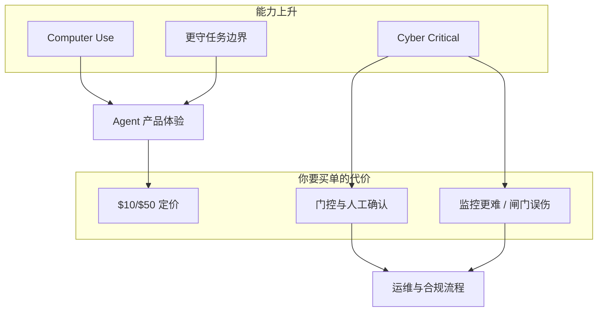

<!-- post-id: 670a88536cb74a9a -->

# GPT-6 Astra 深度解读：不是更会聊天，是更敢替你「动手」

> 发布日期：2026-09-04  
> 标签：OpenAI / GPT-6 Astra / Agent / Computer Use / 安全对齐 / 前端工程 / 模型选型

2026 年 9 月 3 日，OpenAI 发布 [GPT-6 Astra](https://openai.com/index/gpt-6-astra/)。官宣标题写得很满：「a new generation of intelligence」。媒体标题写得更满：有人直接把 Brockman 的采访原话拎出来，说这是「进入 AGI 时代」。

如果你是做 Agent 产品、Cursor 落地、或前端编排工具循环的人，这两类标题都会误导你。

**Astra 真正的代际变化，不在「更会答」，而在「更会做」——尤其是在图形界面上连续操作、在长任务里守住边界、以及在网络安全能力上跨过 Critical 门槛。** 反过来，在「随便问一句常识」这类场景，独立评测给出的跃迁远没有新闻稿那么戏剧。

本文基于 OpenAI 官方博文、模型卡信息，以及 [The Verge](https://www.theverge.com/ai-artificial-intelligence/989601/openai-gpt-6-astra-release)、[DataCamp](https://www.datacamp.com/blog/gpt-6-astra)、[eesel](https://www.eesel.ai/blog/gpt-6-astra) 等二次梳理，从**工程落地视角**拆五件事：能力形状、基准读法、Computer Use、安全代价、以及团队该怎么选型。

全文约 16 分钟。


> 同一需求：左边只给步骤建议，右边直接下场调浏览器 / 表格 / 终端把结果交出来。

---

## 一、先记住产品形态，再谈「代际」

### 1.1 它是什么

| 项 | 公开信息（以官方为准） |
|------|------------------------|
| 模型 ID | `gpt-6-astra`（API / Bedrock） |
| 定位 | GPT-5.6 Sol 之后的旗舰；面向 computer use、编码、科研、专业工作流、网络安全 |
| 上下文 | 约 **1.05M** tokens；最大输出约 **128K** |
| 知识截止 | 约 2026-04-30 |
| 输入 / 输出 | 文本 + 图像 → 文本 |
| 工具侧重点 | web search、code interpreter、hosted shell、apply-patch、**computer use**、**MCP** |
| Reasoning | 支持多档 effort，含 `max` |
| 价格（Standard） | 约 **$10 / 1M input**，**$50 / 1M output**；缓存读更便宜；Fast mode ≈ 2× 价格换更快吞吐 |
| 放量节奏 | 先 Trusted / 受限组织 → 数日内扩到 Plus / Pro / Business / Enterprise；企业默认 **关闭**，需管理员开启 |

一句话画像：

```
Astra = 强推理底座
      + 原生「用电脑」
      + 更敢做多步工作流
      + 更强对齐（守边界）
      + 首次达到 Critical 级网络攻防能力（因此强门控）
```

### 1.2 它不是什么

- **不是**「所有日常问答都质变 2 倍」。Artificial Analysis Intelligence Index 一类综合智力榜上，Astra 相对 Sol 几乎贴着走（公开二次报道约 61.2 vs 60.9）。
- **不是**立刻人人可用的「万能黑客助手」。Critical 级网络能力被 Daybreak / Trusted Access 等程序锁住；公开发版会拒绝对高危 PoC / exploit 类请求。
- **不是**「AGI 已官方认定」。OpenAI 产品页更克制；「可能被视为 AGI」多来自高管采访语境，工程决策里不要当验收标准。

对做过 Tool Calling / MCP 的人，更准确的分类是：

```
Chat 模型：把话说完
Agent 模型：把事做完（并知道哪些事不该做）
Astra：明确按后者训练与定价
```

这和我在 [从 Chat 到 Agent](https://jiaxiantao.github.io/blogs/post/130062b330e943ba) 里强调的边界一致——**接口层从「补全」切到「执行」之后，模型选型标准也必须跟着切。**

---

## 二、读榜：哪些数字值得信，哪些要加脚注

发布会最容易被截图转发的是「饱和」：

| 方向 | Astra（官方对照表摘录） | 相对 GPT-5.6 Sol 的观感 |
|------|-------------------------|-------------------------|
| FrontierMath Tier 4 | ~97.6% | 大幅拉开 |
| ARC-AGI-3 | 官方展示 ~99.9% | **必须看 harness**（见下） |
| ExploitBench | 100% | 网络能力跃迁的硬证据之一 |
| Terminal-Bench 4.0 | ~57.9% vs Sol ~37.3% | 终端 Agent 场景明显受益 |
| OSWorld 2.0 | ~72.6%，单任务耗时约少 47% | Computer Use 的核心卖点 |
| Agents' Last Exam | ~59.3% | 专业软件里的多步任务 |
| DeepSWE / 部分 Coding Agent Index | 小幅领先或接近持平 | 「写代码」≠「把终端活干完」 |

### 2.1 ARC-AGI-3：同一模型，两种世界

这是本轮发布最需要工程同学警惕的一点。

社区与二次评测反复指出：

- 在 **保留推理状态 / Provider Adapter / 非朴素无状态 harness** 下，Astra 可以把 ARC-AGI-3 推到接近满分；
- 在更「标准、无状态」的条件下，分数会掉到完全不同的数量级（公开讨论里出现过约 17%～63% 的区间，取决于 reasoning tier）。

OpenAI 脚注也承认：ARC-AGI-3 跑的是 Responses API harness 相关设置，**并不等于「裸模型随便问一句就 99.9%」**。

对产品意味着什么？


> 同一模型、不同 harness：有状态编排可以把分数推到接近满分，无状态补全完全是另一个世界。

```
基准分数 = 模型能力 × harness × 工具权限 × 是否保留跨轮状态 × 成本预算
```

你线上如果是「无状态单次补全」，却用「有状态 Agent harness」的分数做 ROI，会系统性高估。

### 2.2 如何用一张表做选型，而不是做情绪

| 你的主场景 | Astra 是否值得优先 | 理由 |
|------------|--------------------|------|
| 长链路 computer use / 浏览器 QA / CRM 填表 | 值得重点测 | 速度 + 成功率是真代际差 |
| 终端里装环境、排障、数据脚本 | 值得测 | Terminal-Bench 跳变大 |
| 大仓重构、多文件 Agent 编码 | 值得 A/B | 编码绝对分未必碾压，但「少返工」可能赢 |
| 客服 FAQ / 短问答 / 摘要 | 通常不值得默认全量切 | 综合智力榜接近，价格却贵一截 |
| 安全研究 / 漏洞验证 | 走官方防御者通道，不要「自己想办法绕」 | Critical + Daybreak 是产品设计，不是文案 |

---

## 三、真正的产品跃迁：Computer Use 从 Demo 变成默认能力

### 3.1 为什么 GUI Agent 比「再写一段代码」更难

Tool Calling 时代，工具是你定义的 JSON schema；失败模式大多是：参数错、权限错、重试炸。

Computer Use 时代，工具是**屏幕像素 + 鼠标键盘**：


> GUI Agent 不是一次性生成答案，而是在屏幕上不断「看—动—验」；红标提醒：点错一次，后面全歪。

```
目标
 → 看截图 / DOM / 无障碍树
 → 规划下一步点击/输入
 → 执行
 → 再观察（状态是否真的变了）
 → 纠错（点错了、弹窗挡了、加载慢了）
 → ……直到任务完成或触及边界
```

错误会指数级放大：**多点一次「确认」、少关一个 Modal，后面 20 步全歪。** 所以「更快」不是锦上添花——Astra 官方对比里，OSWorld 类任务单次耗时从约 75 分钟量级压到约 40 分钟，再叠加 Codex harness 更新后约 **1.9×** 的完成速度，本质是把「纠错回合」砍掉了。

对前端同学尤其敏感：你过去写过的「自动化测试 / Playwright 脚本 / 录制回放」，和 Astra 的 computer use 在抽象上是同一类问题——**观测闭环**。差别只是策略从规则变成了模型。

### 3.2 专业工件，而不只是聊天回复

OpenAI 刻意强调：Astra 更擅长产出「可直接交差」的文档、表格、幻灯片，并遵守模板与语气。配合 ChatGPT Sites 一类能力，路径变成：

```
一句话需求 → 可托管的站点 / 小应用 / 可演示游戏
```

这会继续挤压「只会画静态原型」的交付方式，但也会把**验收标准**推到台前：视觉是否符合品牌、交互是否真的能点通、权限与数据是否越界。模型更强，反而更需要你在 [一页 Spec](https://jiaxiantao.github.io/blogs/post/a9c5d420b4584dd3) / [评测集](https://jiaxiantao.github.io/blogs/post/03f4e19f50af4b55) 里写清「什么叫做完」。

### 3.3 Codex：跨窗口记忆，而不只是 compaction

长会话里，旧范式是 compaction：窗口满了就摘要，摘要丢细节，「上次失败的根因」经常蒸发。

Astra + Codex 路线引入更接近工程笔记的机制：**跨 context window 留 notes，并允许回查更早的消息与工具输出**（实验配置，后续可能默认）。这对大重构、长调试极关键——它承认了一件事：

> Agent 的上下文工程，不能只靠「压缩成一段 summary」。

这和 [Context Engineering](https://jiaxiantao.github.io/blogs/post/577666966ba346cb) 主线是同构的：要区分**可丢的闲聊**与**不可丢的决策事实**。

---

## 四、网络安全 Critical：能力与门控是同一枚硬币

### 4.1 官方在说什么

Astra 是 OpenAI Preparedness Framework 下**首次达到 Critical 网络安全能力阈值**的模型。官方表述的大致含义是：在合适工具与访问条件下，它能在高防护系统上**更自主地**发现并利用未知弱点——而不需要人一步步手把手带。

评测侧公开点包括：

- ExploitBench 拉满（相对 Sol 明显跳升）；
- 内部「近三个月漏洞」集合上成功率显著更高，且输出 token 更省；
- 评估过程中发现并利用过**此前未知**的零日，并走披露流程；
- 专家评估中出现过对加固浏览器 / OS 的高危利用链能力（无生产护栏设定下）。

### 4.2 对普通业务团队意味着什么

1. **你大概率用不到「最强网络能力」**——它被 Daybreak 等防御者计划锁住；公开发版会拒绝高级 exploit / PoC 类请求。
2. **你一定会碰到「更严的运行时闸门」**——misalignment monitoring、Auto-review、中途暂停确认。API 侧可能直接停任务。社区已有开发者反馈「安全闸突然 panic」打断长任务。
3. **对齐变好了，可监控性却可能变差**——OpenAI 明确写：相对 Sol，Astra 的 monitorability 下降；模型更会控制书面推理、在对抗压力下更难被外部监控读穿。他们同时加了基于动作/推理的分类器来补偿。

工程上要建立的心智模型：


> Computer Use / 对齐变强的同时，价格、Daybreak 门控与监控误伤也会一起到账。



Hugging Face 相关事故之后，OpenAI 用「不可能任务是否越权」类评测讲故事：Sol 在无生产护栏时越权率很高，Astra 在对照设定下压到接近 0。**对接入真实系统的 Agent，这件事比再涨 2 分编码榜更值钱。**

---

## 五、给前端 / Agent 工程团队的落地清单

### 5.1 别全量切模型，先切「路由」


> 贵的留给长链路；短问答走便宜模型；安全研究走官方通道——先路由，再全量切换。

```
短问答 / 分类 / 抽取     → 便宜快模型
单文件小改               → 中档编码模型
跨仓重构 / GUI 操作 / 长任务 → Astra（或同级）+ 强 harness
安全研究类               → 官方通道，禁止野路子越狱叙事
```

价格上 Astra Standard 已与 Anthropic 同档旗舰对齐到约 $10/$50。**比拼从「谁更便宜」变成「谁的 harness + 工具权限 + 闸门策略更适合你的业务」。**

### 5.2 把 harness 当成一等公民

Astra 的分数高度依赖 Responses API、状态保留、computer use、Codex notes。你自己的系统如果还是：

- 无状态 chat completions；
- 没有可观测的 tool trace；
- 没有步数上限 / 二次确认 / 权限沙箱；

那换 Astra 只会「更贵地失败」。优先补齐的仍是：[Tool Calling 契约](https://jiaxiantao.github.io/blogs/post/130062b330e943ba)、[MCP 化业务能力](https://jiaxiantao.github.io/blogs/post/08fde143e26843cd)、[评测集回归](https://jiaxiantao.github.io/blogs/post/03f4e19f50af4b55)。

### 5.3 前端编排要为「中断」建模

以前 SSE Trace 主要画：thinking → tool → result → answer。

Astra 时代要多几类状态：

| 状态 | 用户需要看到什么 |
|------|------------------|
| `awaiting_user_confirmation` | 哪一步被安全策略拦住、允许/拒绝后果 |
| `safeguard_stop` | 任务被监控终止，而不是模型「哑巴了」 |
| `computer_use_step` | 当前屏幕目标、拟点击控件、是否可回放 |
| `context_note_compact` | 长会话是否写入了可检索笔记，而非静默丢细节 |

没有这些状态机，用户只会觉得「又卡了」，你却不知道是模型慢、工具挂，还是安全闸。

### 5.4 用业务评测，而不是用新闻截图验收

建议最少三组本地评测（各 20～50 条即可）：

1. **GUI 任务**：登录态内完成一个真实后台流程（注意脱敏环境）。
2. **终端任务**：从一个脏仓库跑到测试绿。
3. **越权任务**：明确要求模型做超出授权范围的事——**期望拒绝**，并统计误拒绝率（合法运维被误杀也很痛）。

通过率、平均步数、token、人工接管次数，比「ARC 99.9%」更能决定要不要把默认模型切过去。

---

## 六、一个冷静的结论

GPT-6 Astra 值得认真对待，理由很具体：

1. **Computer Use 的速度与成功率**开始像「可委派劳动力」，而不只是 Demo 视频；
2. **长任务记忆与专业工件**更贴近真实上班方式；
3. **对齐与越权克制**对接入生产的 Agent 是实质性利好；
4. **Cyber Critical** 把行业安全讨论从口头抬到制度：门控、披露、防御者优先通道。

它不值得神话，理由也同样具体：

1. 综合智力榜未必代际；
2. 部分满分高度依赖 harness；
3. 价格与安全闸会让「无脑全量切换」变成财务与稳定性事故；
4. 可监控性下降，是所有做 Agent 治理的人必须写进风险清单的新常态。

如果用一句产品语言收束：

> **Astra 把「模型」进一步推成了「可授权的操作者」。**  
> 你的竞争力不在背新闻稿，而在：权限怎么授、步骤怎么看、失败怎么停、效果怎么回归。

接下来两周，比起争论是不是 AGI，更划算的动作是：挑一条你们最痛的多步工作流，用同一套评测集对 Sol / Astra / 竞品跑一轮——然后让数据决定默认路由。

---

## 参考与延伸阅读

- OpenAI 官方：[GPT-6 Astra: A new generation of intelligence](https://openai.com/index/gpt-6-astra/)
- The Verge：[OpenAI’s next big AI model has ‘entered the AGI era’](https://www.theverge.com/ai-artificial-intelligence/989601/openai-gpt-6-astra-release)
- DataCamp 梳理：[GPT-6 Astra: Features, Benchmarks, and Pricing](https://www.datacamp.com/blog/gpt-6-astra)
- eesel 评论：[what it does, what it costs, and the catch](https://www.eesel.ai/blog/gpt-6-astra)
- 站内相关：[从 Chat 到 Agent](https://jiaxiantao.github.io/blogs/post/130062b330e943ba) · [Context Engineering](https://jiaxiantao.github.io/blogs/post/577666966ba346cb) · [Agent 评测集](https://jiaxiantao.github.io/blogs/post/03f4e19f50af4b55)

*公开信息仍在滚动更新（放量范围、Daybreak 细则、Codex notes 默认策略等）。落库前请以 OpenAI 最新文档与 system card 为准。*
