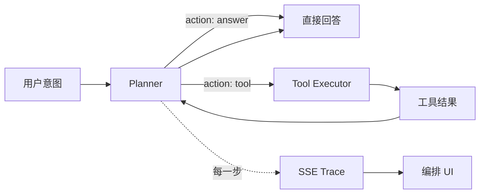
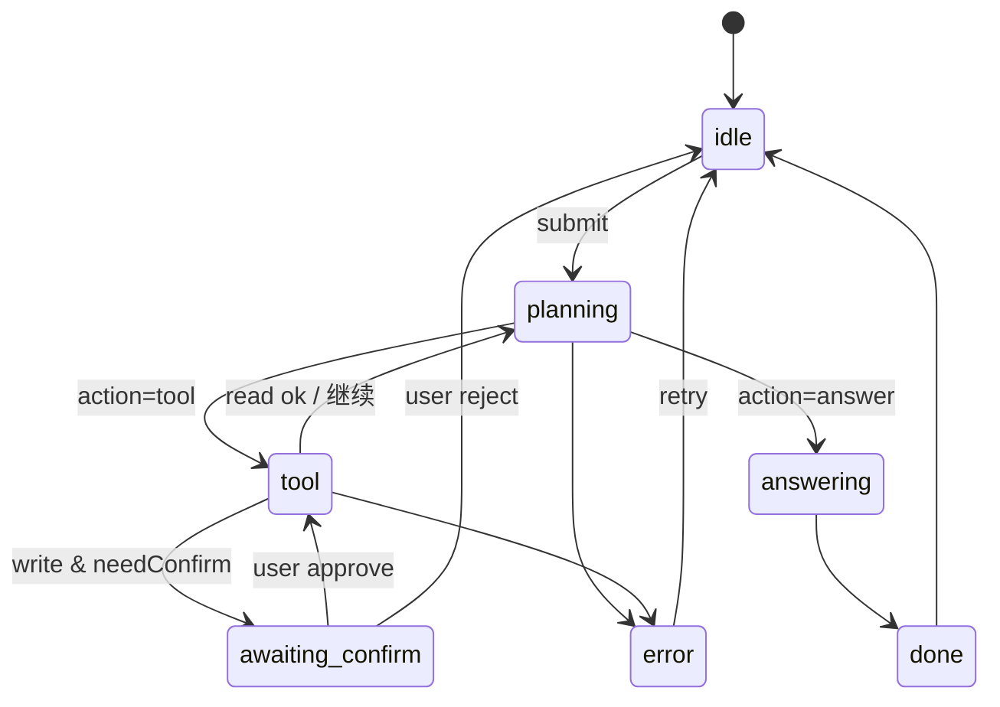

# 从 Chat 到 Agent：Tool Calling 全栈工程化实践

> 发布日期：2026-07-17  
> 标签：前端 / AI 全栈 / Agent / Tool Calling / SSE / Next.js / 工程实践

接上一个 Chat 对话框很容易；做出一个 **能调工具、能多步推理、能被用户看懂且可控** 的 Agent，难在工程，不在 Prompt。

我在 [Home Agent](https://github.com/jiaxiantao/home-agent) 里实现过最小可用的 **Plan → Tool → Answer** 循环，并在 [前端编排文](https://jiaxiantao.github.io/blogs/post/Next.js%E6%90%AD%E5%BB%BAAI-Agent%E5%89%8D%E7%AB%AF%E7%BC%96%E6%8E%92-%E4%BB%8EPlan%E5%88%B0SSE-Trace%E5%AE%8C%E6%95%B4%E5%AE%9E%E8%B7%B5) 里侧重讲了 SSE Trace 与 UI 状态机。那篇文章回答「前端怎么看见 Agent」；本文回答 **「Tool Calling 在全栈侧怎么做成可靠能力」**——工具契约、执行器、鉴权与超时、事件协议、前端消费、反模式与检查清单。

这是「前端转 AI 全栈」主线的第一篇：**把 Chat 补全升级成可工程化的 Agent 工具循环**。

---

## 一、先划清边界：Chat 补全 ≠ Agent

| 维度 | Chat / 补全 | Agent + Tool Calling |
|------|------------|----------------------|
| 输入输出 | 文本到文本 | 文本 ↔ 结构化工具调用 ↔ 文本 |
| 副作用 | 通常无（或仅检索上下文） | 可读写业务系统（查库、下单、发消息） |
| 失败形态 | 胡说、漏字段 | 胡说 + **误调工具、越权、重试炸库** |
| 用户信任 | 看最终答案 | 看 **中间步骤**（调了什么、结果是什么） |
| 工程重心 | Prompt、流式 UI | **契约、执行器、权限、观测、门控** |

一句话：

```
Chat 解决「说」；Agent 解决「做」。
Tool Calling 是「做」的接口层——必须按生产 API 标准设计，不能按聊天框标准设计。
```



---

## 二、全栈视角：Tool Calling 落在哪一层？

结合 [转型 Agent 工程师](https://juejin.cn/post/7656300675648585737) 的三层模型：

```
┌─────────────────────────────────────────┐
│  UI 层：对话、Trace、停止按钮、二次确认      │  ← 前端优势
├─────────────────────────────────────────┤
│  Agent 层：Plan、步数上限、记忆、重试策略    │  ← 全栈交界
├─────────────────────────────────────────┤
│  能力层：Tool / MCP / RAG / 业务 API      │  ← 本文重点下沉
└─────────────────────────────────────────┘
```

Home Agent 的数据流可以概括为：

```
用户输入
  → runAgentLoop（async generator）
  → planAgentStep（LLM 或规则回退）
  → executeAgentTool（能力层）
  → yield trace 事件
  → POST /api/agent SSE 推流
  → use-agent-sse Hook
  → 编排 UI
```

**前端转全栈，最短路径不是学微调，而是把 `executeAgentTool` 这一层做成真正的后端能力。**

---

## 三、工具契约：先设计接口，再写实现

### 3.1 四处必须一致

在 Home Agent 里，新增工具要同步四处（见 [add-a-tool.md](https://github.com/jiaxiantao/home-agent/blob/main/docs/add-a-tool.md)）：

| 位置 | 职责 |
|------|------|
| Planner Schema / System Prompt | 告诉模型有哪些工具、参数长什么样 |
| `tool-catalog.ts` | UI 工具目录与文档 |
| `tools.ts` | 真实执行逻辑 |
| 测试 / smoke | 保证 CI 不依赖外部 LLM 也能验循环 |

漏一处 = 模型调了不存在的工具，或 UI 展示与真实能力不一致。

### 3.2 契约字段清单

一个生产级 Tool 至少声明：

```ts
type ToolDefinition = {
  name: string;                    // 稳定 ID，如 search_notes
  description: string;             // 给模型看：何时该调
  inputSchema: ZodType;            // 参数校验（等同 JSON Schema）
  outputSchema?: ZodType;          // 可选：结构化输出
  sideEffect: 'none' | 'read' | 'write';
  idempotent: boolean;             // 重试是否安全
  requiredPermission?: string[];   // 如 notes:read / order:write
  timeoutMs: number;               // 硬超时
  retryPolicy?: {
    maxRetries: number;
    retryOn: Array<'timeout' | '5xx' | 'network'>;
  };
};
```

| 字段 | 为什么必须有 |
|------|-------------|
| `sideEffect` | 决定能否自动重试、是否需要人确认 |
| `idempotent` | 超时重试会不会重复下单 |
| `requiredPermission` | 防止「模型想调就能调」 |
| `timeoutMs` | 工具挂死不能拖垮整个 Agent 循环 |

### 3.3 用 Zod 当单一真相源

```ts
import { z } from 'zod';

export const SearchNotesArgs = z.object({
  query: z.string().min(1).max(200),
  limit: z.number().int().min(1).max(20).default(5),
});

export type SearchNotesArgs = z.infer<typeof SearchNotesArgs>;

// 执行前：校验模型传来的 args
function parseToolArgs<T>(schema: z.ZodType<T>, raw: unknown): T {
  const result = schema.safeParse(raw);
  if (!result.success) {
    throw new ToolValidationError(result.error.flatten());
  }
  return result.data;
}
```

**模型输出不可信**：Planner 返回的 JSON 必须 Zod 校验；校验失败应回退规则规划或要求模型重试，而不是直接 `eval` 或裸调 API。

### 3.4 description 怎么写才够 Agent 用

差的 description：

```text
搜索笔记
```

好的 description：

```text
在知识库中按关键词检索笔记。适用于用户询问产品架构、历史决策、内部文档内容时。
不要用于计算或查询当前时间。参数 query 使用用户原话中的关键词，limit 默认 5。
```

写 description 的原则：**何时用、何时不用、参数怎么填**——和写组件 Props 文档同一纪律。

---

## 四、执行器：把「调工具」当成后端 RPC

### 4.1 最小执行壳

```ts
type ToolResult =
  | { ok: true; output: string; meta?: Record<string, unknown> }
  | { ok: false; errorCode: string; message: string; retryable: boolean };

async function executeAgentTool(
  name: string,
  rawArgs: unknown,
  ctx: ToolContext, // userId, permissions, signal, requestId
): Promise<ToolResult> {
  const def = registry.get(name);
  if (!def) {
    return { ok: false, errorCode: 'TOOL_NOT_FOUND', message: `Unknown tool: ${name}`, retryable: false };
  }

  if (!authorize(ctx, def.requiredPermission)) {
    return { ok: false, errorCode: 'FORBIDDEN', message: 'Permission denied', retryable: false };
  }

  const args = parseToolArgs(def.inputSchema, rawArgs);

  try {
    const output = await withTimeout(
      () => def.handler(args, ctx),
      def.timeoutMs,
      ctx.signal,
    );
    return { ok: true, output: stringifySafe(output) };
  } catch (err) {
    return normalizeToolError(err, def);
  }
}
```

### 4.2 超时、取消、重试

| 机制 | 建议 | 说明 |
|------|------|------|
| **超时** | 读类 3～10s，写类 5～30s | 超时必须返回可观测错误，不能无限挂起 |
| **AbortSignal** | 贯穿 Planner → Executor → fetch | 前端点「停止」立刻中断 |
| **重试** | 仅 `idempotent && retryable` | 写操作默认 **不自动重试** |
| **步数上限** | `AGENT_MAX_STEPS`（如 4～12） | 防无限 Plan↔Tool 循环 |

Home Agent 里已有：

- `AbortSignal`：请求中断立刻抛出
- `AGENT_MAX_STEPS`：步数耗尽时基于已有结果合成答案，而非硬崩
- `step_metric`：记录 `planMs` / `toolMs` / `totalMs`

这些是「能 demo」和「能上线」之间的地基。

### 4.3 超时实现示意

```ts
async function withTimeout<T>(
  fn: () => Promise<T>,
  ms: number,
  signal?: AbortSignal,
): Promise<T> {
  const controller = new AbortController();
  const onAbort = () => controller.abort();
  signal?.addEventListener('abort', onAbort);

  const timer = setTimeout(() => controller.abort(), ms);
  try {
    return await Promise.race([
      fn(),
      new Promise<T>((_, reject) => {
        controller.signal.addEventListener('abort', () => {
          reject(new ToolTimeoutError(ms));
        });
      }),
    ]);
  } finally {
    clearTimeout(timer);
    signal?.removeEventListener('abort', onAbort);
  }
}
```

### 4.4 沙箱：哪些工具不能「直接 eval」

Home Agent 的 `calculate` 用 **安全表达式求值**，而不是 `eval(userInput)`。扩展原则：

| 工具类型 | 安全策略 |
|---------|---------|
| 数学 / 表达式 | 白名单 AST / 受限解析器 |
| Shell / 代码执行 | 默认禁止；隔离容器 + 资源配额 |
| HTTP 出站 | URL 白名单、禁止内网 SSRF |
| SQL | 参数化查询，禁止拼接 |
| 文件读写 | 限定目录 + 大小限制 |

**Tool Calling 最危险的瞬间，是把模型输出直接当命令执行。**

---

## 五、鉴权与副作用：模型没有权限，用户才有

### 5.1 权限模型

```ts
type ToolContext = {
  userId: string;
  roles: string[];
  permissions: Set<string>;
  requestId: string;
  signal?: AbortSignal;
};

function authorize(ctx: ToolContext, required?: string[]) {
  if (!required?.length) return true;
  return required.every((p) => ctx.permissions.has(p));
}
```

| 规则 | 说明 |
|------|------|
| 工具权限 ⊆ 用户权限 | Agent 不能比登录用户更大 |
| 写操作默认需确认 | `sideEffect: 'write'` → UI 二次确认或审批 |
| 审计日志 | `requestId + userId + tool + args摘要 + result` |

### 5.2 副作用分级与产品策略

| sideEffect | 自动执行？ | 示例 |
|------------|----------|------|
| `none` | 是 | `current_time` |
| `read` | 是（可记审计） | `search_notes`、查订单 |
| `write` | **默认否，等人确认** | 退款、发邮件、改配置 |

前端在 Trace 里看到 `tool_call` 且 `sideEffect=write` 时，应进入 `awaiting_confirm` 阶段，而不是直接执行——这是人机协同的核心（后续编排进阶文会展开）。

### 5.3 参数脱敏

SSE 推给前端的 `tool_call.args` **不要原样带密钥**：

```ts
function redactArgs(tool: string, args: Record<string, unknown>) {
  const clone = { ...args };
  for (const key of ['password', 'token', 'apiKey', 'authorization']) {
    if (key in clone) clone[key] = '***';
  }
  return clone;
}
```

Trace 是给用户和调试看的，不是给攻击者的日志出口。

---

## 六、SSE 事件协议：前后端的契约

Home Agent 使用 `Content-Type: text/event-stream`，事件块形如：

```text
data: {"type":"plan","plan":{"action":"tool","tool":"search_notes",...}}

data: {"type":"tool_call","tool":"search_notes","args":{"query":"架构"}}

data: {"type":"tool_result","tool":"search_notes","output":"..."}

data: {"type":"answer","text":"..."}

data: {"type":"done","steps":2,"toolCalls":1,"totalMs":840}
```

### 6.1 推荐事件集（可直接扩展）

| type | 含义 | 前端动作 |
|------|------|---------|
| `plan` | 本步决策 | 更新 phase=planning，展示 reasoning |
| `tool_call` | 即将执行 | phase=tool，展示参数（已脱敏） |
| `tool_result` | 工具返回 | 追加 Trace 行 |
| `tool_error` | 工具失败 | 标红；决定是否重试或改答 |
| `step_metric` | 耗时埋点 | 调试面板 / 成本分析 |
| `answer` | 最终回答 | phase=answering |
| `done` | 结束 | phase=done，开放输入 |
| `error` | 循环级失败 | phase=error |

协议细节见仓库 [sse-protocol.md](https://github.com/jiaxiantao/home-agent/blob/main/docs/sse-protocol.md)。

### 6.2 为什么用 Async Generator？

```ts
export async function* runAgentLoop(message: string, options: { signal?: AbortSignal } = {}) {
  while (steps < maxSteps) {
    const { plan } = await planAgentStep(message, prior);
    yield { type: 'plan', plan };

    if (plan.action === 'answer') {
      yield { type: 'answer', text: plan.answer };
      yield { type: 'done', steps, toolCalls, totalMs };
      return;
    }

    yield { type: 'tool_call', tool: plan.tool, args: redactArgs(plan.tool, plan.args) };
    const result = await executeAgentTool(plan.tool, plan.args, ctx);
    yield result.ok
      ? { type: 'tool_result', tool: plan.tool, output: result.output }
      : { type: 'tool_error', tool: plan.tool, ...result };
  }
}
```

**每推进一步就 yield**，前端才能实时更新；比「跑完再返回大 JSON」更符合 Agent 产品体验。

### 6.3 API 层桥接 Web Streams

```ts
// 伪代码：/api/agent
const stream = new ReadableStream({
  async start(controller) {
    for await (const event of runAgentLoop(message, { signal })) {
      controller.enqueue(encodeSse(event));
    }
    controller.close();
  },
  cancel() {
    abortController.abort();
  },
});

return new Response(stream, {
  headers: {
    'Content-Type': 'text/event-stream',
    'Cache-Control': 'no-cache',
    Connection: 'keep-alive',
  },
});
```

前后端共用 `sse.ts` 编解码，避免协议漂移——这是全栈小仓库的典型好处。

---

## 七、前端消费：状态机比「拼字符串」重要

### 7.1 phase 状态机

| phase | 含义 | UI |
|-------|------|-----|
| `idle` | 可输入 | 输入框启用 |
| `planning` | 规划中 | Trace 显示「思考中」 |
| `tool` | 调工具 | 展示 tool 名与参数 |
| `awaiting_confirm` | 等人批（写操作） | 确认 / 取消按钮 |
| `answering` | 生成答案 | 流式或整段展示 |
| `done` | 完成 | 汇总 steps / ms |
| `error` | 失败 | 可重试 |



### 7.2 Hook 职责边界

`use-agent-sse` 一类 Hook 应集中做：

1. `fetch` + `ReadableStream` 按 `\n\n` 分块
2. 解析 `data:` JSON → 类型守卫
3. 映射为 Trace 行（人类可读）
4. 维护 `phase` / `abort`
5. **不**在 Hook 里直接调业务 API——业务只走 Agent

UI 组件只消费：`traces`、`phase`、`answer`、`onStop`、`onConfirm`。

### 7.3 Trace 文案示例

| 事件 | 展示 |
|------|------|
| plan → tool | `调用 search_notes · 问题涉及知识库，先检索笔记` |
| tool_call | `→ search_notes({"query":"架构","limit":5})` |
| tool_result | `← 命中 3 条笔记` |
| tool_error | `✕ FORBIDDEN · 无 notes:read 权限` |
| done | `完成 · 2 步 · 840ms` |

用户信任来自 **可见的中间过程**，不是更长的最终答案。

---

## 八、Planner：LLM 与规则双轨

生产环境 LLM 会挂、会超时、会输出非法 JSON。Home Agent 的做法：

| 轨道 | 场景 |
|------|------|
| LLM Planner | 正常语义理解，输出 `{ action, tool, args }` 或 `{ action, answer }` |
| 规则 Planner | `LLM_DISABLED=1`、CI、离线、Zod 校验失败回退 |

```ts
// 规则示例（简化）
if (wantsSearch && !hasTool('search_notes')) {
  return {
    action: 'tool',
    tool: 'search_notes',
    args: { query: extractKeywords(message) },
    reasoning: '规则命中：笔记检索',
  };
}
```

**CI 里关 LLM、用规则跑通「循环 → SSE → UI」**，比「PR 里真调 GPT」更稳——全栈工程要的是可回归，不是每次都烧 Token。

---

## 九、三个真实反模式（以及怎么改）

### 反模式 1：把私钥塞进 Prompt / 工具参数

**现象**：System Prompt 写 `API_KEY=sk-...`，或让模型「生成带 Key 的 curl」。  
**后果**：Trace、日志、浏览器 Network 全泄露。  
**改法**：密钥只在服务端环境变量；工具内部读 `process.env`；SSE 只推脱敏后的结果。

### 反模式 2：无权限、无超时的「万能 execute」

**现象**：`execute(toolName, args)` 直接 `handlers[toolName](args)`。  
**后果**：越权读库、慢查询拖垮进程、SSRF。  
**改法**：注册表 + Zod + authorize + timeout + sideEffect 分级。

### 反模式 3：写操作静默自动重试

**现象**：超时后自动再调一次 `create_order`。  
**后果**：重复下单。  
**改法**：`idempotent: false` 的工具禁止自动重试；写操作用幂等键（`Idempotency-Key`）或等人确认。

### 反模式 4（加赠）：前端自己拼工具结果当答案

**现象**：看到 `tool_result` 后，前端字符串拼接展示，绕过 Agent 总结。  
**后果**：多工具场景逻辑分叉、无法统一引用与拒答。  
**改法**：展示 Trace 可以本地渲染；**最终 answer 仍由 Agent 产出**（或明确的模板策略）。

---

## 十、与 MCP / RAG 的边界（预告下一篇）

| 能力 | 放在 Tool Calling 里？ | 何时升级 |
|------|----------------------|---------|
| 项目内 3～10 个固定工具 | ✅ `tools.ts` 注册表 | — |
| 跨 IDE / 跨产品复用工具 | 升级为 **MCP Server** | 下一篇 B |
| 大规模文档问答 | Tool 内调检索，或独立 RAG 管道 | 下一篇 C |
| Figma / 语雀 / GitLab | 用现成 MCP，或自建 MCP 封装 | [MCP 工作流](https://juejin.cn/post/7657074612481261603) |

今天把 **进程内 Tool 执行器** 做对，明天才能把同一套契约搬到 MCP（资源、权限、传输层换皮，语义不变）。

---

## 十一、最小落地路线图（按一周拆）

| 天 | 目标 | 验收 |
|----|------|------|
| D1 | 定义 1 个读工具的完整契约（Zod + catalog + handler） | 单测校验 args |
| D2 | 执行器加 timeout + AbortSignal | 卡住能停 |
| D3 | 错误码规范化（VALIDATION / FORBIDDEN / TIMEOUT） | Trace 可见 |
| D4 | SSE 增加 `tool_error` + 前端 phase | UI 标红可恢复 |
| D5 | 写操作旁路：`awaiting_confirm` 骨架 | 点确认才执行 |
| D6 | `LLM_DISABLED` 规则回退 + smoke | CI 绿灯 |
| D7 | 审计日志（requestId）+ 脱敏 | 日志无密钥 |

可直接在 [Home Agent](https://github.com/jiaxiantao/home-agent) 上迭代，不必新开空仓库。

---

## 十二、检查清单（可贴进 PR）

### 契约

- [ ] name / description / inputSchema 三处一致
- [ ] 声明 `sideEffect` 与 `idempotent`
- [ ] 有 `timeoutMs` 与权限声明

### 执行

- [ ] 入参 Zod `safeParse`，失败不执行
- [ ] `authorize` 通过才执行
- [ ] 支持 `AbortSignal`
- [ ] 错误返回稳定 `errorCode`，不甩原始堆栈给前端

### 协议与 UI

- [ ] SSE 事件类型有类型守卫
- [ ] args 脱敏后再推流
- [ ] 前端有 `phase` 状态机与停止按钮
- [ ] 写操作有确认路径（或明确标注「仅演示」）

### 质量

- [ ] 无 LLM 也能跑通规则 Planner + 工具
- [ ] smoke / 单测覆盖校验与超时
- [ ] 步数上限与耗尽兜底

---

## 十三、行动清单：今天就可以做的三件事

1. **打开** Home Agent 的 `tools.ts`，给每个工具补上 `sideEffect` / `timeoutMs` 元数据（哪怕先写死在注释与类型里）。  
2. **给** `executeAgentTool` 加一层 Zod + 伪 `authorize`（本地用固定 permissions 即可）。  
3. **在** Trace UI 区分 `tool_result` 与失败态——先把「失败可见」做出来，再谈智能重试。

---

## 结语

从前端走到 AI 全栈，Tool Calling 是最短的一座桥：

- 你已有的 **类型、异步、SSE、状态机** 全部用得上；
- 你要补的是 **契约、权限、超时、幂等、审计**——标准后端肌肉；
- 你要守住的是 **人机门控与可观测 Trace**——标准产品肌肉。

Chat 让模型「会说」；工程化的 Tool Calling 让系统「能做且敢做」。把这一层做扎实，后面的 MCP Server、RAG、评测与成本优化，都只是同一套纪律的扩展。

下一篇预告：**自己写一个 MCP Server，把今天的 Tool 契约搬到可跨客户端复用的能力层**。

---

## 系列延伸阅读

- [用 Next.js 搭建 AI Agent 前端编排：从 Plan 到 SSE Trace](https://jiaxiantao.github.io/blogs/post/Next.js%E6%90%AD%E5%BB%BAAI-Agent%E5%89%8D%E7%AB%AF%E7%BC%96%E6%8E%92-%E4%BB%8EPlan%E5%88%B0SSE-Trace%E5%AE%8C%E6%95%B4%E5%AE%9E%E8%B7%B5) — UI 与协议基础篇（代码：[home-agent](https://github.com/jiaxiantao/home-agent)）  
- [前端工程师如何转型 AI Agent 工程师](https://juejin.cn/post/7656300675648585737) — 能力地图与路径  
- [用 MCP 把 Figma、语雀、GitLab 串成一条前端工作流](https://juejin.cn/post/7657074612481261603) — 消费 MCP；本文是造工具的前奏  
- [AI 生成代码之后，前端 Code Review 审什么？](https://juejin.cn/post/7657475917389447194) — Agent 产出也要人审  
- [当 AI 来敲门：前端工程师如何打造不可替代的竞争力](https://juejin.cn/post/7656751882112630811) — 判断力与责任门  

---

## 参考

| 资源 | 说明 |
|------|------|
| [OpenAI Function calling](https://platform.openai.com/docs/guides/function-calling) | 结构化工具调用 |
| [Anthropic Tool use](https://docs.anthropic.com/en/docs/build-with-claude/tool-use) | 另一厂商对照 |
| [ReAct 论文](https://arxiv.org/abs/2210.03629) | 推理 + 行动循环 |
| [MDN SSE](https://developer.mozilla.org/en-US/docs/Web/API/Server-sent_events) | 流式事件标准 |
| Home Agent SSE / Tool 文档 | 仓库 `docs/` |

---

*本文基于 [Home Agent](https://github.com/jiaxiantao/home-agent) 实践整理，作为「前端 → AI 全栈」系列开篇。*
