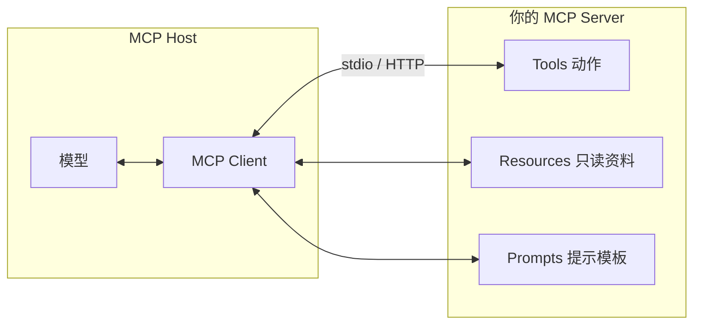
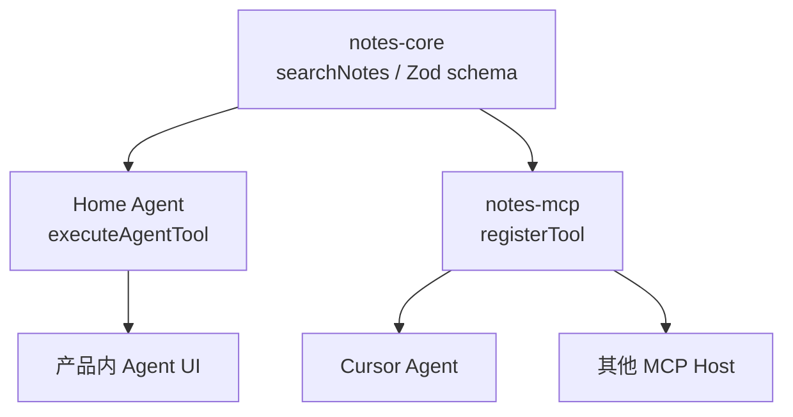

# 从 Tool Calling 到 MCP Server：把业务能力做成 Agent 可复用接口

> 发布日期：2026-07-21  
> 标签：前端 / AI 全栈 / MCP / Tool Calling / TypeScript / Agent / 工程实践

在 [MCP 工作流文](https://juejin.cn/post/7657074612481261603) 里，我讲的是 **怎么用** Figma、语雀、GitLab 的 MCP——消费方视角。在 [Tool Calling 全栈文](https://jiaxiantao.github.io/blogs/post/%E4%BB%8EChat%E5%88%B0Agent-Tool-Calling%E5%85%A8%E6%A0%88%E5%B7%A5%E7%A8%8B%E5%8C%96%E5%AE%9E%E8%B7%B5) 里，我讲的是进程内工具契约与执行器——Home Agent 的 `tools.ts`。

下一问几乎必然出现：

> 「团队自己的组件文档、订单查询、内部知识库，能不能也变成 Agent 随手可调的能力？而且 Cursor、自家产品、CI 都能复用？」

答案就是 **自己写 MCP Server**：把同一套工具契约，从「某个 Next.js 进程里的函数」，升级成 **任何 MCP Host 都能连接的标准能力层**。

这是「前端 → AI 全栈」主线的第二篇。

---

## 一、为什么进程内 Tool 不够用？

| 场景 | 进程内 `tools.ts` | MCP Server |
|------|-------------------|------------|
| 仅 Home Agent 使用 | ✅ 简单直接 | 过重 |
| Cursor / VS Code / Claude 也要调 | ❌ 要复制粘贴逻辑 | ✅ 配一次 `mcp.json` |
| 多个产品共用同一套「查订单」 | ❌ 各仓库拷一份 | ✅ 一处实现，多处消费 |
| 权限与审计要统一 | 难跨进程 | Server 侧集中治理 |
| 与第三方能力并列 | 两套心智 | 统一成 MCP 工具列表 |

```
Tool Calling（进程内）     MCP Server（进程外 / 可远程）
┌─────────────────┐        ┌──────────────────────────┐
│ Home Agent      │        │ Cursor / 自家 Agent / CI │
│ executeAgentTool│   →    │   MCP Host（Client）      │
│ tools.ts        │        │          ↕                │
└─────────────────┘        │   你的 MCP Server         │
                           │   tools / resources       │
                           └──────────────────────────┘
```

**升级信号**：当第二位消费者出现（另一个 IDE、另一个服务），就该把工具抽成 MCP，而不是再拷一份 handler。

---

## 二、先换身份：从 MCP 消费者到提供者

[MCP 工作流](https://juejin.cn/post/7657074612481261603) 里你是 **Host 侧配置者**：

```json
// .cursor/mcp.json（消费别人的 Server）
{
  "mcpServers": {
    "figma": { "command": "...", "args": [] }
  }
}
```

今天你要当 **Server 实现者**：



对前端工程师最友好的心智模型：

```
MCP Server ≈ 给 Agent 用的「微型后端」
Tools     ≈ 带 Schema 的 API 路由
Resources ≈ 只读的静态/半静态文档接口
Prompts   ≈ 可复用的 Prompt 片段（可选）
```

---

## 三、三原语：什么时候用 Tool / Resource / Prompt？

| 原语 | 本质 | 典型例子 | 是否有副作用 |
|------|------|---------|-------------|
| **Tools** | 可调用动作 | `search_notes`、`get_order`、`create_issue` | 可能有 |
| **Resources** | 可读取的资料（URI） | `notes://list`、组件 API 文档、设计 Token JSON | 只读 |
| **Prompts** | 可注入的提示模板 | 「按团队规范做 Code Review」 | 无（模板） |

### 选型口诀

- **要「做一件事」** → Tool  
- **要「读一份东西」且内容相对稳定** → Resource（再让模型决定何时读）  
- **要「用同一套话术约束行为」** → Prompt  

常见错误：把整本语雀文档塞进 Tool 返回值，导致 Token 爆炸——应先 Resource / 搜索 Tool 返回摘要，再按需拉取详情。

---

## 四、契约映射：Home Agent Tool → MCP Tool

[Tool Calling 文](https://jiaxiantao.github.io/blogs/post/%E4%BB%8EChat%E5%88%B0Agent-Tool-Calling%E5%85%A8%E6%A0%88%E5%B7%A5%E7%A8%8B%E5%8C%96%E5%AE%9E%E8%B7%B5) 里的字段，几乎可以 **一对一搬到 MCP**：

| Tool Calling 字段 | MCP 对应 | 说明 |
|------------------|---------|------|
| `name` | tool name | 稳定 ID，如 `search_notes` |
| `description` | tool description | 写清何时用、何时不用 |
| `inputSchema` (Zod) | `inputSchema` | SDK 用 Standard Schema（如 Zod）校验 |
| `sideEffect` / 幂等 | tool **annotations** | `readOnlyHint` / `destructiveHint` / `idempotentHint` |
| `timeoutMs` | Server 内 `withTimeout` | 协议不替你做，要自己包 |
| `requiredPermission` | Server 鉴权 / env Token | Host 不同，鉴权落在 Server |

**关键认知**：MCP 换的是 **传输与发现**；契约纪律不变——Zod、超时、权限、脱敏，一个都不能少。

---

## 五、最小可运行 Server（TypeScript）

以下示例面向 **本地 stdio**（Cursor / Claude Desktop 最常见）。SDK 在 2026 年进入 v2（包名拆成 `@modelcontextprotocol/server` 等），API 仍是「注册工具 + 挂传输」。以 [官方 Server Guide](https://ts.sdk.modelcontextprotocol.io/v2/documents/Documents.Server_Guide.html) 为准；下面用当前推荐的 `serveStdio` 工厂写法。

### 5.1 依赖与目录

```bash
mkdir notes-mcp && cd notes-mcp
pnpm init
pnpm add @modelcontextprotocol/server zod
pnpm add -D typescript tsx @types/node
```

```text
notes-mcp/
├── package.json
├── tsconfig.json
├── src/
│   ├── index.ts          # Server 入口
│   ├── tools/
│   │   └── search-notes.ts
│   └── lib/
│       ├── timeout.ts
│       └── notes-store.ts
└── README.md
```

### 5.2 入口：注册工具并 stdio 服务

```ts
// src/index.ts
import { McpServer } from '@modelcontextprotocol/server';
import { serveStdio } from '@modelcontextprotocol/server/stdio';
import * as z from 'zod/v4';
import { searchNotes } from './tools/search-notes.js';

serveStdio(() => {
  const server = new McpServer(
    { name: 'notes-mcp', version: '1.0.0' },
    {
      instructions:
        '先用 search_notes 检索，再基于命中摘要回答。不要编造未检索到的笔记内容。',
    },
  );

  server.registerTool(
    'search_notes',
    {
      title: '搜索笔记',
      description:
        '在知识库中按关键词检索笔记。适用于架构、决策、内部文档问答。不要用于计算或查时间。',
      inputSchema: z.object({
        query: z.string().min(1).max(200).describe('检索关键词'),
        limit: z.number().int().min(1).max(20).default(5),
      }),
      annotations: {
        readOnlyHint: true,
        idempotentHint: true,
        openWorldHint: false,
      },
    },
    async ({ query, limit }) => {
      const hits = await searchNotes(query, limit);
      const text = hits.length
        ? hits.map((h, i) => `${i + 1}. ${h.title}\n${h.snippet}`).join('\n\n')
        : '未命中任何笔记。';
      return { content: [{ type: 'text', text }] };
    },
  );

  return server;
});
```

### 5.3 执行层：复用 Tool Calling 纪律

```ts
// src/lib/timeout.ts
export async function withTimeout<T>(fn: () => Promise<T>, ms: number): Promise<T> {
  let timer: NodeJS.Timeout;
  try {
    return await Promise.race([
      fn(),
      new Promise<T>((_, reject) => {
        timer = setTimeout(() => reject(new Error(`TIMEOUT ${ms}ms`)), ms);
      }),
    ]);
  } finally {
    clearTimeout(timer!);
  }
}
```

```ts
// src/tools/search-notes.ts
import { withTimeout } from '../lib/timeout.js';
import { queryNotes } from '../lib/notes-store.js';

export async function searchNotes(query: string, limit: number) {
  // 密钥、DB URL 只读 process.env，绝不进模型上下文
  return withTimeout(() => queryNotes(query, limit), 8_000);
}
```

`queryNotes` 可以是 PostgreSQL + `pg_trgm`（与 [Home Agent](https://github.com/jiaxiantao/home-agent) 同源），也可以先用内存数组做学习版。

### 5.4 package.json scripts

```json
{
  "type": "module",
  "bin": { "notes-mcp": "./dist/index.js" },
  "scripts": {
    "dev": "tsx src/index.ts",
    "build": "tsc",
    "start": "node dist/index.js"
  }
}
```

---

## 六、挂到 Cursor：从「能跑」到「能用」

### 6.1 `mcp.json` 配置

```json
{
  "mcpServers": {
    "notes": {
      "command": "pnpm",
      "args": ["--dir", "/absolute/path/to/notes-mcp", "exec", "tsx", "src/index.ts"],
      "env": {
        "NOTES_DATABASE_URL": "${env:NOTES_DATABASE_URL}"
      }
    }
  }
}
```

| 要点 | 说明 |
|------|------|
| 绝对路径 | 相对路径容易因 CWD 不同启动失败 |
| 密钥走 env | 不要写进仓库里的 `mcp.json` 明文 |
| 团队分发 | 仓库提交 `mcp.json.example`，真 Token 本地覆盖 |

### 6.2 验收话术

在 Cursor Agent 里试：

```
用 notes MCP 的 search_notes 搜索「Agent 循环」，总结命中内容，并注明来源标题。
```

期望：Tools 面板出现 `search_notes`，参数有 `query`，返回摘要而非空话。

### 6.3 调试手段

| 手段 | 用途 |
|------|------|
| MCP Inspector | 不经过模型，直接点选调工具 |
| Server 日志打 stderr | **不要打 stdout**——stdio 协议占用 stdout |
| 先单测 `searchNotes` | 协议通之前保证业务逻辑正确 |

```ts
// ❌ 会破坏 stdio 协议
console.log('server started');

// ✅
console.error('server started');
```

---

## 七、加 Resource：让 Agent「按需读文档」

Tools 适合「搜一下」；Resources 适合「这份清单/规范一直在那儿」。

```ts
server.registerResource(
  'notes-index',
  'notes://index',
  {
    description: '笔记库目录（标题列表）',
    mimeType: 'application/json',
  },
  async (uri) => ({
    contents: [
      {
        uri: uri.href,
        mimeType: 'application/json',
        text: JSON.stringify(await listNoteTitles(), null, 2),
      },
    ],
  }),
);
```

| 模式 | 流程 |
|------|------|
| 只 Tool | 模型每次猜要不要搜 |
| Tool + Resource | 先读 `notes://index` 缩小范围，再 `search_notes` |
| 大文档 | Tool 返回 `resource_link`，客户端再按需 fetch（避免一次塞爆上下文） |

这与 MCP 消费文里「不要一次拉整份 Figma」是同一纪律：**按需、可寻址、可截断**。

---

## 八、传输层：stdio vs Streamable HTTP

| 传输 | 适用 | 部署 |
|------|------|------|
| **stdio** | 本机 IDE、桌面 Host 拉起子进程 | `command` + `args` |
| **Streamable HTTP** | 团队远程共享、多用户、网关后 | `createMcpHandler` + 反向代理 |

本地学习、个人 Cursor：**先 stdio**。  
要给全组用、要走 SSO / 审计：**再上 HTTP**，并加：

- Bearer / OAuth（官方 Express 适配有现成钩子）
- 网关限流与 DNS rebinding 防护
- 日志与 `requestId` 追踪

2026 协议演进（如 `2026-07-28` RC）在 HTTP 路径上更强调 **无状态 per-request**——远程部署时优先跟官方 `createMcpHandler`，避免自己手搓会话粘滞。细节以 [MCP 规范](https://modelcontextprotocol.io) 与 [TS SDK v2](https://ts.sdk.modelcontextprotocol.io/v2/) 为准。

---

## 九、安全红线：Server 是新的攻击面

把能力暴露给模型，等于把 **半自动脚本** 接到了业务系统上。

### 9.1 必做清单

| 项 | 做法 |
|----|------|
| 密钥 | 仅环境变量；禁止进入 Tool 返回值与日志明文 |
| 入参 | Zod 严格校验；拒绝多余字段 |
| 出站 HTTP | URL 白名单，防 SSRF 打内网 |
| 写操作 | `destructiveHint: true`；敏感写配合 Host 确认或 Server 侧审批 |
| 权限 | Token 最小化（只读笔记 Token ≠ 管理员） |
| 超时 | 每个 Tool 硬超时 |
| 审计 | `tool + args摘要 + user/token 指纹 + latency` |

### 9.2 危险示例（反面）

```ts
// ❌ 任意 URL fetch —— SSRF 重灾区
server.registerTool('fetch_url', { ... }, async ({ url }) => {
  const res = await fetch(url);
  return { content: [{ type: 'text', text: await res.text() }] };
});
```

```ts
// ✅ 仅允许文档站域名
const ALLOWED = new Set(['docs.company.com', 'yuque.company.com']);
```

### 9.3 与 `.cursorignore` 的关系

MCP Server 跑在 **独立进程**，不受编辑器 `.cursorignore` 直接约束。敏感文件保护要在 **Server 读文件的白名单** 里做，不能假设「Cursor 忽略了就安全」。

---

## 十、架构进阶：一份实现，两处消费

目标形态：



```ts
// packages/notes-core/src/search-notes.ts  —— 单一实现
export const SearchNotesArgs = z.object({ ... });
export async function searchNotes(args: SearchNotesArgs) { ... }

// apps/home-agent  —— 进程内调用
case 'search_notes':
  return searchNotes(SearchNotesArgs.parse(raw));

// apps/notes-mcp   —— MCP 包装
server.registerTool('search_notes', { inputSchema: SearchNotesArgs, ... }, async (args) => {
  const hits = await searchNotes(args);
  return { content: [{ type: 'text', text: formatHits(hits) }] };
});
```

**全栈基本功**：业务逻辑进 core；MCP / HTTP / Agent 都只是 adapter。这和前端「hooks 进 package，页面只组装」是同一套路。

---

## 十一、从「学习 Server」到「团队 Server」的演进

| 阶段 | 交付物 | 验收 |
|------|--------|------|
| P0 | 1 个只读 Tool + stdio | Cursor 能调通 |
| P1 | Resource 目录 + 超时/日志 | Inspector 可浏览 |
| P2 | monorepo core 复用 | Home Agent 与 MCP 同测通过 |
| P3 | HTTP + 鉴权 + 限流 | 同事用远程 endpoint |
| P4 | 写操作 + 确认流 | 破坏性注解 + 审计完备 |

建议第一周只做 **P0～P1**：读多写少，先建立「可发现、可调用、可观测」。

---

## 十二、踩坑速查

| 现象 | 原因 | 对策 |
|------|------|------|
| Cursor 里看不到工具 | 进程起失败 / 路径错 | 看 MCP 日志；改用绝对路径 |
| 工具列表空 | capabilities 未声明 / 注册失败 | 确认 `registerTool` 在 connect 前执行 |
| 随机 JSON 解析错 | `console.log` 污染 stdout | 日志改 stderr |
| 模型乱调工具 | description 含糊 | 写清「何时用 / 不用」 |
| 返回 Truncated | 一次塞整库 | 分页、摘要、Resource 分层 |
| 本地可以远程不行 | 鉴权 / CORS / 协议版本 | 跟官方 HTTP handler；查 Host 支持 |
| 密钥出现在 Trace | 返回值含 Token | 脱敏；密钥仅 env |
| 与 Home Agent 行为不一致 | 两套 handler 漂移 | 抽 `notes-core` |

---

## 十三、和「前端转 AI 全栈」路径的关系

结合 [转型指南](https://juejin.cn/post/7656300675648585737)：

| 能力 | 消费 MCP | 提供 MCP |
|------|---------|---------|
| 工具设计 | 会选会配 | **会定义 Schema 与副作用** |
| 权限与安全 | 配 Token | **实现鉴权与审计** |
| 传输与部署 | 改 json | **stdio / HTTP 选型** |
| 产品复用 | 个人提效 | **团队基础设施** |

你会用 Figma MCP，说明懂 Context；你会写 notes-mcp，说明能 **生产 Context**——这才是全栈侧的能力层。

---

## 十四、检查清单（可贴 PR）

### 协议与实现

- [ ] Tool `name` / `description` / `inputSchema` 完整
- [ ] 只读/破坏性/幂等注解如实填写
- [ ] handler 有超时；错误信息对模型友好、对攻击者克制
- [ ] stdout 干净；诊断走 stderr

### 安全

- [ ] 无明文密钥进仓库与返回值
- [ ] 无开放 `fetch(任意 url)`
- [ ] 写操作有额外门控或明确标注「演示专用」

### 体验

- [ ] Cursor / Inspector 至少一端验收通过
- [ ] 返回值默认摘要，必要时再拉详情
- [ ] README 含安装、`mcp.json` 样例、示例 Prompt

### 工程

- [ ] 业务逻辑可被单测，不依赖真实 Host
- [ ] 与产品内 Agent 共享 core（若已有第二消费者）

---

## 十五、行动清单：今天就能开工

1. **新建** `notes-mcp`，只实现一个 `search_notes`（可先内存数据）。  
2. **挂到** Cursor `mcp.json`，用一句 Prompt 验收。  
3. **把** Zod schema 与 `searchNotes` 抽到可复用模块，给 [Home Agent](https://github.com/jiaxiantao/home-agent) 预留同一实现。  
4. **加** stderr 启动日志与 8s 超时。  
5. **写** `mcp.json.example`，准备下周给同事用。

---

## 结语

MCP 对前端出身的人并不陌生：你早已在组件边界、API 契约、权限模型里练过同样的肌肉。差别只是消费者从「页面」变成了「模型 + Host」。

- [消费 MCP](https://juejin.cn/post/7657074612481261603) 让你效率起飞；  
- [Tool Calling 工程化](https://jiaxiantao.github.io/blogs/post/%E4%BB%8EChat%E5%88%B0Agent-Tool-Calling%E5%85%A8%E6%A0%88%E5%B7%A5%E7%A8%8B%E5%8C%96%E5%AE%9E%E8%B7%B5) 让你在一个进程里把工具做对；  
- **自建 MCP Server** 让你把工具做成 **团队与多 Host 可复用的能力基础设施**。

下一篇预告：**RAG 最小全栈**——切分、检索、带引用回答；检索本身，也可以继续暴露为 MCP Tool。

---

## 系列延伸阅读

- [从 Chat 到 Agent：Tool Calling 全栈工程化实践](https://jiaxiantao.github.io/blogs/post/%E4%BB%8EChat%E5%88%B0Agent-Tool-Calling%E5%85%A8%E6%A0%88%E5%B7%A5%E7%A8%8B%E5%8C%96%E5%AE%9E%E8%B7%B5)
- [用 MCP 把 Figma、语雀、GitLab 串成一条前端工作流](https://juejin.cn/post/7657074612481261603)
- [用 Next.js 搭建 AI Agent 前端编排](https://jiaxiantao.github.io/blogs/post/Next.js%E6%90%AD%E5%BB%BAAI-Agent%E5%89%8D%E7%AB%AF%E7%BC%96%E6%8E%92-%E4%BB%8EPlan%E5%88%B0SSE-Trace%E5%AE%8C%E6%95%B4%E5%AE%9E%E8%B7%B5)
- [前端工程师如何转型 AI Agent 工程师](https://juejin.cn/post/7656300675648585737)
- [前端团队 Cursor 落地 Playbook](https://jiaxiantao.github.io/blogs/post/%E5%89%8D%E7%AB%AF%E5%9B%A2%E9%98%9FCursor%E8%90%BD%E5%9C%B0Playbook-%E4%BB%8E%E4%B8%AA%E4%BA%BA%E6%95%88%E7%8E%87%E5%88%B0%E5%9B%A2%E9%98%9F%E6%A0%87%E5%87%86)

---

## 参考

| 资源 | 链接 |
|------|------|
| MCP 官网文档 | https://modelcontextprotocol.io |
| TypeScript SDK v2 | https://ts.sdk.modelcontextprotocol.io/v2/ |
| Server Guide | https://ts.sdk.modelcontextprotocol.io/v2/documents/Documents.Server_Guide.html |
| SDK GitHub | https://github.com/modelcontextprotocol/typescript-sdk |
| Home Agent | https://github.com/jiaxiantao/home-agent |

---

*本文作为「前端 → AI 全栈」系列第二篇，承接 Tool Calling，导向可复用的 MCP 能力层。SDK API 以官方文档为准，落地时请核对你使用的 Host 与协议版本。*
