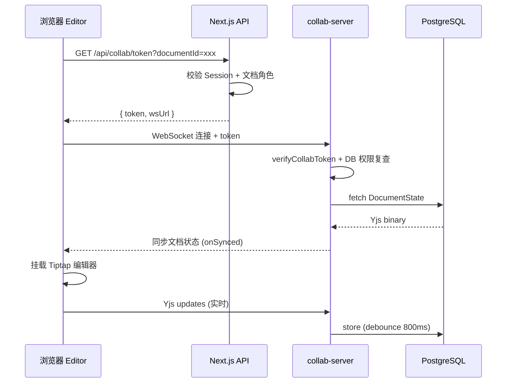

# 从零到协同：构建类飞书在线文档系统的五个技术重难点

> 本文基于开源项目 [Team Docs](https://github.com/jiaxiantao/team-docs) 的实战经验，拆解一套「Next.js + Tiptap + Yjs + Hocuspocus」协同文档系统在设计与实现中的核心难题，以及我们给出的工程解法。

<!-- 封面图：建议放一张产品全貌或编辑器主界面，吸引读者点击 -->


***

## 一、我们在解决什么问题？

在线协同文档不是「富文本编辑器 + WebSocket」那么简单。飞书文档、Notion、Google Docs 这类产品的共同特征是：

*   多人同时编辑，**不出现冲突覆盖**
*   协作者光标、在线状态实时可见
*   权限细粒度：可编辑 / 仅查看 / 公开分享
*   内容可靠持久化，并支持版本回溯

Team Docs 是一个面向团队的开源协同文档系统，技术栈如下：

| 层级   | 技术选型                                            |
| ---- | ----------------------------------------------- |
| 前端   | Next.js 16 (App Router) + React 19              |
| 编辑器  | Tiptap 3 + ProseMirror                          |
| 协同引擎 | Yjs (CRDT) + Hocuspocus 3                       |
| 数据库  | PostgreSQL 16 + Prisma 6                        |
| 认证   | Auth.js (NextAuth v5)                           |
| 部署   | Docker Compose（Web + Collab + Postgres + Redis） |

整体架构可以概括为「三进程、一数据库」：


下面按**难度从高到低**，逐一展开五个重难点。

***

## 二、重难点一：CRDT 协同编辑的正确打开方式

### 问题本质

传统方案用 Operational Transformation（OT）处理并发编辑，实现复杂、服务端压力大。Yjs 基于 **CRDT（无冲突复制数据类型）**，任意顺序的编辑操作最终都能收敛到同一状态——这对 P2P 或弱网环境非常友好。

但 CRDT 只解决「数据合并」，不解决「编辑器集成」。你需要回答三个问题：

1.  **如何把 Yjs 文档绑定到 ProseMirror/Tiptap？**
2.  **协同光标（Awareness）如何展示？**
3.  **为什么必须关闭内置 Undo/Redo？**

### 我们的解法

在 Tiptap 侧，通过 `@tiptap/extension-collaboration` 和 `@tiptap/extension-collaboration-caret` 将 `Y.Doc` 与 Hocuspocus Provider 接入：

```typescript
// editor-extensions.ts 核心配置
StarterKit.configure({
  undoRedo: false,  // 关键：协同模式下禁用本地撤销栈
  link: false,
  underline: false,
}),
Collaboration.configure({ document: ydoc }),
CollaborationCaret.configure({
  provider,
  user: { name: user.name, color: user.color },
}),
```

**为什么禁用 undoRedo？** 在多人协同场景下，每个客户端维护自己的撤销历史会导致状态分叉。Yjs 的 CRDT 合并机制本身就是「最终一致性」的基石，本地 Undo 栈反而会成为干扰源。

前端连接生命周期也做了精细管理：

*   文档切换时重建 `Y.Doc`，避免状态污染
*   区分 `connecting → syncing → ready → disconnected` 四种连接状态
*   断线后提供重试，并在 `beforeunload` 时主动 `disconnect` 刷出待同步数据

```typescript
// collaborative-editor.tsx — 连接状态机
type ConnectionState = "connecting" | "syncing" | "ready" | "disconnected" | "error";
```




### 踩坑记录

*   **不要在 `synced` 之前就挂载编辑器**：未同步完成的 Y.Doc 可能与服务端状态冲突，表现为内容闪烁或覆盖。
*   **Hocuspocus 的 debounce 参数很关键**：我们设置 `debounce: 800ms`、`maxDebounce: 3000ms`，在写入频率与数据库压力之间取平衡。

***

## 三、重难点二：双服务架构下的鉴权设计

### 问题本质

Team Docs 不是单体应用。浏览器同时面对两个后端：

| 服务            | 协议        | 职责                  |
| ------------- | --------- | ------------------- |
| Next.js       | HTTP/REST | 用户登录、文档 CRUD、签发协同令牌 |
| collab-server | WebSocket | Yjs 实时同步、状态持久化      |

Auth.js 的 JWT Session **无法直接用于 WebSocket 握手**——Cookie 不会自动跟随 WS 连接，且协同服务是独立进程，不应耦合 Next.js 的 session 中间件。

### 我们的解法：HMAC 协同令牌

采用「短期 HMAC 令牌 + 连接时二次鉴权」的双层模型：

    token = base64url(payload) + "." + HMAC-SHA256(payload, COLLAB_SECRET)

Payload 包含：

```typescript
type CollabTokenPayload = {
  userId: string;
  documentId: string;
  name: string;
  color: string;
  access: "editor" | "viewer";
  shareToken?: string;  // 公开分享场景
  exp: number;          // 15 分钟过期
};
```

**签发**（Next.js API）：

```typescript
// GET /api/collab/token?documentId=xxx
const token = signCollabToken({
  userId: session.user.id,
  documentId,
  access: collabAccessModeForRole(role), // OWNER/EDITOR → editor, VIEWER → viewer
  // ...
});
```

**校验**（collab-server `onAuthenticate`）：

1.  `timingSafeEqual` 验证签名，防时序攻击
2.  校验 `documentId` 与 WebSocket room name 一致
3.  **实时查询数据库**确认用户权限未被撤销
4.  返回 `readOnly: true` 给 VIEWER 角色

这是整个系统安全性的关键设计：**令牌只证明「谁、以什么角色、访问哪个文档」，真正的权限以数据库为准**。即使用户被移除协作者，下一次连接或令牌刷新时就会失效。


### 长会话的令牌刷新

15 分钟 TTL 防止令牌泄露后被长期滥用。前端在连接 `ready` 后，每 12 分钟（TTL 的 80%）静默刷新：

```typescript
const timer = setInterval(refreshToken, COLLAB_TOKEN_REFRESH_MS);
current.configuration.token = data.token; // 热更新，无需重连
```

### 公开分享的特殊路径

访客通过 `/share/[token]` 只读查看，不登录。此时协同令牌携带 `shareToken`，collab-server 额外校验：

*   分享链接是否启用、未过期
*   `access` 必须为 `viewer`
*   连接强制 `readOnly: true`

同一套 Yjs 通道，三种身份（编辑者 / 查看者 / 匿名访客）共用，鉴权逻辑全部收敛在 `onAuthenticate` 一处。


***

## 四、重难点三：Yjs 二进制状态的持久化与版本管理

### 问题本质

协同文档的「真相来源」不是 HTML 或 JSON，而是 **Yjs 编码后的二进制状态**（`Uint8Array`）。这带来一系列工程问题：

*   状态体积随编辑历史增长（设置 5MB 上限）
*   高频写入会打爆数据库
*   版本快照应该存什么、何时存、如何恢复

### 持久化策略

Hocuspocus Database Extension 负责读写 `DocumentState` 表：

```javascript
// collab-server — store 钩子
await prisma.documentState.upsert({
  where: { documentId: documentName },
  create: { documentId: documentName, state: Buffer.from(state) },
  update: { state: Buffer.from(state), updatedAt: new Date() },
});
```

配合 `debounce: 800ms`，将秒级编辑合并为次级数据库写入。超过 5MB 时跳过持久化并告警，防止单文档拖垮存储。

> **配图说明（图 8，持久化与快照流程图）**\
> 建议绘制数据流图，从左到右：
>
> `用户编辑` → `Yjs update` → `Hocuspocus debounce` → `store 钩子` → 分叉为两条路：
>
> *   上路：`DocumentState.upsert`（实时状态）
> *   下路：判断距上次自动快照 ≥ 30min → `DocumentSnapshot.create` → `pruneSnapshots`（保留 20 条）
>
> 在 `DocumentState` 旁标注「上限 5MB，超出跳过持久化」。

### 版本历史：快照而非 diff

我们没有实现 OT 式的增量 diff，而是直接快照完整 Yjs 状态：

| 策略   | 参数                      |
| ---- | ----------------------- |
| 自动快照 | 每 30 分钟，在 `store` 钩子中触发 |
| 手动快照 | 用户点击「创建快照」              |
| 保留上限 | 每文档最多 20 条，超出删除最旧       |

恢复时，将快照状态写回 `DocumentState` 并同步标题，然后**刷新页面**让所有在线客户端重新加载 Yjs 文档——这是 CRDT 系统里最简单可靠的「时光倒流」方式。


### 导出：Yjs → ProseMirror JSON → HTML

版本预览和 HTML 导出需要把二进制状态「反序列化」为可读内容：

```typescript
export function yjsStateToHtml(state: Uint8Array): string {
  const ydoc = new Y.Doc();
  Y.applyUpdate(ydoc, state);
  const json = yDocToProsemirrorJSON(ydoc, "default");
  return generateHTML(json, getStaticEditorExtensions());
}
```

注意：静态导出用的扩展集（`editor-static-extensions`）与协同编辑器扩展集是**两套配置**——前者不需要 Collaboration 相关扩展，后者必须关闭 undoRedo。这是 Tiptap 项目中常见的「双扩展集」模式。

***

## 五、重难点四：富文本中的附件与图片

### 问题本质

图片和附件**不应该塞进 Yjs 文档状态**——一个 10MB 的 PDF 会让 CRDT 状态膨胀到不可接受。正确做法是：

1.  文件上传到对象存储（本地 / S3）
2.  在编辑器中插入**引用节点**（URL + 元数据）
3.  引用随 Yjs 同步，文件本体走 REST API

### 实现要点

**上传链路**：

    粘贴/拖拽 → validateFileUpload() → POST /api/documents/[id]/upload
    → StorageAdapter (local | S3) → DocumentAttachment 记录
    → 返回 /api/attachments/[id] URL → 插入 Image 或 FileAttachment 节点

**自定义 FileAttachment 节点**：Tiptap 没有内置「文件卡片」，我们通过 ProseMirror Node Spec 扩展了一个 `fileAttachment` 类型，渲染为可下载的附件卡片。

**鉴权访问**：附件 API 在中间件中标记为公开路径，但路由内部做细粒度判断：

```typescript
// 登录用户：检查文档访问权限
// 未登录用户：检查文档是否有活跃的公开分享链接
export async function canViewAttachment(attachmentId: string) { ... }
```

这样公开分享页面中的图片和附件也能正常显示，同时未分享文档的附件不会被越权访问。


***

## 六、重难点五：生产级部署与水平扩展

### 多实例协同：Redis Pub/Sub

单 collab-server 实例可以支撑小规模团队。要水平扩展，必须解决「用户 A 连实例 1，用户 B 连实例 2，如何同步同一文档？」

Hocuspocus 的 Redis Extension 通过 Pub/Sub 在实例间广播 Yjs update：

```javascript
if (redisUrl) {
  extensions.unshift(new Redis({ redis: new RedisClient(redisUrl) }));
}
```

Docker Compose 已内置 Redis 服务，`REDIS_URL` 自动注入 collab 容器。本地单实例开发无需配置。

### Docker 编排的关键细节

```yaml
# docker-compose.yml 服务依赖链
postgres (healthy) → migrate (completed) → web + collab (healthy)
```

*   **migrate 作为一次性 Job**：确保 schema 先于应用就绪
*   **web 依赖 collab healthy**：避免前端连不上 WS
*   **COLLAB\_SECRET 必须 web 与 collab 一致**：否则令牌校验失败
*   **uploads 用 named volume**：本地存储模式下容器重建不丢文件

> **配图说明（图 12，Docker 部署拓扑图）**\
> 建议按 `docker-compose.yml` 绘制容器拓扑：
>
>     [Browser] → :3000 [web] → :5432 [postgres]
>                    ↓ ws://:1234
>               [collab] ←→ [redis]（多实例时）
>                    ↓
>               [postgres]
>     [migrate] ──一次性──→ [postgres]
>
> 标注健康检查端点：`web → /api/health`，`collab → /health`，`postgres → pg_isready`。

### 可观测性与防御

| 措施    | 实现                                        |
| ----- | ----------------------------------------- |
| 健康检查  | `/api/health`（含迁移状态）、collab `/health`     |
| 频率限制  | 登录 20次/分钟、协同令牌 30次/分钟                     |
| 启动校验  | `instrumentation.ts` 检查必要环境变量             |
| 迁移检测  | `dev:web` 启动前 fail-fast 未应用的迁移            |
| 安全响应头 | `next.config.ts` 配置 CSP、X-Frame-Options 等 |

***

## 七、架构决策回顾

| 决策    | 选择                  | 原因                       |
| ----- | ------------------- | ------------------------ |
| 协同算法  | CRDT (Yjs)          | 实现简单、离线友好、无需中心化 OT 服务器   |
| 服务拆分  | Web + Collab 独立进程   | WS 长连接与 HTTP 请求隔离，可独立扩缩容 |
| 鉴权    | HMAC 短期令牌 + DB 二次校验 | 跨服务、无状态、可撤权              |
| 持久化格式 | Yjs 二进制             | 保真度最高，避免 HTML 往返损失       |
| 版本管理  | 全量快照                | 实现简单，20 条上限控制存储成本        |
| 附件    | 外部存储 + 引用节点         | 避免 CRDT 状态膨胀             |

***

## 八、写在最后

构建协同文档系统，难的不是画一个编辑器工具栏，而是把 **CRDT 一致性、跨服务鉴权、状态持久化、权限模型、生产部署** 五条线拧成一股绳。

Team Docs 目前覆盖了团队文档的核心场景：实时协同、角色权限、公开分享、版本历史、图片附件、Docker 一键部署。如果你正在评估自研协同文档的可行性，希望这篇文章能帮你少踩几个坑。

项目开源地址：[github.com/jiaxiantao/team-docs](https://github.com/jiaxiantao/team-docs)

欢迎 Star、Issue 和 PR。

***

**演示账号（`pnpm db:seed` 后可用）：**

| 角色  | 邮箱                      | 密码             |
| --- | ----------------------- | -------------- |
| 所有者 | `demo@teamdocs.local`   | `demo123456`   |
| 仅查看 | `viewer@teamdocs.local` | `viewer123456` |

***

**推荐阅读**

*   [Yjs 官方文档 — CRDT 原理](https://docs.yjs.dev/)
*   [Hocuspocus — Yjs 的 WebSocket 后端](https://tiptap.dev/hocuspocus)
*   [Tiptap Collaboration 扩展](https://tiptap.dev/docs/editor/extensions/functionality/collaboration)
