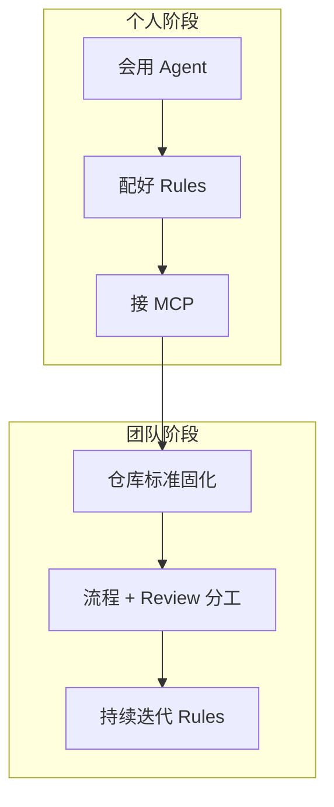
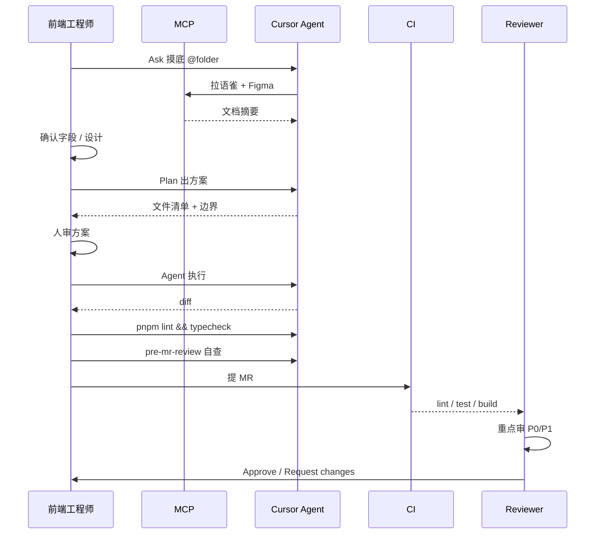

# 前端团队 Cursor 落地 Playbook：从个人效率到团队标准

> 发布日期：2026-07-08  
> 标签：前端 / Cursor / 团队工程化 / Rules / MCP / Code Review / AI 编程

过去半年，我陆续写了 [Cursor 一年复盘](https://juejin.cn/post/7656751882112565275)、[MCP 工作流](https://juejin.cn/post/7657074612481261603)、[Rules / Skills 分层](https://jiaxiantao.github.io/blogs/post/Cursor-Rules%E4%B8%8ESkills%E5%88%86%E5%B1%82%E8%AE%BE%E8%AE%A1-%E8%AE%A9Agent%E5%83%8F%E5%9B%A2%E9%98%9F%E6%96%B0%E5%90%8C%E4%BA%8B)、[四模式选型](https://jiaxiantao.github.io/blogs/post/Cursor%E5%9B%9B%E6%A8%A1%E5%BC%8F%E9%80%89%E5%9E%8B%E6%8C%87%E5%8D%97-Ask-Plan-Agent-Debug%E4%BD%95%E6%97%B6%E7%94%A8%E5%93%AA%E4%B8%AA)、[多 Agent 并行](https://jiaxiantao.github.io/blogs/post/Cursor%E5%A4%9AAgent%E4%B8%8EWorktree%E5%B9%B6%E8%A1%8C%E5%BC%80%E5%8F%91%E5%AE%9E%E6%88%98-%E5%A4%A7%E9%87%8D%E6%9E%84%E4%B8%8D%E5%86%8D%E8%B5%8C%E4%B8%80%E6%8A%8A)——都是 **个人视角** 的实战。

但读者问得最多的问题是：

> 「我一个人用得很顺，怎么在团队推？有人不信 AI 写的代码，有人 Rules 写了没人维护，MR 越来越多 Review 不过来……」

这篇文章是一份 **前端团队 Cursor 落地 Playbook**：从 0 到 1 怎么建标准、新人怎么上手、和 [Code Review](https://juejin.cn/post/7657475917389447194) / CI 怎么分工，以及我见过的阻力与对策。不是 Cursor 教程，而是 **把前面几篇串成可执行的团队方案**。

---

## 一、先对齐目标：团队要的不是「人人会用」，是「输出可预期」

个人用 Cursor，追求的是 **提效**；团队落地 Cursor，追求的是 **可预期**。

| 维度 | 个人效率 | 团队标准 |
|------|---------|---------|
| 核心指标 | 自己写得快 | 任何人 Agent 产出风格一致 |
| 约束载体 | 脑子里的习惯 | 仓库里的 Rules / Skills |
| 质量保障 | 自己跑 lint | CI + Review 分层 |
| 知识传递 | 不用传递 | 新人 7 天能上手 |
| 失败代价 | 自己回滚 | 影响主分支和线上 |



**Playbook 的核心逻辑**：

```
约束进仓库 → 流程进 Skill → 质量进 CI + Review → 经验进复盘迭代
```

---

## 二、成熟度模型：你们在哪个阶段？

落地前，先评估团队现状，避免「一步到位」导致推不动。

| 等级 | 特征 | 本周行动 |
|------|------|---------|
| **L0 野生** | 各自用 Cursor，无共享规范 | 选 1 个试点项目，写 `00-global.mdc` |
| **L1 规范** | 仓库有 Rules，但没人维护 | 指定 Rules Owner，MR 模板加 AI 检查项 |
| **L2 流程** | Rules + Skills + 固定 SOP | 配 MCP 模板，新人按 7 天路径培训 |
| **L3 闭环** | Rules + CI + Review 分层 + 复盘 | 每月 Rules 迭代会，线上 Bug 反哺 Rule |
| **L4 编排** | 多 Agent / worktree / Hooks 标准化 | 大重构有并行 SOP，安全边界固化 |

大多数团队 **L1 → L2** 是最务实的目标，1～2 个 Sprint 可完成。

---

## 三、仓库标准：什么进 Git，什么不进

### 3.1 目录结构（推荐）

```text
your-frontend-project/
├── .cursor/
│   ├── rules/
│   │   ├── 00-global.mdc       # 红线：技术栈、安全、Git
│   │   ├── 10-react.mdc        # 框架规范（globs 匹配）
│   │   ├── 20-api.mdc          # API 层约定
│   │   ├── 30-testing.mdc      # 测试规范
│   │   ├── 40-mcp.mdc          # MCP 调用边界
│   │   └── 50-review.mdc       # Agent 自检红线
│   ├── skills/
│   │   └── frontend-feature-dev/
│   │       ├── SKILL.md        # Ask → Plan → Agent SOP
│   │       └── checklists/
│   │           └── pre-mr.md
│   └── mcp.json.example        # MCP 模板（Token 用环境变量）
├── .cursorignore               # 敏感文件排除
├── CONTRIBUTING.md             # 链接 Rules + Playbook
└── .github/
    └── pull_request_template.md
```

### 3.2 提交策略

| 文件 / 目录 | 提交 Git | 说明 |
|------------|---------|------|
| `.cursor/rules/*.mdc` | ✅ | 团队共享，MR 可审 |
| `.cursor/skills/` | ✅ | 流程 SOP，跟仓库走 |
| `.cursor/mcp.json.example` | ✅ | 模板 + 文档说明 |
| `.cursor/mcp.json`（含 Token） | ❌ | 加入 `.gitignore` |
| `~/.cursor/skills/` | ❌ | 个人级，不提交 |
| `.cursorignore` | ✅ | 全员统一敏感文件边界 |

### 3.3 `.cursorignore` 团队底线

```text
# 密钥与配置
.env
.env.*
*.pem
*.key
credentials.json

# 内部地址
**/internal-config/
**/deploy/secrets/

# 大文件 / 无关目录
node_modules/
dist/
*.min.js
```

Agent 能读什么，和 Rules 管什么写法一样重要——**安全是团队落地的第一道门**。

---

## 四、Rules：团队红线的唯一真相源

Rules 细节见 [Rules / Skills 分层设计](https://jiaxiantao.github.io/blogs/post/Cursor-Rules%E4%B8%8ESkills%E5%88%86%E5%B1%82%E8%AE%BE%E8%AE%A1-%E8%AE%A9Agent%E5%83%8F%E5%9B%A2%E9%98%9F%E6%96%B0%E5%90%8C%E4%BA%8B)，团队落地只需记住三件事：

### 4.1 指定 Rules Owner

| 职责 | 谁来做 |
|------|--------|
| 新增 / 修改 Rule | Rules Owner（可轮值） |
| Review 中质疑「是否该加 Rule」 | 所有 Reviewer |
| 线上 Bug 反哺 Rule | 复盘会提出，Owner 合入 |

**没有 Owner，Rules 三个月必过时。**

### 4.2 团队 L1 红线模板（`00-global.mdc`）

```markdown
---
description: 全局编码红线与安全约束
alwaysApply: true
---

# 全局红线

## 技术栈（不可偏离）
- React 19 + TypeScript 5.8 + Vite 7 + pnpm

## 安全
- 禁止硬编码 API Key、Token、内网地址
- 禁止 dangerouslySetInnerHTML（除非 DOMPurify + MR 说明）

## Agent 行为
- 中等以上需求先 Plan，禁止跳过
- 改动后必须跑 pnpm typecheck && pnpm lint
- 禁止 git push、rm -rf（需人工确认）
```

### 4.3 Rules 变更也要走 MR

Rules 是「Agent 的操作手册」，改 Rules = 改团队标准，必须：

- 单独 MR 或随功能 MR 附带说明
- Reviewer 确认不与其他 Rule 冲突
- 合并后团队频道广播（或 Release Note）

---

## 五、Skills：把个人 SOP 变成团队肌肉记忆

### 5.1 至少建 3 个团队 Skill

| Skill | 触发场景 | 核心流程 |
|-------|---------|---------|
| `frontend-feature-dev` | 新页面、新组件、接需求 | Ask → Plan → Agent → lint |
| `api-integration` | 接口联调 | MCP 拉文档 → 人确认 → 按既有模式写 |
| `pre-mr-review` | 提交前 | 对照 Checklist 自查，不改代码 |

`frontend-feature-dev` 的 `SKILL.md` 头部示例：

```markdown
---
name: frontend-feature-dev
description: >
  前端功能开发标准流程。用户要开发新页面、新组件、接需求、
  修 Bug 时触发。包含 Ask → Plan → Agent → 验证的完整 SOP。
---
```

### 5.2 和四模式的映射

团队 SOP 应明确写入 Skill（详见 [四模式选型](https://jiaxiantao.github.io/blogs/post/Cursor%E5%9B%9B%E6%A8%A1%E5%BC%8F%E9%80%89%E5%9E%8B%E6%8C%87%E5%8D%97-Ask-Plan-Agent-Debug%E4%BD%95%E6%97%B6%E7%94%A8%E5%93%AA%E4%B8%AA)）：

| 任务类型 | 模式 | 是否强制 |
|---------|------|---------|
| 陌生模块摸底 | Ask | 推荐 |
| 3+ 文件 / 有架构影响 | Plan | **强制** |
| 方案已对齐的执行 | Agent | — |
| 有报错栈的 Bug | Debug | **强制** |
| 改一行样式 | Tab / Cmd+K | — |

---

## 六、MCP：团队 Context 基础设施

个人配 MCP 是提效；团队配 MCP 是 **消灭「文档版本各说各话」**。

### 6.1 推荐优先级

| 优先级 | MCP | 团队价值 |
|--------|-----|---------|
| P0 | 语雀 / Notion / 内部文档 | 接口字段统一来源 |
| P1 | GitLab / GitHub | MR 历史、类似实现 |
| P2 | Figma | 设计标注，减少目测 |
| P3 | 浏览器（内置） | 页面验证、截图对比 |

配置细节见 [MCP 工作流](https://juejin.cn/post/7657074612481261603)。

### 6.2 团队分发方式

```text
1. 仓库提交 mcp.json.example（无 Token）
2. README / CONTRIBUTING 写配置步骤
3. Token 走个人环境变量或团队密钥管理
4. 40-mcp.mdc 写调用边界（不要一次拉整份 Figma）
```

### 6.3 `40-mcp.mdc` 示例

```markdown
---
description: MCP 调用边界与节约 Token 规范
alwaysApply: true
---

# MCP 规范

- 语雀：先 search 再 get_doc，不要猜测文档 ID
- Figma：用 node-id 精准查询，不要拉整个文件
- GitLab：优先 search_merge_requests，限制返回条数
- MCP 失败时告知用户，不要编造文档内容
```

---

## 七、标准需求流程：一次完整协作路径



### 7.1 各角色分工

| 角色 | 做什么 | 不做什么 |
|------|--------|---------|
| **开发者** | Plan 对齐、执行、自查、贴 Agent 范围 | 跳过 Plan 直接大改 |
| **Agent** | 按 Rules + Skill 生成代码 | 决定架构方向、合并 MR |
| **CI** | 格式、类型、测试、构建 | 审业务逻辑和权限 |
| **Reviewer** | P0/P1 项、架构一致性 | 纠结缩进和命名（交给 CI） |

---

## 八、Code Review：AI 时代的分层审查

团队落地 Cursor 后，MR 量涨、diff 行数涨——Review 策略必须调整。

### 8.1 审查强度分层

摘自 [Code Review 文](https://juejin.cn/post/7657475917389447194)，团队可直接采用：

| 维度 | 审查强度 | 谁负责 |
|------|---------|--------|
| 格式 / 命名 | ⬜ 忽略 | CI |
| TypeScript 基础类型 | 🟨 中 | CI + 抽查 |
| 权限 / 鉴权 | 🟥 高 | **人必审** |
| 异步竞态 / 时序 | 🟥 高 | **人必审** |
| 边界态 / 异常态 | 🟥 高 | **人必审** |
| 安全 / 隐私 | 🟥 高 | **人必审** |

### 8.2 AI 辅助 MR 的 Review 重点

Reviewer 看到「Agent 生成」标签时，**加严**以下项：

1. 文件范围是否超出需求？（有没有顺手改公共组件）
2. 接口字段是否和语雀最新版一致？
3. 是否有「能跑但架构别扭」的写法？
4. 测试是测行为还是测实现？

### 8.3 质量防线四层模型

```text
L1  Rules/Skills     → 生成时预防（风格、红线）
L2  本地 lint/test   → 提交前（开发者 + Agent）
L3  CI               → 合并前（自动化）
L4  人审             → 合并时（P0/P1 业务逻辑）
```

**原则**：能在 L1～L3 拦截的，不要堆到 L4——Reviewer 的时间要留给 AI 审不了的东西。

---

## 九、MR 模板：把纪律写进流程

在 `.github/pull_request_template.md` 中加入：

```markdown
## 需求说明
<!-- 一句话描述 + 关联 Issue -->

## AI 辅助开发（如实填写）
- [ ] 本次使用 Cursor Agent 生成 / 大改
- [ ] Agent 改动范围：<!-- 列出主要文件，如 src/features/order/** -->
- [ ] 是否涉及新范式（新请求库、新状态库）？如是，已更新 `.cursor/rules/`
- [ ] 已对照 Code Review Checklist 自查（pre-mr-review Skill）
- [ ] 已跑 pnpm typecheck && pnpm lint && pnpm test

## 测试说明
<!-- 手动验证步骤、截图 -->

## Reviewer 关注（AI 生成时必填）
<!-- 建议 Reviewer 重点看什么：权限、竞态、接口字段、边界态 -->
```

**关键**：不要求「是否用 AI」羞耻，要求 **透明 + 可审**。

---

## 十、新人 7 天上手路径

| 天 | 任务 | 产出 |
|----|------|------|
| **D1** | 装 Cursor，克隆项目，读 `CONTRIBUTING.md` + Rules 目录 | 能解释 L1 红线 |
| **D2** | 配 MCP（语雀 + GitLab），跑通 example 配置 | MCP 连通截图 |
| **D3** | Ask 模式梳理一个陌生 `src/features/` 模块 | 模块地图笔记 |
| **D4** | 用小需求走 Plan → Agent（如加按钮） | 第一个 Agent MR |
| **D5** | 学 pre-mr-review 自查，对照 Checklist | 自查报告一份 |
| **D6** | 参与一次 Code Review（审别人的 Agent MR） | Review 评论记录 |
| **D7** | 独立完成中等需求全流程 | 合并第一个独立 MR |

### 10.1 指定 Buddy

新人前 2 周配一个 Buddy：

- 帮看 Plan 输出是否合理
- 帮看 Agent 是否越界改文件
- **不帮写 Prompt**——自己动手才能形成肌肉记忆

---

## 十一、大重构 / 多 Agent 的团队约定

当任务达到 [多 Agent 并行](https://jiaxiantao.github.io/blogs/post/Cursor%E5%A4%9AAgent%E4%B8%8EWorktree%E5%B9%B6%E8%A1%8C%E5%BC%80%E5%8F%91%E5%AE%9E%E6%88%98-%E5%A4%A7%E9%87%8D%E6%9E%84%E4%B8%8D%E5%86%8D%E8%B5%8C%E4%B8%80%E6%8A%8A) 阈值时，团队应额外遵守：

| 规则 | 说明 |
|------|------|
| 必须 Plan | 输出迁移模式 + 文件边界 |
| 按目录切任务 | 禁止两个 Agent 写同一文件 |
| worktree 隔离 | 不在 main 上实验 |
| 分支命名 | `migrate/<模块>` |
| 合并顺序 | 先公共层，再并行模块，最后人工收尾 |
| 合并后 | 全量 `typecheck + lint + test` + 统一格式化 |

在 Skill 里固化 **并行迁移 SOP**，避免每次口头交代。

---

## 十二、阻力与对策

### 阻力 1：「AI 写的代码我不信」

**对策**：
- 不争论「信不信」，用 **MR 透明 + Review 分层** 建立信任
- CI 绿灯 + 人审 P0 项，比「谁写的」更重要
- 展示 Rules 如何让不同人 Agent 产出风格一致

### 阻力 2：「Rules 写了没人维护」

**对策**：
- 指定 Rules Owner，纳入 Sprint 复盘
- 线上 Bug 复盘必问：「哪条 Rule 能拦住？」
- Rules 变更走 MR，和代码同权

### 阻力 3：「Review 更忙了，不是更高效吗？」

**对策**：
- 把格式 / 命名下沉到 CI（L3）
- Reviewer 只审 P0/P1（L4）
- 开发者提交前用 pre-mr-review Skill 自查，减少往返

### 阻力 4：「有人滥用 Agent，一改十几文件」

**对策**：
- MR 模板强制填 Agent 改动范围
- Plan 模式写进 Skill 强制项
- Reviewer 对超范围 diff 直接 Request changes

### 阻力 5：「MCP Token 和安全顾虑」

**对策**：
- 仓库只提交 `mcp.json.example`
- `.cursorignore` 统一排除敏感文件
- 内网文档 MCP 走 VPN + 只读 Token

---

## 十三、持续迭代：每月 Rules 复盘会（30 分钟）

建议每月一次，议程固定：

| 时间 | 议题 |
|------|------|
| 5 min | 本月 Agent 相关线上问题回顾 |
| 10 min | 是否需要新增 / 修改 Rule |
| 10 min | Skill / SOP 是否过时 |
| 5 min | 新人反馈：哪里不顺手 |

产出：**一条 Rule 变更 MR** 或 **一条 Skill 更新 MR**——小步快跑，胜过半年大修。

---

## 十四、Playbook 落地检查清单

### 第一周（L0 → L1）

- [ ] 创建 `.cursor/rules/00-global.mdc`
- [ ] 创建 `.cursorignore`
- [ ] 指定 Rules Owner
- [ ] 添加 MR 模板 AI 检查项

### 第二周（L1 → L2）

- [ ] 创建 `frontend-feature-dev` Skill
- [ ] 提交 `mcp.json.example` + 配置文档
- [ ] `CONTRIBUTING.md` 链接 Playbook
- [ ] 开新人培训，走 D1～D3

### 第一个月（L2 → L3）

- [ ] CI 覆盖 lint / typecheck / test
- [ ] 团队统一 Code Review 分层表
- [ ] 完成至少 1 次 Rules 复盘会
- [ ] 收集 3 个「Agent 翻车」案例写入 Skill 踩坑

---

## 结语

Cursor 团队落地，本质不是「推广一个编辑器」，而是 **建设一套 AI 时代的前端工程标准**：

- **Rules** 是团队红线
- **Skills** 是团队 SOP
- **MCP** 是团队 Context 基础设施
- **CI + Review** 是团队质量门禁
- **Playbook** 是把以上全部串起来的操作手册

个人效率是起点，团队可预期是终点。你在 [Cursor 复盘](https://juejin.cn/post/7656751882112565275) 里练的是机长技术；Playbook 要解决的，是 **整支航空公司的运行手册**。

从 `00-global.mdc` 和 MR 模板开始，一个 Sprint 内团队就能到 L2。别等「完美方案」——**先跑起来，用复盘会迭代**。

---

## 系列延伸阅读（建议按顺序阅读）

1. [前端工程师的 AI 副驾驶：Cursor 一整年真实体验与避坑指南](https://juejin.cn/post/7656751882112565275)
2. [用 MCP 把 Figma、语雀、GitLab 串成一条前端工作流](https://juejin.cn/post/7657074612481261603)
3. [Cursor Rules / Skills 分层设计：让 Agent 像「团队新同事」](https://jiaxiantao.github.io/blogs/post/Cursor-Rules%E4%B8%8ESkills%E5%88%86%E5%B1%82%E8%AE%BE%E8%AE%A1-%E8%AE%A9Agent%E5%83%8F%E5%9B%A2%E9%98%9F%E6%96%B0%E5%90%8C%E4%BA%8B)
4. [Cursor 四模式选型指南：Ask / Plan / Agent / Debug 何时用哪个？](https://jiaxiantao.github.io/blogs/post/Cursor%E5%9B%9B%E6%A8%A1%E5%BC%8F%E9%80%89%E5%9E%8B%E6%8C%87%E5%8D%97-Ask-Plan-Agent-Debug%E4%BD%95%E6%97%B6%E7%94%A8%E5%93%AA%E4%B8%AA)
5. [AI 生成代码之后，前端 Code Review 审什么？](https://juejin.cn/post/7657475917389447194)
6. [Cursor 多 Agent 与 Worktree：大重构不再赌一把](https://jiaxiantao.github.io/blogs/post/Cursor%E5%A4%9AAgent%E4%B8%8EWorktree%E5%B9%B6%E8%A1%8C%E5%BC%80%E5%8F%91%E5%AE%9E%E6%88%98-%E5%A4%A7%E9%87%8D%E6%9E%84%E4%B8%8D%E5%86%8D%E8%B5%8C%E4%B8%80%E6%8A%8A)
7. [前端工程师如何转型 AI Agent 工程师](https://juejin.cn/post/7656300675648585737)

---

*本文将个人 Cursor 工程实践归纳为团队 Playbook，具体功能以 [Cursor 官方文档](https://docs.cursor.com) 为准。*
