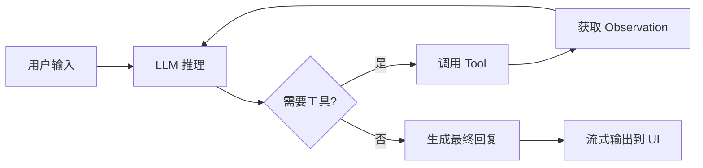
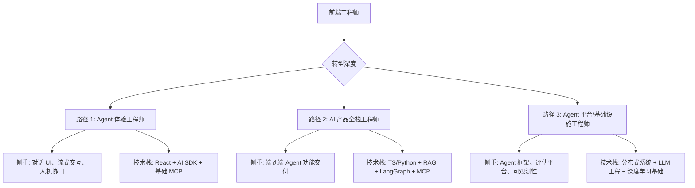

# 前端工程师如何转型 AI Agent 工程师：一份可执行的路径指南

> 发布日期：2026-06-26  
> 标签：前端 / AI Agent / MCP / 职业转型 / TypeScript

2024 年，「给页面加个 ChatGPT 对话框」还算新鲜事；到了 2026 年，越来越多的产品默认具备 **Agent 能力**——能查数据、调工具、多步推理、自主完成任务。岗位名称也在变：AI Agent 工程师、Agentic AI 工程师、LLM 应用工程师……

很多前端同学会问：**我是不是要放弃 React，去学 Python 和深度学习？**

答案通常是否定的。前端工程师离 AI Agent 工程师，往往只差一层 **能力抽象** 和 **工程化思维** 的扩展。本文梳理一条可落地的转型路径，帮你把已有优势转化为新赛道上的竞争力。

---

## 一、先厘清：AI Agent 工程师在做什么？

传统前端工程师的核心产出是 **用户界面**：组件、交互、状态管理、性能优化。

AI Agent 工程师的核心产出是 **自主完成任务的智能体**：理解意图、规划步骤、调用工具、验证结果、处理异常。

两者并非对立，而是同一产品链路上的不同层次：

```
用户意图
    ↓
┌───────────────────────────────────────┐
│  Agent 层：推理、规划、工具调用、记忆    │
├───────────────────────────────────────┤
│  能力层：API、MCP Server、RAG、工作流   │
├───────────────────────────────────────┤
│  UI 层：对话界面、流式输出、人机协同      │
└───────────────────────────────────────┘
    ↓
业务结果（查订单、写代码、生成报告……）
```

一个成熟的 AI 产品，往往 **三层都需要**。前端工程师天然占据 UI 层，且对「用户如何与系统交互」有深刻理解——这正是转型时最宝贵的资产。

### Agent 工程师的典型职责

| 职责 | 说明 | 前端可迁移度 |
|------|------|-------------|
| 工具与能力设计 | 把业务能力封装为 Agent 可调用的 Tool | ⭐⭐⭐⭐⭐ |
| 对话与流式 UI | 聊天界面、思考过程展示、工具调用可视化 | ⭐⭐⭐⭐⭐ |
| Prompt 与结构化输出 | 约束模型行为，保证输出可解析 | ⭐⭐⭐⭐ |
| RAG 知识检索 | 文档切片、向量检索、上下文注入 | ⭐⭐⭐ |
| Agent 编排 | 多步推理、状态机、人机协同 | ⭐⭐⭐ |
| 模型评估与监控 | 质量评测、成本追踪、异常告警 | ⭐⭐⭐ |
| 模型训练与微调 | 数据标注、Fine-tuning | ⭐（需另学） |

可以看到，**前四项与前端背景高度重合**，后三项需要补充，但不必从零开始。

---

## 二、前端工程师的隐藏优势

很多人低估了自己已有的能力。以下前端日常技能，在 Agent 工程中直接对应：

### 1. 状态管理与数据流

React 的 `useState`、Vue 的 `ref`、Redux/Pinia——本质上都是在管理 **可变状态 + 副作用**。Agent 的状态机（当前步骤、工具调用历史、上下文窗口）与此同构。

```typescript
// 前端状态
const [messages, setMessages] = useState<Message[]>([]);
const [loading, setLoading] = useState(false);

// Agent 状态（概念对应）
interface AgentState {
  messages: Message[];
  toolCalls: ToolCall[];
  currentStep: 'planning' | 'executing' | 'verifying';
}
```

### 2. 异步与流式处理

SSE、WebSocket、ReadableStream——前端对「边生成边展示」并不陌生。LLM 的 streaming 响应、工具调用的中间状态展示，正是前端强项。

### 3. API 集成与类型安全

TypeScript + Zod 约束 API 响应，与 **结构化 Prompt 输出** 是同一套思路：让模型的输出可预测、可校验、可编程。

```typescript
import { z } from 'zod';

const OrderQuerySchema = z.object({
  orderId: z.string(),
  status: z.enum(['pending', 'shipped', 'delivered']),
  items: z.array(z.object({ name: z.string(), qty: z.number() })),
});

// 约束 LLM 输出必须符合此 Schema
type OrderQuery = z.infer<typeof OrderQuerySchema>;
```

### 4. 用户体验与信息架构

Agent 产品最难的不是「让模型说话」，而是 **让用户信任、理解、纠错**。何时展示思考过程？敏感操作如何二次确认？多 Agent 协作如何可视化？——这些都是 UX 问题，前端工程师比纯算法背景的人更有感觉。

### 5. 组件化与可复用设计

把「查订单」「发邮件」「搜文档」封装为独立 Tool，与封装 React 组件没有本质区别：**单一职责、清晰接口、可组合**。

---

## 三、需要补齐的知识地图

转型不是「推翻重来」，而是在现有技能树上 **嫁接新分支**。按优先级排列：

### 第一层：必学（1–2 个月可入门）

| 主题 | 核心概念 | 推荐工具 |
|------|---------|---------|
| LLM API 调用 | Token、Temperature、System Prompt | OpenAI / Anthropic / Gemini SDK |
| 流式响应 | SSE、Streaming、增量渲染 | Vercel AI SDK |
| 结构化输出 | JSON Mode、Function Calling、Zod | `ai` + `zod` |
| Prompt 工程 | Few-shot、Chain-of-Thought、角色设定 | 实践为主 |
| MCP 协议 | Tools、Resources、Prompts 三原语 | `@modelcontextprotocol/sdk` |

### 第二层：进阶（2–4 个月）

| 主题 | 核心概念 | 推荐工具 |
|------|---------|---------|
| RAG | Embedding、Chunking、向量检索、重排序 | LangChain、LlamaIndex |
| Agent 编排 | ReAct、Plan-and-Execute、状态图 | LangGraph |
| 记忆与上下文 | 短期/长期记忆、上下文压缩 | 向量数据库（Pinecone、Qdrant） |
| 评估体系 | 准确率、幻觉率、延迟、成本 | LangSmith、RAGAS |
| 安全护栏 | 权限边界、敏感操作确认、输出过滤 | Guardrails、自定义中间件 |

### 第三层：按需（特定方向深入）

| 方向 | 适用场景 | 主要技能 |
|------|---------|---------|
| 全栈 Agent 后端 | 复杂编排、高并发 | Python、FastAPI、LangGraph |
| 端侧 Agent | 隐私敏感、离线场景 | WebLLM、ONNX、小型模型 |
| 多模态 Agent | 图像、语音、文档理解 | Vision API、Whisper |
| Agent 运维 | 生产稳定性 | 可观测性、A/B 测试、成本优化 |

**对大多数前端出身的同学，TypeScript 路线足够覆盖 80% 的生产场景**，Python 可在遇到复杂 RAG 管线或团队已有 Python 基建时再补。

---

## 四、MCP：前端工程师的「转型加速器」

**Model Context Protocol（MCP）** 是 2024 年底由 Anthropic 提出、2025 年捐赠给 Linux Foundation 的开放协议，已成为连接 AI Agent 与外部工具的事实标准。OpenAI、Google、Microsoft、AWS 均已原生支持。

对前端工程师而言，MCP 是最佳切入点：**用你熟悉的 TypeScript，把现有业务能力暴露给任意 LLM**。

### MCP 的三个核心原语

```
┌─────────────┐     MCP 协议      ┌─────────────┐
│  MCP Client │ ←──────────────→ │  MCP Server │
│  (Agent/IDE)│                   │  (你的应用)  │
└─────────────┘                   └─────────────┘
                                        │
                    ┌───────────────────┼───────────────────┐
                    ▼                   ▼                   ▼
                 Tools              Resources            Prompts
              (可执行操作)          (只读数据源)         (提示词模板)
```

- **Tools**：Agent 可以调用的函数，如 `createOrder`、`searchProducts`
- **Resources**：Agent 可以读取的数据，如 `order://123`、`doc://user-guide`
- **Prompts**：预置的提示词模板，如 `summarize-order`

### 最小 MCP Server 示例

```typescript
import { McpServer } from '@modelcontextprotocol/sdk/server/mcp.js';
import { z } from 'zod';

const server = new McpServer({ name: 'order-service', version: '1.0.0' });

server.tool(
  'get_order',
  '根据订单号查询订单详情',
  { orderId: z.string().describe('订单号') },
  async ({ orderId }) => {
    const order = await fetchOrder(orderId);
    return {
      content: [{ type: 'text', text: JSON.stringify(order, null, 2) }],
    };
  }
);

server.resource(
  'order-list',
  'order://recent',
  async (uri) => ({
    contents: [{ uri: uri.href, text: await getRecentOrders() }],
  })
);
```

这段代码的思维模式与写一个 REST API 无异——区别只是 **消费者从人类变成了 Agent**。

### 为什么 MCP 适合前端先做？

1. **TypeScript 原生支持**，无需切换语言
2. **与现有前端项目共存**，可渐进式接入
3. **Cursor、Claude Desktop 等 IDE 直接可用**，调试成本低
4. **把「业务能力」从 UI 中解耦**，形成可复用的 Agent 能力层

---

## 五、Agent 架构：从 Chatbot 到自主智能体

很多团队的「AI 功能」停留在 Chatbot 阶段：用户提问 → 模型回答。Agent 工程师需要构建的是 **能行动的系统**。

### 演进路径

```
Level 0: 纯对话
  用户 → LLM → 文本回复

Level 1: 工具调用（Tool Use）
  用户 → LLM → 选择 Tool → 执行 → 汇总回复

Level 2: 多步推理（ReAct / Plan-and-Execute）
  用户 → 规划 → [调用 Tool → 观察结果 → 再规划] × N → 最终回复

Level 3: 多 Agent 协作
  用户 → 协调者 Agent → [专家 Agent A, B, C 并行/串行] → 汇总

Level 4: 自主 Agent（带记忆与目标）
  目标设定 → 长期记忆 → 自主规划 → 持续执行 → 人工审核关键节点
```

### 典型 Agent Loop（ReAct 模式）



### 用 Vercel AI SDK 实现 Tool Calling

```typescript
import { streamText, tool } from 'ai';
import { openai } from '@ai-sdk/openai';
import { z } from 'zod';

const result = streamText({
  model: openai('gpt-4o'),
  system: '你是订单助手，可以查询和处理订单。',
  messages,
  tools: {
    getOrder: tool({
      description: '查询订单详情',
      parameters: z.object({ orderId: z.string() }),
      execute: async ({ orderId }) => fetchOrder(orderId),
    }),
    cancelOrder: tool({
      description: '取消订单（需用户确认）',
      parameters: z.object({ orderId: z.string() }),
      execute: async ({ orderId }) => {
        // 敏感操作：应在前端/UI 层做二次确认
        return cancelOrder(orderId);
      },
    }),
  },
  maxSteps: 5, // 允许多轮工具调用
});
```

前端负责 `streamText` 的 UI 渲染；Tool 的 `execute` 可以复用现有业务 API——**你的后端逻辑不需要重写，只需要多一层 Agent 入口**。

---

## 六、RAG：让 Agent「懂你的业务」

通用大模型不知道你公司的订单规则、产品文档、内部流程。**RAG（Retrieval-Augmented Generation）** 通过检索相关文档片段注入上下文，让 Agent 基于私有知识回答。

### RAG 流水线（前端需要理解的部分）

```
文档源（语雀/Notion/PDF）
    ↓ 切片（Chunking）
文本块 + Embedding 向量
    ↓ 存入向量数据库
用户提问 → Embedding → 相似度检索 → Top-K 文档块
    ↓ 注入 Prompt
LLM 生成基于上下文的回答
```

### 前端在 RAG 中的角色

| 环节 | 前端可参与的工作 |
|------|----------------|
| 文档上传与管理 | 管理后台 UI、上传进度、切片预览 |
| 检索结果展示 | 引用来源高亮、可点击跳转原文 |
| 反馈闭环 | 「这个回答有帮助吗？」→ 用于评估与优化 |
| 对话 + 知识库 | 聊天界面中展示检索到的文档片段 |

你不必亲自调 Embedding 模型，但需要理解 **「检索质量决定回答质量」**，并在 UI 上给用户足够的透明度和纠错入口。

---

## 七、六阶段转型路线图

以下是一条 **6–9 个月、业余学习可完成** 的路径，假设每周投入 8–12 小时。

### 阶段 0：心态与定位（第 1 周）

- 明确目标：做 **「懂 Agent 的前端」** 还是 **「全栈 Agent 工程师」**
- 不建议完全抛弃前端——2026 年市场需求最大的是 **混合型人才**
- 选定一个真实业务场景作为练习载体（如个人博客、 side project、公司内部工具）

### 阶段 1：LLM API 与流式 UI（第 2–4 周）

**目标**：用 Vercel AI SDK 做一个带流式输出的聊天界面。

- 学习 Prompt 基础：System / User / Assistant 角色
- 实现 SSE 流式渲染、Markdown 展示、代码高亮
- 尝试 Structured Output，用 Zod 约束 JSON 输出

**验收标准**：聊天应用可部署，支持多轮对话，流式体验流畅。

### 阶段 2：Tool Calling（第 5–8 周）

**目标**：让 Agent 能调用 2–3 个真实 API。

- 把现有业务 API 封装为 `tool`
- 实现工具调用的 UI 反馈（「正在查询订单……」）
- 处理 Tool 执行失败、超时、权限不足

**验收标准**：用户说「查一下订单 12345」，Agent 能自动调用 API 并汇总结果。

### 阶段 3：MCP Server（第 9–12 周）

**目标**：把阶段 2 的能力升级为 MCP Server，接入 Cursor / Claude Desktop。

- 用 `@modelcontextprotocol/sdk` 重写 Tool 层
- 添加 Resources（只读数据）和 Prompts（模板）
- 用 MCP Inspector 调试

**验收标准**：在 Cursor 中可以通过自然语言操作你的应用能力。

### 阶段 4：RAG 入门（第 13–16 周）

**目标**：让 Agent 能基于你的文档库回答问题。

- 选一个小型文档集（如项目 README、API 文档）
- 完成切片 → Embedding → 检索 → 注入 Prompt 全流程
- UI 展示引用来源

**验收标准**：对文档内容的问答准确率明显优于纯 LLM。

### 阶段 5：Agent 编排（第 17–20 周）

**目标**：实现多步任务（如「分析销售数据并生成周报」）。

- 学习 LangGraph 或自研状态机
- 实现 Plan → Execute → Verify 循环
- 敏感步骤加入人工确认（Human-in-the-loop）

**验收标准**：复杂任务可分解为 3+ 步自动执行，关键节点可人工介入。

### 阶段 6：生产化（第 21–24 周）

**目标**：把 Demo 变成可上线的功能。

- 评估体系：准备 20+ 测试用例，量化准确率
- 可观测性：日志、Tracing、成本监控
- 安全护栏：权限控制、输出过滤、速率限制
- 错误处理：优雅降级、用户友好的失败提示

**验收标准**：有监控 dashboard，知道每次调用的成本与成功率。

---

## 八、三个练手项目建议

### 项目 A：个人知识库 Agent（难度：⭐⭐）

- 把本地 Markdown / 语雀文档接入 RAG
- 用 MCP 暴露 `search_docs`、`summarize` 工具
- 在 Cursor 中直接问「我上周写的关于 XX 的笔记在哪」

**锻炼技能**：RAG、MCP、Prompt

### 项目 B：业务操作 Agent（难度：⭐⭐⭐）

- 基于现有 side project 或开源项目
- 暴露 CRUD 操作为 Tools（创建任务、更新状态、查询列表）
- 聊天界面 + 操作确认 + 操作历史

**锻炼技能**：Tool Calling、权限设计、流式 UI

### 项目 C：多 Agent 协作流水线（难度：⭐⭐⭐⭐）

- 场景：用户输入需求 → 调研 Agent → 写作 Agent → 审核 Agent → 输出
- 用 LangGraph 编排状态流转
- 每个 Agent 有独立 System Prompt 和 Tool 集

**锻炼技能**：Agent 编排、状态管理、评估

---

## 九、常见误区与避坑指南

### 误区 1：「必须学 Python 和深度学习」

**现实**：LLM 应用开发（含 Agent）以 **API 调用 + 工程编排** 为主。Python 在复杂 RAG 管线、模型微调时更有优势，但 TypeScript 生态（Vercel AI SDK、MCP SDK、LangChain.js）已足够支撑生产级 Agent 产品。

**建议**：先用 TypeScript 走通全流程，遇到瓶颈再补 Python。

### 误区 2：「Prompt 写好就够了」

**现实**：Demo 阶段靠 Prompt，生产阶段靠 **工具设计、检索质量、评估体系、错误处理**。没有 Eval 的 Agent 产品，上线即失控。

**建议**：从阶段 1 就建立测试用例集，每次改 Prompt 或 Tool 都跑一遍。

### 误区 3：「Agent 应该完全自主」

**现实**：用户并不总是想要「黑盒自主」。涉及金钱、隐私、不可逆操作时，**Human-in-the-loop** 是标配，不是降级。

**建议**：前端背景让你更懂「确认对话框」的价值——在 Agent 场景同样适用。

### 误区 4：「追最新模型就够了」

**现实**：GPT-4o、Claude、Gemini 能力差距在缩小。生产竞争力来自 **领域知识、工具质量、用户体验**，而非模型选型。

**建议**：抽象模型层，支持切换 Provider；把精力放在 Tool 和 RAG 上。

### 误区 5：「放弃前端，all in AI」

**现实**：2026 年最稀缺的是 **既懂 UI 又懂 Agent 的人**。纯 AI 工程师往往做不好对话体验；纯前端往往搞不定工具编排。你的组合才是差异化。

**建议**：定位「Agent 体验工程师」或「AI 产品工程师」，而非泛泛的「AI 工程师」。

---

## 十、职业定位：三种可行路径



| 路径 | 适合人群 | 市场稀缺度 | 学习周期 |
|------|---------|-----------|---------|
| Agent 体验工程师 | 热爱 UI/UX 的前端 | ⭐⭐⭐⭐ | 3–4 个月 |
| AI 产品全栈工程师 | 有全栈经验、想独立交付 | ⭐⭐⭐⭐⭐ | 6–9 个月 |
| Agent 平台工程师 | 有后端/infra 兴趣 | ⭐⭐⭐ | 12+ 个月 |

**大多数前端同学，路径 1 或 2 是最佳平衡点。**

---

## 十一、推荐学习资源

### 文档与协议

- [Model Context Protocol 官方文档](https://modelcontextprotocol.io)
- [Vercel AI SDK 文档](https://sdk.vercel.ai/docs)
- [LangGraph 概念指南](https://langchain-ai.github.io/langgraph/)
- [Anthropic Prompt Engineering 指南](https://docs.anthropic.com/en/docs/build-with-claude/prompt-engineering/overview)

### 开源项目（读代码比看教程更有效）

- [mcp-servers](https://github.com/modelcontextprotocol/servers) — 官方 MCP Server 示例
- [ai-chatbot](https://github.com/vercel/ai-chatbot) — Vercel 官方 AI 聊天模板
- [langgraphjs](https://github.com/langchain-ai/langgraphjs) — TypeScript 版 Agent 编排

### 实践环境

- **Cursor** — 内置 MCP 支持，边写代码边调试 Agent
- **MCP Inspector** — 官方 MCP 调试工具
- **LangSmith** — Agent 链路追踪与评估

---

## 十二、行动清单：今天就可以开始

1. **选一个现有项目**，列出 3 个可被 Agent 调用的业务能力（如查询、创建、搜索）
2. **用 Vercel AI SDK** 搭一个最小聊天页，跑通流式输出
3. **把 1 个能力封装为 Tool**，实现「自然语言 → API 调用」
4. **写一个 MCP Server**，在 Cursor 里用自然语言调用它
5. **准备 10 条测试问题**，建立最简 Eval 集
6. **更新简历**：把「前端工程师」改为「前端 / AI Agent 工程师」，附上练手项目链接

---

## 结语

前端工程师转型 AI Agent 工程师，不是改行，而是 **升维**。

你仍然在做「连接用户与系统」这件事——只是交互介质从按钮和表单，扩展到了自然语言与自主行动。组件化思维、状态管理、异步流式、用户体验、TypeScript 类型约束……这些都不会浪费。

2026 年的人才市场，不缺会调 API 的人，不缺会写 Prompt 的人，缺的是 **能把 Agent 能力做成可靠、好用、可信赖产品的人**。

而这，恰恰是前端工程师最擅长的事。

---

*本文基于 2025–2026 年 AI Agent 工程实践与社区资料整理，工具与协议版本以各项目官方发布为准。*
