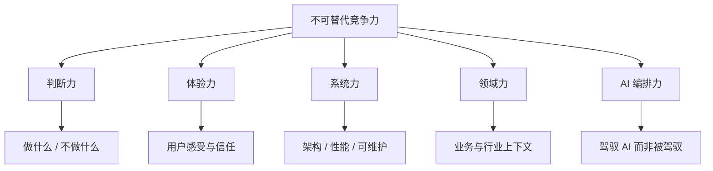
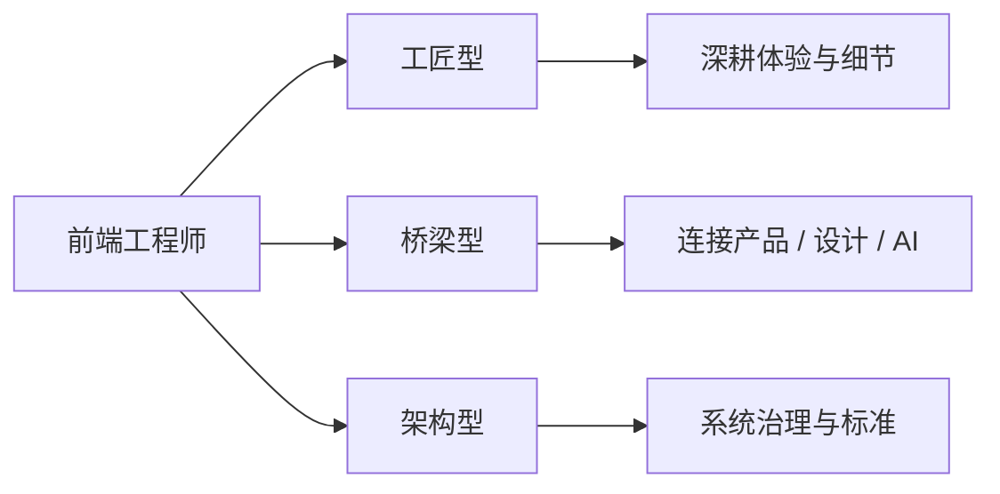

# 当 AI 来敲门：前端工程师如何打造自己的「不可替代的竞争力」

> 发布日期：2026-06-26  
> 标签：前端 / 职业发展 / AI / 竞争力 / 工程思维

「AI 都能写组件了，前端还有前途吗？」

2025 年，这句话在茶水间、技术群、绩效面谈里反复出现。2026 年，答案已经更清晰：**有前途的从来不是「会写代码的人」，而是「能把代码变成正确结果的人」。**

AI 来敲门，敲掉的首先是 **可commoditize（商品化）** 的劳动——重复的布局、标准的 CRUD、照抄文档的接口封装。它敲不掉的，是 **判断、责任、信任与体验**——而这些，恰恰是优秀前端工程师常年修炼的内功。

本文不谈焦虑贩卖，也不画「学三门语言就能逆袭」的饼。我想和你聊聊：在 AI 成为标配的 2026 年，前端工程师的竞争力到底长什么样，以及如何 **刻意练习** 把它建起来。

---

## 一、先接受一个事实：门槛变了，不是消失了

很多人把「AI 替代前端」理解成「不需要前端了」。更准确的描述是：

```
2020 年的前端门槛：会写页面 + 会调接口 + 会配 webpack
2026 年的前端门槛：会写页面（AI 辅助）+ 会判断对不对 + 会对结果负责
```

AI 把 **下限** 抬高了——实习生 + Cursor 也能产出「看起来能跑」的代码；同时把 **上限** 的表达方式也变了——资深工程师可以把精力放在架构、体验、协作和 AI 编排上，而不是和 CSS 像素较劲。

这意味着两件事同时成立：

1. **纯执行型前端** 的议价空间在收窄——只比谁写得快，你一定比不过 7×24 不累的模型。
2. **系统型前端** 的价值在放大——谁能定义问题、约束 AI、保证交付质量，谁就更稀缺。

焦虑的根源，往往是不确定自己属于哪一种。

---

## 二、AI 真正替代的是什么？一张诚实的对照表

在制定竞争力策略之前，先划清边界：

| AI 已经做得不错 | AI 仍明显薄弱 | 人的不可替代区 |
|----------------|--------------|---------------|
| 标准组件骨架 | 复杂业务的边界判断 | 产品决策与取舍 |
| 按文档写 API 层 | 跨团队利益协调 | 沟通与推动 |
| 修常见 Lint/类型错误 | 线上事故的问责与复盘 | 责任与信任 |
| 生成单元测试骨架 | 什么样的测试才算「有意义」 | 质量哲学 |
| 模仿既有代码风格 | 用户是谁、场景有多极端 | 用户同理心 |
| 解释主流框架概念 | 你们公司为什么这样设计 | 组织上下文 |
| 快速出 Demo | Demo 与生产的距离 | 工程化与治理 |

注意最后一列：**没有一项是「再学一个 npm 包」能解决的。** 它们来自经验、品味、责任和与真实世界打交道的能力。

我在 [Cursor 一年使用复盘](https://juejin.cn/post/7656751882112565275) 里写过：AI 压缩的是「把想法变成代码」的机械劳动，不是「想清楚要做什么」。竞争力就藏在这句话的后半段。

---

## 三、不可替代竞争力的五个支柱

我把前端工程师在 AI 时代的护城河，归纳为五根柱子。不必每根都满分，但 **至少两根要突出**，并有意识地补强短板。



### 支柱 1：判断力——知道什么不该做

AI 最大的风险不是「写不出来」，而是 **「什么都敢写」**。

一个真实场景：产品说「列表页加个 AI 智能推荐」。模型 10 分钟给你拼出聊天框 + 推荐卡片 + 调用接口——看起来完整，但可能忽略了：

- 推荐逻辑是否需要用户授权？
- 出错时降级策略是什么？
- 首屏性能预算够不够？
- 和现有筛选交互是否冲突？

**判断力** 体现在：在写第一行代码之前，能问出这些问题，并推动达成共识。

刻意练习方式：

- 接到需求先写 **「不做什么」** 清单，而不只是任务列表
- 用 Plan 模式让 AI 出方案，你负责 **否决和风险标注**
- 复盘线上事故：哪些判断前置了能避免？

> 会写代码的人很多，敢 say no 且说得有理的人很少。

### 支柱 2：体验力——AI 写不出「恰到好处」

AI 生成的 UI 往往 **「逻辑正确、体验平庸」**：间距差不多、状态勉强覆盖、极端场景缺失、无障碍常被打折。

体验力不是「审美玄学」，而是一组可修炼的能力：

| 维度 | 具体表现 | AI 的典型短板 |
|------|---------|--------------|
| 状态设计 | 空、加载、错、权限不足、部分成功 | 只覆盖 happy path |
| 反馈时机 | 何时静默、何时提示、何时打断 | 一律 toast 或一律静默 |
| 认知负荷 | 信息层级、默认值、渐进披露 | 把所有字段平铺 |
| 信任感 | 敏感操作确认、可撤销、过程透明 | 黑盒执行 |
| 包容性 | 键盘、读屏、对比度、弱网 | 经常遗漏 |

前端工程师离用户最近。**体验力** 是 AI 时代反而更值钱的能力——因为产品差异化越来越落在「用起来是否舒服、是否放心」上。

刻意练习方式：

- 每个功能强制画 **状态矩阵**（至少 5 种状态）
- 用真实设备 + 弱网 + 读屏工具走一遍流程
- 学习基础 **无障碍规范**（WCAG），写入团队 Rules

### 支柱 3：系统力——从组件到系统

当 AI 能快速产出组件，瓶颈转移到 **组件之上**：

- 模块边界怎么划？
- 状态放哪一层？
- 设计系统如何演进而不腐烂？
- 性能预算谁守？
- 技术债什么时候还？

这就是 **系统力**：不只解决「这个页面」，而是解决「这个项目一年后还能不能健康迭代」。

前端系统力在 2026 年的具体抓手：

```
设计系统 / 组件治理
    ↓
类型与契约（前后端、跨端）
    ↓
构建与交付（CI、监控、Feature Flag）
    ↓
AI 协作治理（Rules、Skills、Eval）
```

你会注意到，最后一项是新的——**团队如何用 AI 规模化产出且不失控**，本身就需要系统力。谁能把规范写进 `.cursor/rules`、谁能设计 MCP 工具边界、谁能建立 AI 生成代码的 Review 标准，谁就是团队里的 **「AI 时代的 Tech Lead」**。

刻意练习方式：

- 主导一次小型 **架构 RFC**（哪怕只是一个模块）
- 为团队写 **组件分层约定** 和 **反模式文档**
- 建立 **性能预算** 和 **包体积告警**

### 支柱 4：领域力——懂业务，而不只是懂 React

同样的技术栈，做电商、做金融、做医疗、做内部 OA，完全不同的 **约束与语言**。

AI 可以读文档，但读不懂：

- 你们公司「订单状态」和历史遗留的特殊枚举
- 财务为什么坚持那样对账
- 销售为什么非要那个看起来丑陋的字段

**领域力** 是时间的函数，也是竞争力的硬壁垒。越复杂的 B 端、越强的合规要求、越深的历史包袱，越需要「懂行的人」。

刻意练习方式：

- 主动参加需求评审，问 **业务目标** 而不只是交互细节
- 画 **业务流程图**，而不只是页面流程图
- 维护一份团队内部的 **「业务词典」**（AI 可读，新人可学）

### 支柱 5：AI 编排力——做机长，不做乘客

这是 2026 年新增的一柱，也是前端工程师 **转型成本最低、回报最高** 的方向（详见 [前端转型 AI Agent 工程师](https://juejin.cn/post/7656300675648585737)）。

AI 编排力 ≠ 会写 Prompt。它包括：

1. **任务分解**：把需求拆成 AI 可执行、可验证的子任务
2. **约束设计**：Rules、类型、测试、MCP 工具边界
3. **质量验收**：diff Review、Eval、lint/test 门禁
4. **人机协同**：何时全自动、何时必须人工确认
5. **失败恢复**：AI 走偏时如何低成本回滚

一个编排力强的人，带 Cursor 的效率可能是普通人的 3 倍；编排力弱的人，可能 **比不用 AI 还慢**——因为要花更多时间擦屁股。

刻意练习方式：

- 为常用工作流写 **Skills**（例如「按规范生成列表页」）
- 每个 Agent 任务绑定 **验收命令**（`lint` / `test` / `build`）
- 记录 **Prompt 反模式**：哪些描述方式容易让 AI 翻车

---

## 四、竞争力不是「更会写代码」，而是「更会对结果负责」

有一条很多人不愿意承认：

> 公司雇前端，买的不是 JSX，是 **「这个功能上线后别出事」** 的承诺。

AI 可以分担书写，但分担不了：

- **线上故障** 时凌晨被叫起来的人
- **和产品经理解释** 为什么这个方案更稳妥的人
- **对安全漏洞** 签字负责的人
- **对残障用户** 能否使用负责的人

「责任」听起来虚，但在组织里极其实——**谁负责，谁就有议价权。**

提升路径：

| 阶段 | 行为特征 | 组织中的位置 |
|------|---------|-------------|
| 执行者 | 等任务、交代码 | 可替代度高 |
| 交付者 | 保质量、守工期 | 团队骨干 |
| 负责人 | 对模块/链路结果负责 | 难以替代 |
| 塑造者 | 定标准、带人、治理 AI 协作 | 稀缺 |

从执行者走向塑造者，核心竞争力就从 **技能栈** 转向了 **影响力 + 标准制定权**。

---

## 五、别和 AI 比快，要比「谁更懂用户」

有一种悲观叙事：「AI 连设计稿都能还原了，前端完了。」

还原设计稿从来就不是前端价值的全部。用户要的不是像素，是 **目标能否完成**：

- 老人能不能看清按钮？
- 地铁弱网下会不会以为「没点上」而重复支付？
- 填到一半离开，回来数据还在不在？
- AI 推荐错了，用户能不能轻松纠正？

这些问题，需要 **对用户场景的想象力**——AI 没有你的生活经验，没有你们产品的真实反馈数据，没有客服群里那些看起来「无理取闹」却暴露真实痛点的吐槽。

**体验力 + 领域力**，是离用户最近的护城河。

一个实用习惯：每个需求至少访谈或观察 **一个真实用户**（或客服、运营、销售）。把一手信息带进技术决策，这是 LLM 检索不到的 Context。

---

## 六、技术深度还要不要？要，但方式变了

「不可替代」不等于「不学新技术」。2026 年的技术学习，建议从 **「背 API」** 转向 **「理解原理 + 知道何时让 AI 查」**：

### 仍然值得深度掌握

| 领域 | 原因 |
|------|------|
| JavaScript 语言本质 | 判断 AI 代码是否有闭包/异步/类型陷阱 |
| 浏览器工作原理 | 性能、安全、渲染问题绕不开 |
| 网络与缓存 | 线上体验的底层 |
| 框架设计思想 | 选型与迁移，而不只是语法 |
| 类型系统 | 约束 AI 输出的利器 |
| 安全基础 | XSS、CSRF、鉴权——AI 常犯险 |

### 可以「会用 + 会查」

| 领域 | 策略 |
|------|------|
| 新库 API 细节 | `@docs` + 官方文档，用到再深钻 |
| 构建工具配置 | 理解原理，细节交给 AI + 模板 |
| 冷门 CSS 属性 | 知道存在，会验证兼容性 |

我在 [2026 前端新技术展望](https://juejin.cn/post/7655529019282767899) 里梳理过框架收敛、Signals、RSC 等方向——**理解趋势比追逐版本号更重要**。趋势帮你做判断，版本号 AI 可以帮你查。

---

## 七、三种前端画像：你对号入座，然后补短板



| 画像 | 优势 | AI 时代风险 | 强化方向 |
|------|------|------------|---------|
| **工匠型** | 还原精准、交互细腻 | 像素级劳动被压缩 | → 设计系统、无障碍、动效哲学 |
| **桥梁型** | 懂沟通、能翻译需求 | 若不懂技术深度易被架空 | → AI 编排、原型验证、快速试错 |
| **架构型** | 稳、可扩展 | 若脱离用户体验易「过度设计」 | → 体验评审、业务理解 |

大多数人其实是 **混合型**。关键是：找到你的长板，把它从「团队里不错」练到 **「离了你这事就难办」**。

---

## 八、可执行的「竞争力建仓」计划

下面是一份 **90 天** 行动计划，每周约 4～6 小时业余投入，不追求面面俱到，追求 **可验证的积累**。

### 第 1～4 周：建立 AI 协作基线

- [ ] 配置 Cursor Rules，固化团队规范
- [ ] 养成 **Plan → Agent → Review** 流程
- [ ] 记录一周：哪些任务 AI 帮了忙？哪些帮倒忙？归纳个人反模式

**产出物**：一份《我的 AI 协作避坑清单》（可参考 [Cursor 一年复盘](https://juejin.cn/post/7656751882112565275)）

### 第 5～8 周：强化体验力

- [ ] 选一个线上页面做 **状态矩阵审计**
- [ ] 完成一次无障碍走查并修 3 个实际问题
- [ ] 为敏感操作设计 **可撤销 / 可确认** 流程

**产出物**：体验改进 MR + 简短复盘文档

### 第 9～12 周：沉淀系统力或领域力（二选一）

**系统力路线**：

- [ ] 起草一份模块架构 RFC
- [ ] 建立包体积或 LCP 监控告警
- [ ] 为团队写组件分层与反模式文档

**领域力路线**：

- [ ] 绘制核心业务流程图
- [ ] 维护业务词典（10～20 个关键概念）
- [ ] 参加 2 次需求评审并提问业务目标

**产出物**：团队可复用的文档或工具

### 持续进行：扩大责任半径

- 主动认领 **on-call 或线上质量** 相关职责
- 在 Code Review 中不只审代码，还审 **产品逻辑与体验**
- 教会一个同事你的 AI 工作流——教是最好的学

---

## 九、心态：与 AI 共存，而不是与 AI 赛跑

最后想聊一点心态。

AI 来敲门，不是要抢走你的工位，而是 **重新定义工位上干什么**。历史上，IDE、框架、组件库、低代码都曾被说成「前端要完了」——每一次，活下来的都是适应了工具、抬高了价值维度的人。

几个值得反复提醒自己的观念：

1. **AI 是杠杆，不是替身。** 杠杆放大的是你已有的判断力和品味。
2. **不必成为 AI 专家，但要成为 AI 时代的优秀工程师。** 编排力是加分项，不是换专业。
3. **开放学习，拒绝 FOMO。** 今天换模型、明天换框架，不如建好基本功和护城河。
4. **可见度来自交付与负责，不来自焦虑发帖。** 把东西做好、做稳、让人放心，市场会给出答案。

---

## 十、结语：敲门声里，听见自己的位置

当 AI 来敲门，有人会听成丧钟，有人会听成开工铃。

前端工程师的不可替代性，从来不在于「谁能多写两千行」，而在于：

- 谁能把模糊的需求变成 **靠谱的体验**
- 谁能在 AI 狂奔时 **踩住刹车**
- 谁能在系统变复杂时 **守住底线**
- 谁能在团队里 **把 AI 变成倍增器而不是地雷**

这五件事，没有一键生成的快捷键。

把 [技术趋势](https://juejin.cn/post/7655529019282767899) 当作地图，把 [AI Agent 能力](https://juejin.cn/post/7656300675648585737) 当作新工具，把 [Cursor 实践](https://juejin.cn/post/7656751882112565275) 当作日常训练场——然后在该深耕处深耕，在该负责处负责。

敲门声还在响。值得问的从来不是「AI 会不会取代我」，而是：

**门开后，你站在什么位置上？**

---

## 行动清单

- [ ] 用五支柱自评：判断力 / 体验力 / 系统力 / 领域力 / AI 编排力，各打 1～5 分
- [ ] 选出最短板的 1 项，纳入下季度 OKR
- [ ] 写一份个人「AI 协作避坑清单」，10 条以内
- [ ] 找一个真实用户场景，验证当前在做的功能
- [ ] 主动承担一次「对结果负责」的模块或链路

---

## 系列延伸阅读

- [2026 前端新技术展望：从框架之争到渲染模型的收敛](https://juejin.cn/post/7655529019282767899)
- [前端工程师如何转型 AI Agent 工程师](https://juejin.cn/post/7656300675648585737)
- [前端工程师的 AI 副驾驶：我用 Cursor 一整年的真实体验与避坑指南](https://juejin.cn/post/7656751882112565275)

---

*本文是「前端 × AI 时代」系列文章的第四篇，聚焦职业竞争力与长期主义，与前述技术、工具、实践文章互补阅读。*
