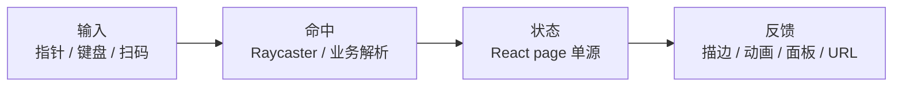
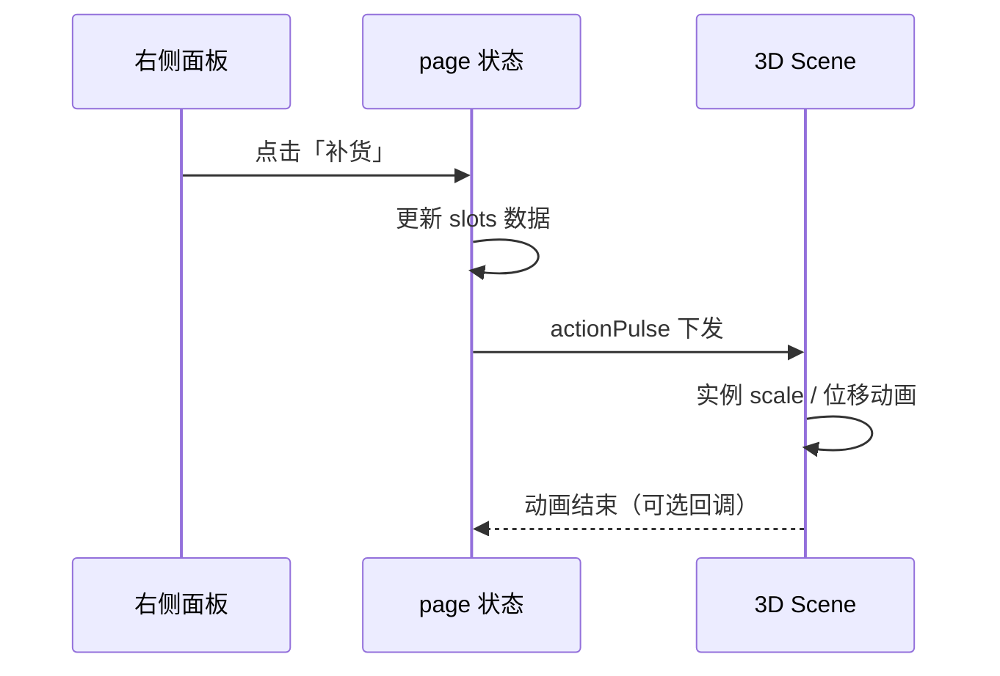

# 浏览器 3D 交互实战：射线拾取、描边高亮与业务面板联动

> 发布日期：2026-07-15  
> 标签：前端 / Three.js / React Three Fiber / 3D 交互 / WebGL / 工程实践

把 3D 场景「画出来」和「能点得着、点完有反馈、还能跟业务面板说话」，是两件难度完全不同的事。

我在 [仓储可视化](https://juejin.cn/post/7654641623330209802) 里做了 144 货位的点击选中、流动描边、右侧面板操作；在 [3D 看车](https://github.com/jiaxiantao/3d-car-viewing) 里做了车门/灯光按钮门控；在 [仓储升级篇](https://jiaxiantao.github.io/blogs/post/3D%E5%BF%AB%E9%80%92%E4%BB%93%E5%82%A8%E5%8F%AF%E8%A7%86%E5%8C%96%E9%87%8D%E7%A3%85%E5%8D%87%E7%BA%A7-%E4%BB%8E%E9%9D%99%E6%80%81%E7%9C%8B%E6%9D%BF%E5%88%B0%E5%8F%AF%E6%BC%AB%E6%B8%B8%E7%9A%84WMS%E6%BC%94%E7%A4%BA%E5%9C%BA) 里又碰到了「相机拖拽 / 地面寻路 / 货位点击」抢事件的问题。

[性能优化文](https://jiaxiantao.github.io/blogs/post/%E6%B5%8F%E8%A7%88%E5%99%A8%E7%AB%AF3D%E5%9C%BA%E6%99%AF%E6%80%A7%E8%83%BD%E4%BC%98%E5%8C%96%E5%AE%9E%E6%88%98-%E4%BB%8EDraw-Call%E5%88%B0%E9%A6%96%E5%B1%8F%E5%8A%A0%E8%BD%BD) 解决的是「怎么画得快」；本文专门讲 **交互层通用模式**：射线拾取怎么做、InstancedMesh 怎么点、选中怎么高亮、3D 与 React 面板如何联动、URL 深链怎么设计，以及常见踩坑。

---

## 一、先定心智模型：3D 交互是一层「输入 → 命中 → 状态 → 反馈」

把交互拆成四段，比一上来写 `onClick` 清晰得多：



| 阶段 | 职责 | 常见错误 |
|------|------|---------|
| **输入** | 归一化坐标、分流「拖相机还是点物体」 | 拖拽松手被当成一次点击 |
| **命中** | 射线求交 → 业务 ID（slotId / partId） | 命中了 mesh，却找不到业务对象 |
| **状态** | React 持有选中、筛选、操作脉冲 | 在 Canvas 里另起一套状态，面板不同步 |
| **反馈** | 高亮、描边、面板、相机聚焦、深链 | 放大本体导致穿模 / 挤邻格 |

**原则**：业务状态放在 Canvas **外面**；场景只负责「呈现 + 拾取 + 动画表现」。这在仓储和看车两个项目里都验证过。

---

## 二、状态分层：谁持有选中，谁只负责画

### 2.1 推荐架构

```text
page.tsx（React）
  ├── selectedId / filter / viewMode / actionPulse
  ├── 右侧业务面板（读状态、发操作）
  └── <Canvas>
        └── Scene（props 下发状态，回调上报命中）
```

| 模块 | 持有什么 | 不持有什么 |
|------|---------|-----------|
| `page.tsx` | 选中 ID、筛选、视角、操作脉冲 | WebGL 对象引用 |
| Scene | 矩阵、相机、描边 mesh | 业务真相源（不以它为准） |
| Panel | 展示与按钮 | 自己算世界坐标 |

### 2.2 看车项目的 capabilities 门控

不是所有模型都能开门。看车用 **capabilities 上报**，UI 按能力启用按钮：

```ts
// 伪代码
onAssetRigCapabilities({
  doors: true,
  lights: true,
  paint: true,
  trunk: false, // 合并网格 → 按钮禁用
});
```

交互体验的底线是：**点了没反应，比按钮灰掉更糟**。

---

## 三、射线拾取：从「点到屏幕」到「业务对象」

### 3.1 基本流程

```ts
const raycaster = new THREE.Raycaster();
const pointer = new THREE.Vector2();

function onPointerDown(event: PointerEvent) {
  const rect = canvas.getBoundingClientRect();
  pointer.x = ((event.clientX - rect.left) / rect.width) * 2 - 1;
  pointer.y = -((event.clientY - rect.top) / rect.height) * 2 + 1;

  raycaster.setFromCamera(pointer, camera);
  const hits = raycaster.intersectObjects(pickables, true);
  if (!hits.length) {
    clearSelection();
    return;
  }
  const id = resolveBusinessId(hits[0].object); // userData.slotId 等
  setSelectedId(id);
}
```

关键不在 Raycaster API，而在 **`resolveBusinessId`**：命中几何体后，如何稳定拿到业务 ID。

### 3.2 给可点击对象挂 `userData`

```ts
mesh.userData.slotId = slot.id;
mesh.userData.pickType = 'slot';
```

| 做法 | 优点 | 缺点 |
|------|------|------|
| `userData` 直接挂 ID | 简单直观 | 实例化时每实例一份数据 |
| Mesh 名编码 ID | 调试时看得见 | 命名易冲突，不推荐 |
| 独立空间索引 | 适合海量点 | 实现成本高 |

### 3.3 R3F 里常见写法

```tsx
<mesh
  onClick={(e) => {
    e.stopPropagation();
    onSelect(e.object.userData.slotId);
  }}
  onPointerOver={() => setHovered(true)}
  onPointerOut={() => setHovered(false)}
>
  <boxGeometry />
  <meshBasicMaterial />
</mesh>
```

`stopPropagation` 很重要：否则点货位会穿透到地面寻路、点地面会误清选中。

### 3.4 拖拽 vs 点击：避免「松手误点」

仓储升级后，上帝视角拖轨道、地面点选寻路、货位点选并存。常见解法：

```ts
const dragThreshold = 4; // px
let downPos = { x: 0, y: 0 };
let moved = false;

onPointerDown = (e) => { downPos = { x: e.clientX, y: e.clientY }; moved = false; };
onPointerMove = (e) => {
  if (Math.hypot(e.clientX - downPos.x, e.clientY - downPos.y) > dragThreshold) {
    moved = true;
  }
};
onPointerUp = (e) => {
  if (moved) return; // 这是拖相机，不是点击
  handlePick(e);
};
```

配合 `blockGroundClickRef`（拖拽结束短暂屏蔽地面点击），可消掉大量误触。

---

## 四、InstancedMesh 拾取：量大时的必答题

仓储 144 货位用 `InstancedMesh`。普通 `intersectObjects` 能拿到：

- `object`：整块 InstancedMesh
- `instanceId`：第几个实例

### 4.1 用 instanceId 反查业务

```ts
const hits = raycaster.intersectObject(instancedMesh);
if (!hits.length) return;

const { instanceId } = hits[0];
const slot = instanceIndexToSlot.get(instanceId); // 预先建好映射
setSelectedId(slot.id);
```

| 映射表 | 内容 |
|--------|------|
| `instanceIndex → slotId` | 拾取时 O(1) |
| `slotId → instanceIndex` | 外部选中时刷新矩阵 / 描边 |

**踩坑**：筛选导致「匹配走 InstancedMesh、未匹配走独立 mesh」时，映射表要随分组重建，否则 `instanceId` 对不上。

### 4.2 性能注意

| 做法 | 说明 |
|------|------|
| 只放可点击对象进 `pickables` | 别把货架梁、地面标签全塞进去 |
| hover 节流 | `pointermove` 不必每像素求交，可 rAF 合并 |
| demand 渲染 | 命中后 `invalidate()`，详见 [性能文](https://jiaxiantao.github.io/blogs/post/%E6%B5%8F%E8%A7%88%E5%99%A8%E7%AB%AF3D%E5%9C%BA%E6%99%AF%E6%80%A7%E8%83%BD%E4%BC%98%E5%8C%96%E5%AE%9E%E6%88%98-%E4%BB%8EDraw-Call%E5%88%B0%E9%A6%96%E5%B1%8F%E5%8A%A0%E8%BD%BD) |

---

## 五、选中反馈：描边比「放大」更适合密集网格

### 5.1 为什么不要放大货位本体

仓储货位贴得很紧。选中时 `scale *= 1.1` 会：

- 挤占邻格空间，视觉上「鼓包」
- 和货架梁穿模
- hover / selected 叠加时更难看

### 5.2 外扩流动线框方案

仓储最终方案：

1. 货位 mesh **保持原始缩放**
2. 单独渲染 `SelectedSlotOutline`：`LineSegments2` + `LineMaterial`（`worldUnits: true`）
3. 线框几何相对货位外扩约 `0.045` 世界单位
4. 描边颜色跟随货位状态色
5. `dashOffset` 在 `useFrame` 中递增，形成流动虚线

```tsx
// 伪代码结构
function SelectedSlotOutline({ slot, color }) {
  const matRef = useRef<LineMaterial>(null);
  useFrame((_, dt) => {
    if (matRef.current) matRef.current.dashOffset -= dt * 0.8;
    invalidate();
  });
  return (
    <lineSegments2 position={slot.worldPos}>
      <lineSegmentsGeometry /* 外扩 box edges */ />
      <lineMaterial
        ref={matRef}
        color={color}
        linewidth={2}
        worldUnits
        dashed
      />
    </lineSegments2>
  );
}
```

### 5.3 反馈手段对照

| 手段 | 适用 | 风险 |
|------|------|------|
| 外扩线框 / 描边 | 密集网格、仓储货位 | 实现稍重 |
| emissive 提亮 | 单模型部件（车门、灯） | 材质共享时要 clone |
| 独立 outline pass | 电影级高亮 | 移动端成本高 |
| 放大 scale | 稀疏物体、图标 | 密集场景易穿模 |
| 相机聚焦飞入 | 讲解 / 扫码定位 | 要和用户拖拽抢控制权 |

### 5.4 无障碍

尊重 `prefers-reduced-motion`：流动虚线可改为静态描边，避免眩晕。

---

## 六、3D ↔ 业务面板联动：actionPulse 模式

点击货位后，右侧面板展示 SKU、库存条、操作按钮。操作不要直接在 panel 里改 mesh，而是：

```ts
// page 层
const [actionPulse, setActionPulse] = useState<{
  slotId: string;
  action: 'restock' | 'clear' | 'toggle-lock';
  at: number;
} | null>(null);

function onRestock(slotId: string) {
  applySlotAction(slotId, 'restock'); // 更新数据
  setActionPulse({ slotId, action: 'restock', at: Date.now() });
}
```

3D 层读 `actionPulse`，在对应实例上叠加短暂动画（弹跳 / 收缩 / 抖动），约 720ms 后结束。



**好处**：面板与场景解耦；数据仍是单一真相源；动画是「表现层」，失败可回放。

---

## 七、多输入源：不只靠鼠标

升级版仓储增加了扫码定位：

| 输入 | 解析结果 | 状态动作 |
|------|---------|---------|
| 点击货位 | `slotId` | `setSelectedId` |
| URL `?slot=` | `slotId` | hydrate 选中 + 可选飞镜 |
| 扫码 / `?sku=` | SKU → 多个货位 | 选中首个 + toast 数量 |
| 筛选栏 | `filter` | 半透明压暗未匹配项 |

抽象成统一入口：

```ts
function selectSlot(slotId: string, opts?: { focusCamera?: boolean; source?: string }) {
  setSelectedId(slotId);
  syncUrl({ slot: slotId });
  if (opts?.focusCamera) flyToSlot(slotId);
}
```

**所有输入最终都落进同一个 `selectSlot`**，避免扫码一套逻辑、点击又一套。

---

## 八、URL 深链：可分享的交互状态

仓储示例：

```text
/warehouse?slot=A-03-L2&view=aisle&filter=low
```

看车示例：车型、车漆、机位写入 query。

### 实践要点

| 点 | 建议 |
|----|------|
| 写回方式 | `history.replaceState`，避免每点一次推一条历史 |
| SSR | `useEffect` 读 URL，避免 hydration mismatch |
| 兼容 | 未知参数忽略，不要白屏 |
| 与动画 | 深链进页时可飞镜一次，用户再拖则交还控制权 |

```ts
useEffect(() => {
  const params = new URLSearchParams(window.location.search);
  const slot = params.get('slot');
  if (slot) selectSlot(slot, { focusCamera: true, source: 'url' });
}, []);
```

---

## 九、事件冲突：一张 Canvas，多套手势

[仓储升级篇](https://jiaxiantao.github.io/blogs/post/3D%E5%BF%AB%E9%80%92%E4%BB%93%E5%82%A8%E5%8F%AF%E8%A7%86%E5%8C%96%E9%87%8D%E7%A3%85%E5%8D%87%E7%BA%A7-%E4%BB%8E%E9%9D%99%E6%80%81%E7%9C%8B%E6%9D%BF%E5%88%B0%E5%8F%AF%E6%BC%AB%E6%B8%B8%E7%9A%84WMS%E6%BC%94%E7%A4%BA%E5%9C%BA) 的难点之一，就是多手势抢事件：

| 视角模式 | 拖拽含义 | 点击含义 |
|---------|---------|---------|
| 上帝 / overview | 轨道旋转 | 点货位 / 地面 |
| 第三人称 | 拖机身转向 | 点地面寻路 |
| 第一人称 | 视角 | 尽量少点选 UI 外物体 |

**分流规则写进 `viewMode`**，不要靠「谁后绑谁先响应」碰运气。

```ts
if (viewMode === 'god') {
  // OrbitControls 启用；地面点击可选关
} else if (viewMode === 'third') {
  // 拖拽改 yaw；点击地面 → 寻路
}
```

---

## 十、demand 渲染下的「看起来在动」

`frameloop="demand"` 省电，但描边流动、补货弹跳、相机插值都必须主动：

```ts
useFrame(() => {
  updateOutlineDash();
  updateActionPulse();
  invalidate(); // 有动画才调
});
```

空闲时不要每帧更新 144 个实例矩阵——只在「有 pulse / 有 hover / 首屏引导」时更新。

---

## 十一、可复用的交互检查清单

### 命中

- [ ] 可点击对象有稳定 `userData` / 映射表
- [ ] InstancedMesh 用 `instanceId` 反查业务 ID
- [ ] `stopPropagation` 防止穿透
- [ ] 拖拽阈值，避免松手误点

### 反馈

- [ ] 密集网格用外扩描边，而非放大本体
- [ ] 选中色与业务状态色一致
- [ ] 尊重 `prefers-reduced-motion`
- [ ] 操作有短暂 3D 动画反馈（actionPulse）

### 联动

- [ ] React page 为唯一状态源
- [ ] 面板操作 → 数据更新 → pulse 下发 3D
- [ ] URL / 扫码 / 点击共用 `selectSlot`

### 冲突与性能

- [ ] `viewMode` 分流手势
- [ ] pickables 列表尽量短
- [ ] demand 下动画路径都 `invalidate()`

---

## 十二、踩坑速查

| 现象 | 原因 | 对策 |
|------|------|------|
| 点得着但面板不更新 | 状态在 Canvas 内 | 上提 selectedId 到 page |
| 点了没反应 | 部件无能力 / pick 未挂 ID | capabilities 门控 + userData |
| 拖完相机多选了一下 | 拖拽被当点击 | 像素阈值 + blockGroundClick |
| InstancedMesh 选错货位 | 映射表过期 | 筛选/分组后重建 index 表 |
| 选中挤穿邻格 | scale 放大本体 | 外扩线框 |
| 描边不流动 / 不显示 | demand 未 invalidate | 动画帧调用 invalidate |
| 地面寻路与点货位打架 | 事件未分流 | viewMode + stopPropagation |
| 分享链接状态丢失 | 只写内存 | URL replaceState 同步 |

---

## 结语

浏览器端 3D 交互的工程要点，可以压成四句话：

1. **状态在 React，场景只负责呈现与命中**
2. **业务 ID 比 mesh 引用更重要**
3. **密集网格用描边，不靠放大**
4. **所有输入（点击 / URL / 扫码）汇入同一个 select 函数**

把这层做稳，后面接真实 WMS、接 AGV 位置、接新车型部件，都只是换数据源和 capabilities——交互骨架不用推倒重来。

如果你正在做仓储类可视化或商品展厅，建议先用检查清单过一遍现有拾取与反馈；大多数「点着别扭」的问题，都能归到「映射、分流、状态分层」这三类。

---

## 系列延伸阅读

- [用 Next.js + React Three Fiber 打造 3D 快递仓储可视化](https://juejin.cn/post/7654641623330209802) — InstancedMesh、筛选、描边、深链
- [3D 快递仓储可视化重磅升级](https://jiaxiantao.github.io/blogs/post/3D%E5%BF%AB%E9%80%92%E4%BB%93%E5%82%A8%E5%8F%AF%E8%A7%86%E5%8C%96%E9%87%8D%E7%A3%85%E5%8D%87%E7%BA%A7-%E4%BB%8E%E9%9D%99%E6%80%81%E7%9C%8B%E6%9D%BF%E5%88%B0%E5%8F%AF%E6%BC%AB%E6%B8%B8%E7%9A%84WMS%E6%BC%94%E7%A4%BA%E5%9C%BA) — 多视角抢事件、扫码定位
- [浏览器端 3D 看车：从 GLB 到可交互展厅](https://github.com/jiaxiantao/3d-car-viewing) — capabilities 门控、URL 状态
- [浏览器端 3D 场景性能优化实战](https://jiaxiantao.github.io/blogs/post/%E6%B5%8F%E8%A7%88%E5%99%A8%E7%AB%AF3D%E5%9C%BA%E6%99%AF%E6%80%A7%E8%83%BD%E4%BC%98%E5%8C%96%E5%AE%9E%E6%88%98-%E4%BB%8EDraw-Call%E5%88%B0%E9%A6%96%E5%B1%8F%E5%8A%A0%E8%BD%BD) — demand 渲染与 draw call

---

## 参考

| 资源 | 说明 |
|------|------|
| Three.js Raycaster | https://threejs.org/docs/#api/en/core/Raycaster |
| R3F Events | https://docs.pmnd.rs/react-three-fiber/api/events |
| drei Line / LineSegments2 | 世界单位线宽描边 |

---

*本文基于 [3d-express-warehouse](https://github.com/jiaxiantao/3d-express-warehouse) 与 [3d-car-viewing](https://github.com/jiaxiantao/3d-car-viewing) 交互层实践整理。*
