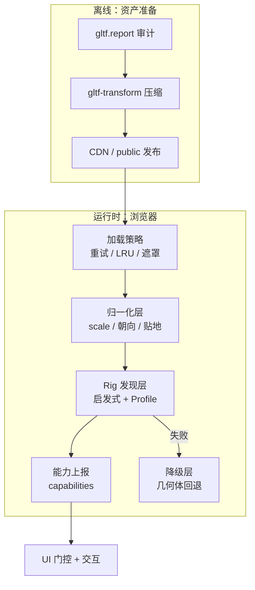
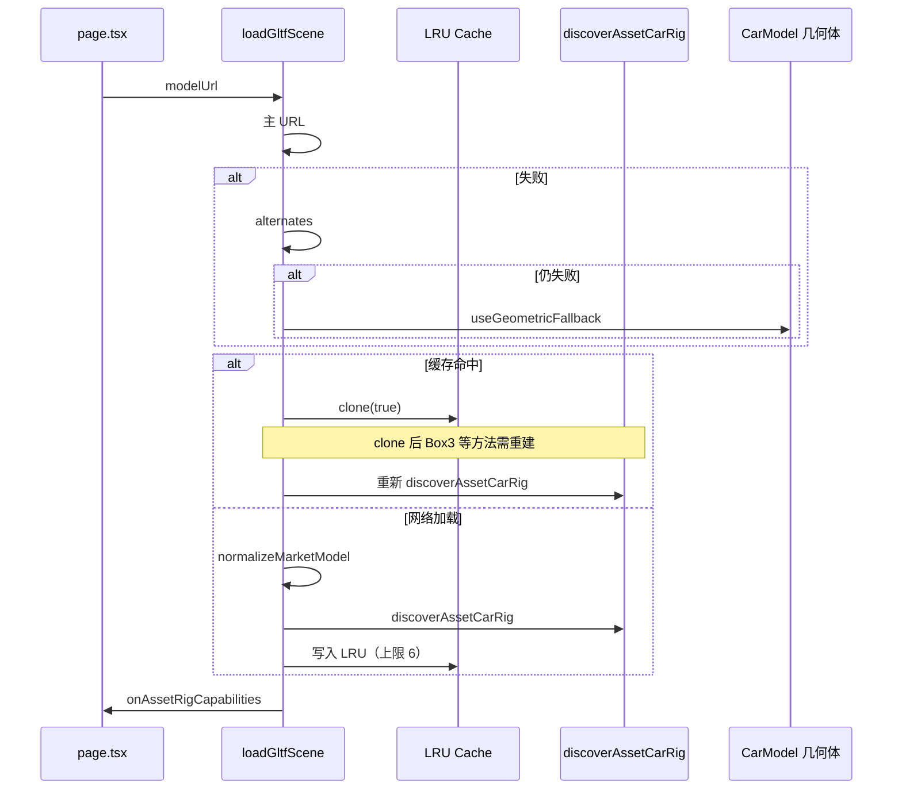
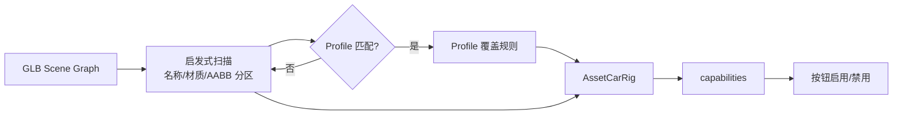
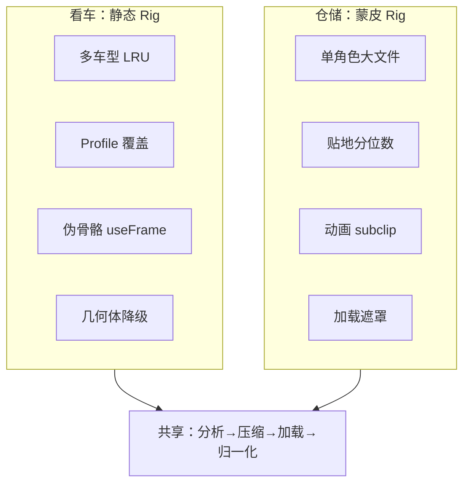

# 浏览器 3D 项目 GLB 工程化全链路：分析、压缩、归一化、Rig 发现与降级

> 发布日期：2026-07-16  
> 标签：前端 / Three.js / GLB / glTF / React Three Fiber / 3D 工程化 / WebGL

在 [3D 看车](https://github.com/jiaxiantao/3d-car-viewing) 项目里，我接入了 Sketchfab、Forza 导出的第三方 GLB：命名混乱、部件合并、没有开门动画，切换车型时机位全乱。在 [仓储升级](https://jiaxiantao.github.io/blogs/post/3D%E5%BF%AB%E9%80%92%E4%BB%93%E5%82%A8%E5%8F%AF%E8%A7%86%E5%8C%96%E9%87%8D%E7%A3%85%E5%8D%87%E7%BA%A7-%E4%BB%8E%E9%9D%99%E6%80%81%E7%9C%8B%E6%9D%BF%E5%88%B0%E5%8F%AF%E6%BC%AB%E6%B8%B8%E7%9A%84WMS%E6%BC%94%E7%A4%BA%E5%9C%BA) 里，`robot.glb` 约 28MB，蒙皮角色贴地、缩放、动画循环各踩一遍坑。

[性能文](https://jiaxiantao.github.io/blogs/post/%E6%B5%8F%E8%A7%88%E5%99%A8%E7%AB%AF3D%E5%9C%BA%E6%99%AF%E6%80%A7%E8%83%BD%E4%BC%98%E5%8C%96%E5%AE%9E%E6%88%98-%E4%BB%8EDraw-Call%E5%88%B0%E9%A6%96%E5%B1%8F%E5%8A%A0%E8%BD%BD) 讲「画得快」；[交互文](https://jiaxiantao.github.io/blogs/post/%E6%B5%8F%E8%A7%88%E5%99%A83D%E4%BA%A4%E4%BA%92%E5%AE%9E%E6%88%98-%E5%B0%84%E7%BA%BF%E6%8B%BE%E5%8F%96%E6%8F%8F%E8%BE%B9%E9%AB%98%E4%BA%AE%E4%B8%8E%E4%B8%9A%E5%8A%A1%E9%9D%A2%E6%9D%BF%E8%81%94%E5%8A%A8) 讲「点得着」。本文专门讲中间这层：**模型怎么从下载的 GLB，变成浏览器里可控、可交互、可降级的资产**。

这不是 glTF 规范教程，而是一份 **可复用的工程化管线**：分析 → 压缩发布 → 加载 → 归一化 → Rig 发现 → 降级，以及两个真实项目的对照与踩坑。

---

## 一、第三方 GLB 的「不可控」清单

上线前，先接受现实：你几乎无法控制上游资产。

| 问题 | 看车项目实例 | 仓储机器人实例 |
|------|------------|--------------|
| 命名混乱 | `Object_47`、`polySurface5638` | 骨骼名无业务语义 |
| 部件合并 | 宝马 M2 车门与车身同一 mesh | — |
| 无 glTF 动画 | 多数车模只有静态网格 | 有行走 clip，但含静止死区 |
| 尺度差异 | FBX 导出 `scale=0.01` | 模型单位与场景不匹配 |
| 朝向不一致 | Z 轴朝前 vs 展厅假设 -X 朝前 | 转身绕场景原点公转 |
| 体积过大 | 单车型 20～40MB，全库 120MB+ | `robot.glb` ~28MB |
| 辅助节点残留 | camera、gizmo mesh | — |

**工程目标不是「让 GLB 变完美」，而是「把不可控翻译成可控」**：

```
不可控 GLB → 分析审计 → 压缩发布 → 加载管线 → 归一化 → Rig 发现 → capabilities → 降级
```

---

## 二、五层管线架构



| 层级 | 职责 | 失败时 |
|------|------|--------|
| **分析** | 知道模型有什么、多大、能否用 | 不进入仓库 |
| **压缩** | 控制首屏体积 | 分 LOD / 延迟加载 |
| **加载** | 稳、快、有反馈 | 重试链 → 降级 |
| **归一化** | 尺度/朝向/落地一致 | 相机和交互全乱 |
| **Rig 发现** | 把 mesh 映射成交互能力 | capabilities 关按钮 |
| **降级** | 演示不白屏 | 几何体替代 |

下面按流水线顺序展开。

---

## 三、Phase 1：模型分析——上线前先体检

### 3.1 用 gltf.report 做审计

每个新 GLB 入库前，打开 [gltf.report](https://gltf.report/) 或 Blender 查看：

| 检查项 | 关注点 | 红线 |
|--------|--------|------|
| 文件体积 | 总大小、纹理占比 | 单文件 > 30MB 需压缩或拆分 |
| 三角面数 | draw call 压力 | 移动端 > 500K 需 LOD |
| 纹理分辨率 | 4K 贴图滥用 | > 2K 考虑降采样 |
| 节点树 | mesh 命名、层级 | 有无 door/wheel 等可识别节点 |
| 材质 | PBR 贴图数量 | 透明 + 双面过多影响排序 |
| 动画 | clips 名称与时长 | 首尾静止帧 → 需 subclip |

### 3.2 看车三车型差异（真实数据）

| 车型 | mesh 数 | 拆分特点 | 可交互能力 |
|------|--------|---------|-----------|
| SUV（奥迪 Q3） | ~253 | 部件较清晰 | 门/后备箱/天窗；轮与车身合并 |
| 轿车（宝马 M2） | ~1200 | `Object_*` 命名 | 灯/漆/振动；门轮合并 |
| 越野（Brabus G900） | ~109 | 路面轮焊车身 | 灯/振动；备胎不转 |

**结论**：不能假设「有 door 关键字就能开门」——必须先审计，再决定靠启发式还是 Profile 硬编码。

### 3.3 入库清单（模板）

```markdown
## GLB 资产卡：suv-mainstream.glb

- 来源：Sketchfab / 自研
- 体积：34MB（压缩前）→ 8MB（Draco 后）
- 三角面：182K
- 最大纹理：2048²
- 动画：无
- 已知问题：路面四轮与车身合并
- Rig 策略：自动发现 + suv-q3 Profile
- capabilities：doors ✓ trunk ✓ wheels ✗
- 降级：几何体 CarModel
```

---

## 四、Phase 2：压缩与发布——首屏的生死线

### 4.1 压缩手段对照

| 手段 | 典型收益 | 工具 | 注意 |
|------|---------|------|------|
| Draco 几何压缩 | 50%～90% 体积 | `gltf-transform`、`gltf-pipeline` | 需 `DRACOLoader` 解码 |
| 纹理 WebP / KTX2 | 60%～80% | `gltf-transform`、toktx | KTX2 需 basis 转码 |
| 减面 Decimate | 视模型而定 | Blender | 影响细节，需目视验收 |
| 纹理降分辨率 | 明显 | Blender / ImageMagick | 车漆贴图 2K 通常够用 |
| 分离 LOD | 首屏更快 | 多文件 + 距离切换 | 仓储机器人 TODO |

### 4.2 gltf-transform 一键管线

```bash
# 安装
npm i -g @gltf-transform/cli

# 优化：Draco + 纹理 WebP + 去重
gltf-transform optimize input.glb output.glb \
  --compress draco \
  --texture-compress webp

# 仅分析（不改动）
gltf-transform inspect input.glb
```

### 4.3 发布策略

| 策略 | 适用 |
|------|------|
| `public/models/` 静态托管 | 演示站、GitHub Pages |
| CDN + 长缓存 | 生产环境，`Cache-Control: immutable` |
| 按车型/角色分包 | 看车多车型、不要一次拉 120MB |
| `dynamic import` 路由级懒加载 | 3D 页才加载 Three.js（两项目均采用） |

```tsx
const CarShowroomScene = dynamic(
  () => import('@/components/car-showroom-scene').then(m => m.CarShowroomScene),
  { ssr: false, loading: () => <LoadingPlaceholder /> },
);
```

### 4.4 仓储机器人：下一个优化点

升级篇 TODO 已写明：**robot.glb Draco 压缩或 LOD**。28MB 蒙皮角色是首屏最大瓶颈——压缩 + 加载遮罩是组合拳，不能只靠遮罩糊弄。

---

## 五、Phase 3：加载策略——稳、快、有反馈

### 5.1 看车加载流程



### 5.2 关键机制

| 机制 | 作用 | 参数 |
|------|------|------|
| LRU 缓存 | 切车型秒开 | `limit = 6`，淘汰时 `dispose` |
| `clone(true)` | 多实例不共享骨骼/材质状态 | 克隆后 **必须重建 rig** |
| 候选 URL 链 | 主 → 备选 → fallback | 全失败才几何体 |
| 切换保留旧模型 | 新车未就绪时旧车仍可见 | 避免闪白 |
| `MIN_LOADING_OVERLAY_MS` | 缓存命中也短暂显示 overlay | ~480ms，防闪烁 |
| 加载遮罩 | 机器人/大车首屏等待 | `aria-live` 读屏友好 |

### 5.3 LRU 与 dispose

```ts
const MAX_CACHED_MODELS = 6;

function evictOldest() {
  const oldestKey = cache.keys().next().value;
  const entry = cache.get(oldestKey);
  disposeGltf(entry.scene); // geometry + material + texture
  cache.delete(oldestKey);
}

function disposeGltf(root: THREE.Object3D) {
  root.traverse((obj) => {
    if (obj instanceof THREE.Mesh) {
      obj.geometry?.dispose();
      const mats = Array.isArray(obj.material) ? obj.material : [obj.material];
      mats.forEach((m) => {
        m.dispose();
        Object.values(m).forEach((v) => v?.dispose?.());
      });
    }
  });
}
```

**踩坑**：只 `cache.delete()` 不 `dispose()` → GPU 内存泄漏，切几次车型浏览器卡死。

---

## 六、Phase 4：归一化层——异构 GLB 的统一坐标系

不同来源的 GLB，尺度和朝向各异。不归一化，切换资产时相机、地面、orbit 限制全部失效。

### 6.1 看车：`normalizeMarketModel()`

```ts
export function normalizeMarketModel(
  root: THREE.Object3D,
  targetLength = 4,
  groundY = -0.22,
) {
  hideHelperMeshes(root);              // 隐藏 camera / gizmo
  root.position.sub(center);         // 几何中心 → 原点
  root.scale.multiplyScalar(scale);    // 最长轴缩放到 ~4m
  root.rotation.y = -Math.PI / 2;      // Z-forward → -X-forward（车头）
  root.position.y += groundY - bounds.min.y; // 轮胎落地
  return getVisibleMeshBounds(root);
}
```

| 步骤 | 原因 |
|------|------|
| `hideHelperMeshes` | 辅助 mesh 污染包围盒 |
| 世界空间 AABB | 必须 `updateWorldMatrix` 后算，含父级 scale |
| 车头 -X | 与展厅相机预设、orbit 逻辑一致 |
| `groundY` 落地 | 不同车型轮胎接触同一平面 |

归一化后，`getOrbitDistanceLimits()` 基于 span 动态算 `minDistance` / `maxDistance`——大小车都能合理缩放。

### 6.2 仓储机器人：蒙皮角色的特殊规则

蒙皮 mesh **不能**在父级 `Group` 上统一 scale，否则顶点与骨骼错位。

| 规则 | 说明 |
|------|------|
| 缩放写在 GLTF 根节点 | 不用外层 Group 缩放 |
| 禁止乱调 `pose()` | bind pose 已正确时，强行 pose 会穿模 |
| 贴地用顶点分位数 | `bounds.min.y` 常低于脚底，采样后下沉 |
| 水平中心对齐 pivot | 转弯绕机身竖直轴，不绕场景原点 |
| `SkeletonUtils.clone` | 多实例不共享骨骼状态 |

```ts
// 伪代码：prepareRobotModel
function prepareRobotModel(gltf: GLTF) {
  const root = gltf.scene;
  applyScaleOnRoot(root, TARGET_HEIGHT);
  alignHorizontalPivot(root);
  snapToGroundByVertexPercentile(root, 0.02); // 2% 分位作脚底
  return root;
}
```

### 6.3 归一化 vs Rig 发现的顺序

```text
加载 → normalize（尺度/朝向/落地）→ discoverRig（部件/骨骼）→ 上报 capabilities
```

**顺序不能反**：先 rig 再 normalize，包围盒分区阈值全错。

---

## 七、Phase 5：Rig 发现层——把 mesh 翻译成交互能力

这是看车项目的 **核心工程价值**：用发现层把不可控 GLB 映射成 `AssetCarRig`。

### 7.1 架构



### 7.2 启发式发现（`discoverAssetCarRig`）

1. 遍历所有 `Mesh`，收集名称、材质名、包围盒中心与尺寸
2. **空间分区**：按整车 AABB 算前/后、左/右阈值，车门须在对应象限
3. **局部面板校验**：`isLocalizedPanel()` 拒绝 footprint 覆盖大部分车身的 mesh
4. **排除规则**：`DOOR_EXCLUDE` 过滤尾灯、风挡等误匹配
5. 输出 pivot 组、材质引用、车轮节点

**为什么需要空间分区？** 宝马 M2 的 `Object_*` 命名毫无语义，单靠正则会把半个车身当车门——旋转时整车跟着转。

### 7.3 Profile 覆盖（`market-rig-profiles.ts`）

自动发现不够时，按 URL 挂精确规则：

```ts
const suvQ3Profile: MarketRigProfile = {
  id: 'suv-q3',
  urlPattern: /suv-mainstream/i,
  leftDoor: [/polySurface5638/i, /Door_Soft_Black_Plastic_Q3/i],
  rightDoor: [/polySurface5634/i, /polySurface5632/i],
  trunk: [/Boot_ext2_Mesh_049_Carpaint/i],
  headLight: [/\bHL\d_Mesh/i],
  bakedWheels: true, // 路面轮合并 → 不尝试旋转
};
```

| 策略 | 适用 | 维护成本 |
|------|------|---------|
| 纯启发式 | 命名规范、拆分清晰的模型 | 低 |
| Profile 覆盖 | 特定车型的已知盲区 | 每车型一份 |
| 手工标注 JSON | 工业级、车型少 | 高但最稳 |

### 7.4 capabilities 上报

发现完成后输出结构体 + 标志位：

```ts
onAssetRigCapabilities({
  doors: !!rig.leftDoorPivot && !!rig.rightDoorPivot,
  trunk: !!rig.trunkPivot,
  wheels: !profile?.bakedWheels && rig.wheels.length > 0,
  sunroof: !!rig.sunroofNode,
  paint: rig.paintMaterials.length > 0,
  lights: rig.headLightMaterials.length > 0,
});
```

**UX 底线**：识别不了的能力 → **按钮禁用 + 提示**，不是「点了没反应」。

### 7.5 无 glTF 动画时的「伪骨骼」驱动

多数车模没有开门动画，靠 **Pivot 组 + `useFrame` 阻尼**：

```ts
// 车门
if (rig.leftDoorPivot) {
  const target = state.leftDoorOpen ? -MAX_OPEN_RADIANS : 0;
  rig.leftDoorPivot.rotation.y = THREE.MathUtils.damp(
    rig.leftDoorPivot.rotation.y, target, 8, delta,
  );
}

// 车轮：每帧从 base 矩阵重建，不塞额外 helper 节点
applyWheelMotion(wheelNode, spinAngle, steerAngle);
```

多通道叠加（怠速振动、点火脉冲、制动俯仰、双闪）在同一 `useFrame` 内按优先级合并。

### 7.6 蒙皮角色 Rig（仓储机器人）

| 维度 | 静态车模 | 蒙皮角色 |
|------|---------|---------|
| 驱动方式 | pivot 旋转 / 矩阵重建 | `AnimationMixer` + clip |
| 循环 | 不适用 | `subclip` 裁静止死区 |
| 位移与动画 | 独立 | `moveWarmupSeconds` 防起步滑步 |
| 克隆 | `clone(true)` + 重建 rig | `SkeletonUtils.clone` |

行走动画踩坑（升级篇复盘）：

| 问题 | 解法 |
|------|------|
| 循环回绕死区 | `AnimationUtils.subclip` 裁首尾静止帧 |
| 起步滑步 | 动画先播 ~1s 再位移 |
| 倒走迈腿方向反 | `timeScale` 倒放 walk clip |
| 同帧竞态 | Controls `useFrame` 优先于 Animator |

---

## 八、Phase 6：降级层——演示绝不白屏

### 8.1 三级降级

```text
L1  主 GLB URL
L2  alternates / 备选 CDN
L3  几何体回退（CarModel / 占位 mesh）
```

看车 `CarModel`：纯 Three.js 几何体拼整车，与 GLB 路径 **共用同一套 `useFrame` 动画逻辑**。回退时 capabilities 全开，保证演示功能完整。

### 8.2 降级 vs 隐瞒

| 做法 | 评价 |
|------|------|
| 静默失败白屏 | ❌ |
| 几何体回退 + 提示「当前为演示模型」 | ✅ |
| capabilities 如实关闭不可用的按钮 | ✅ |
| 假_capabilities 全开但点了不动 | ❌ 最糟 |

### 8.3 开发调试：Rig 识别面板

开发环境展示部件识别结果（mesh 名 → 映射到 door/wheel/light），新车型接入时 **5 分钟验证** Profile 是否生效。生产环境可关。

---

## 九、接入新车 / 新角色的标准流程

### 9.1 看车：接入新车型（5 步）

1. GLB 放入 `public/models/market/`
2. `car-categories.ts` 注册 URL（含 alternates）
3. `gltf.report` 审计 → 必要时 `gltf-transform optimize`
4. 刷新页，看 Debug 面板识别结果
5. 不准则加 `market-rig-profiles.ts` Profile

详细命名约定：[market-glb-rig.md](https://github.com/jiaxiantao/3d-car-viewing/blob/main/docs/market-glb-rig.md)

### 9.2 仓储：接入新 GLTF 角色

1. 审计体积 → Draco 压缩
2. `prepareRobotModel` 验证贴地 / 转向中心
3. 行走 clip `subclip` 去死区
4. 首屏加载遮罩 + `RobotReadyNotifier`
5. `demand` 渲染下动画路径补 `invalidate()`

---

## 十、两项目对照：同一管线，不同侧重

| 管线阶段 | 3D 看车 | 仓储机器人 |
|---------|--------|-----------|
| 体积 | 20～40MB/车型，LRU 6 | ~28MB，待 Draco |
| 加载 | 链式重试 + LRU + overlay | Suspense + 遮罩 |
| 归一化 | `normalizeMarketModel` 尺度和朝向 | 根节点缩放 + 顶点贴地 |
| Rig | 启发式 + Profile + pivot | `AnimationMixer` + 骨骼锚点 |
| capabilities | 门/轮/灯/漆 分项 | 行走/驾驶（隐式） |
| 降级 | 几何体 CarModel | 无（必须加载成功） |
| 交互 | 热区 Box + 按钮门控 | 键盘/触屏/地面寻路 |



---

## 十一、发布前检查清单

### 离线资产

- [ ] `gltf.report` 审计通过，资产卡已填
- [ ] 体积 < 目标预算（移动端单模型建议 < 15MB 压缩后）
- [ ] Draco / 纹理压缩已执行并验证解码
- [ ] 无多余 camera/light helper mesh

### 运行时

- [ ] `ssr: false` + 路由级 `dynamic` 懒加载
- [ ] 加载失败有重试链或降级，不白屏
- [ ] 归一化后相机 / orbit / 地面接触正确
- [ ] Rig 发现结果与 Debug 面板一致
- [ ] capabilities 驱动 UI，无「点了没反应」
- [ ] LRU 淘汰调用 `dispose()`
- [ ] 大模型有加载遮罩（`aria-live`）

### 内存

- [ ] 切换资产后 `renderer.info.memory` 不持续增长
- [ ] 纹理 / 几何体在 unmount 时释放

---

## 十二、踩坑速查（12 条）

| # | 现象 | 原因 | 对策 |
|---|------|------|------|
| 1 | 切车型后相机距离不对 | 未归一化 | `normalizeMarketModel` |
| 2 | 开门时半个车身跟着转 | 合并 mesh 被当车门 | 空间分区 + `isLocalizedPanel` |
| 3 | 切车型越来越卡 | LRU 未 dispose | 淘汰时释放 GPU 资源 |
| 4 | 缓存命中后 rig 错乱 | `clone` 后 Box3 失效 | 克隆后重建 rig |
| 5 | 机器人穿地或悬空 | 用 AABB min.y 贴地 | 顶点分位数下沉 |
| 6 | 蒙皮缩放后畸形 | 父 Group 统一 scale | 缩放写 GLTF 根节点 |
| 7 | 走久了腿突然停 | 动画 clip 首尾静止 | `subclip` 裁切 |
| 8 | 起步滑步 | 位移先于动画 | `moveWarmupSeconds` |
| 9 | 加载闪一下 | 缓存命中无 overlay | `MIN_LOADING_OVERLAY_MS` |
| 10 | 按钮全灰 | Profile 未配 / 发现失败 | 加 Profile 或检查正则 |
| 11 | 按钮全开但不动 | 假 capabilities | 如实上报 |
| 12 | Draco 模型加载失败 | 未配 `DRACOLoader` | 扩展 GLTFLoader |

---

## 十三、扩展方向

| 方向 | 说明 | 优先级 |
|------|------|--------|
| 机器人 Draco + LOD | 28MB → 首屏 < 5s | P0 |
| 看车纹理 KTX2 | 进一步减 GPU 显存 | P1 |
| 资产版本化 | `model?v=2` 破缓存 | P1 |
| 服务端 glTF 管线 | CI 自动 optimize + 报告 | P2 |
| 统一 Rig DSL | JSON 描述 Profile，非 TS 硬编码 | P2 |

---

## 结语

浏览器 3D 项目的竞争力，往往不在「会不会用 R3F」，而在 **能不能把乱七八糟的 GLB 管成一条可靠管线**。

看车项目教会我：**启发式 + Profile + capabilities + 几何体降级** 四层叠加，才能把第三方车模变成产品；仓储机器人教会我：**蒙皮角色的归一化和动画** 是另一条平行管线，但分析、压缩、加载、dispose 的逻辑相通。

把管线拆清楚，后面接 [交互层](https://jiaxiantao.github.io/blogs/post/%E6%B5%8F%E8%A7%88%E5%99%A83D%E4%BA%A4%E4%BA%92%E5%AE%9E%E6%88%98-%E5%B0%84%E7%BA%BF%E6%8B%BE%E5%8F%96%E6%8F%8F%E8%BE%B9%E9%AB%98%E4%BA%AE%E4%B8%8E%E4%B8%9A%E5%8A%A1%E9%9D%A2%E6%9D%BF%E8%81%94%E5%8A%A8)、接真实 WMS、接更多车型，都只是在 Rig 层加 Profile，而不是推倒重来。

---

## 系列延伸阅读

- [浏览器端 3D 看车：从 GLB 到可交互展厅](https://github.com/jiaxiantao/3d-car-viewing) — Rig 发现、伪骨骼、归一化、加载管线
- [3D 快递仓储可视化重磅升级](https://jiaxiantao.github.io/blogs/post/3D%E5%BF%AB%E9%80%92%E4%BB%93%E5%82%A8%E5%8F%AF%E8%A7%86%E5%8C%96%E9%87%8D%E7%A3%85%E5%8D%87%E7%BA%A7-%E4%BB%8E%E9%9D%99%E6%80%81%E7%9C%8B%E6%9D%BF%E5%88%B0%E5%8F%AF%E6%BC%AB%E6%B8%B8%E7%9A%84WMS%E6%BC%94%E7%A4%BA%E5%9C%BA) — 蒙皮机器人、动画、贴地
- [浏览器端 3D 场景性能优化实战](https://jiaxiantao.github.io/blogs/post/%E6%B5%8F%E8%A7%88%E5%99%A8%E7%AB%AF3D%E5%9C%BA%E6%99%AF%E6%80%A7%E8%83%BD%E4%BC%98%E5%8C%96%E5%AE%9E%E6%88%98-%E4%BB%8EDraw-Call%E5%88%B0%E9%A6%96%E5%B1%8F%E5%8A%A0%E8%BD%BD) — Draco、LRU、dispose
- [浏览器 3D 交互实战](https://jiaxiantao.github.io/blogs/post/%E6%B5%8F%E8%A7%88%E5%99%A83D%E4%BA%A4%E4%BA%92%E5%AE%9E%E6%88%98-%E5%B0%84%E7%BA%BF%E6%8B%BE%E5%8F%96%E6%8F%8F%E8%BE%B9%E9%AB%98%E4%BA%AE%E4%B8%8E%E4%B8%9A%E5%8A%A1%E9%9D%A2%E6%9D%BF%E8%81%94%E5%8A%A8) — capabilities 与 UI 门控

---

## 附录：工具与参考

| 资源 | 链接 |
|------|------|
| gltf.report | https://gltf.report/ |
| gltf-transform | https://gltf-transform.dev/ |
| three.js GLTFLoader | https://threejs.org/docs/#examples/en/loaders/GLTFLoader |
| 看车 Rig 文档 | https://github.com/jiaxiantao/3d-car-viewing/blob/main/docs/market-glb-rig.md |
| 仓储仓库 | https://github.com/jiaxiantao/3d-express-warehouse |

---

*本文基于 [3d-car-viewing](https://github.com/jiaxiantao/3d-car-viewing) 与 [3d-express-warehouse](https://github.com/jiaxiantao/3d-express-warehouse) 模型管线实践整理。*
