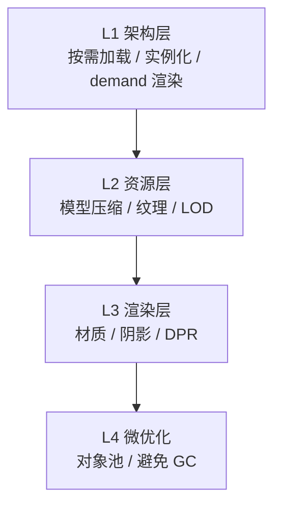
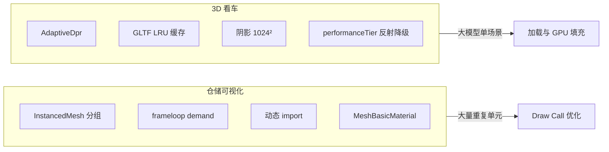

# 浏览器端 3D 场景性能优化实战：从 Draw Call 到首屏加载

> 发布日期：2026-07-07  
> 标签：前端 / Three.js / React Three Fiber / WebGL / 性能优化 / 3D 可视化

做 [3D 快递仓储可视化](https://juejin.cn/post/7654641623330209802) 时，144 个货位在开发机上丝滑流畅；做 [3D 看车展厅](https://github.com/jiaxiantao/3d-car-viewing) 时，GLB 一换车型，首屏就要等好几秒。

两个项目的技术栈相似（Next.js + React Three Fiber + Three.js），但性能瓶颈完全不同：仓储是 **大量重复几何体的 draw call**；看车是 **大模型加载与 GPU 像素填充**。

[仓储升级篇](https://jiaxiantao.github.io/blogs/post/3D%E5%BF%AB%E9%80%92%E4%BB%93%E5%82%A8%E5%8F%AF%E8%A7%86%E5%8C%96%E9%87%8D%E7%A3%85%E5%8D%87%E7%BA%A7-%E4%BB%8E%E9%9D%99%E6%80%81%E7%9C%8B%E6%9D%BF%E5%88%B0%E5%8F%AF%E6%BC%AB%E6%B8%B8%E7%9A%84WMS%E6%BC%94%E7%A4%BA%E5%9C%BA) 和看车文里都零散提过优化手段，但从未系统整理过。这篇文章是一份 **浏览器端 3D 性能优化实战清单**：按「先量后优」的思路，从指标、工具、到我在两个真实项目里踩过的坑，帮你建立可复用的优化框架。

---

## 一、先定性能预算：别优化完才发现目标错了

3D 性能优化最大的误区，是 **还没量就开始减面、砍特效**。

### 1.1 三类场景，三个预算

| 场景类型 | 代表项目 | 核心指标 | 可接受区间 |
|---------|---------|---------|-----------|
| **数据可视化**（大量重复单元） | 仓储 144 货位 | 稳定 60fps、交互响应 < 100ms | draw call < 50 |
| **商品展示**（高精度单模型） | 3D 看车 | 首屏可交互 < 5s、旋转流畅 | 单模型 < 30MB（压缩后） |
| **漫游演示**（角色 + 大场景） | 仓储 v2 机器人 | 行走 30fps+、相机切换无卡顿 | GLB < 10MB + demand 渲染 |

### 1.2 优化优先级金字塔



**经验法则**：L1 没做好，L4 救不了。先砍架构，再抠细节。

---

## 二、Draw Call：重复物体的头号杀手

### 2.1 问题从哪来

Three.js 中，**每个 Mesh 至少一次 draw call**（同材质同几何体可合批，但 R3F 里每个 `<mesh>` 通常是独立节点）。

仓储项目早期原型：144 个货位 = 144 个 `Mesh` = 144 次 draw call，加上货架结构、地面、标注，轻松突破 200。

### 2.2 解法：InstancedMesh 按属性分组

最终方案：按 **7 种货位状态** 分 7 个 `InstancedMesh`，draw call 从 144 降到 7：

```tsx
// 按状态分组，每组一个 InstancedMesh
{SLOT_STATUSES.map((status) => (
  <InstancedStatusSlotBatch
    key={status}
    status={status}
    material={statusMaterials[status]}
    entries={grouped[status]}
  />
))}
```

| 方案 | draw call（144 货位） | React 节点数 | 适用 |
|------|---------------------|-------------|------|
| 每货位一个 Mesh | 144+ | 144+ | ❌ 不推荐 |
| 按状态 InstancedMesh | 7 | 7 | ✅ 纯色、同几何体 |
| 合并为单个 BufferGeometry | 1 | 1 | 需 per-instance 颜色时复杂 |

### 2.3 踩坑：`instanceColor` 全黑

在 Three.js r181 + R3F 环境下，我们试过 `InstancedMesh` + `instanceColor` + `MeshLambertMaterial`，结果 **整批货位全黑**；模块级材质在 HMR 后也会绑定失效。

**最终方案**：

- 按状态拆 7 个 `InstancedMesh`（每组纯色 `MeshBasicMaterial`）
- 材质在 Canvas 内 `useMemo` 创建，卸载时 `dispose`
- 颜色定义集中在 `warehouse-colors.ts`

### 2.4 筛选半透明：InstancedMesh 的边界

状态筛选需要「匹配货位高亮、其余半透明压暗」。对整块 `InstancedMesh` 开 `transparent: true` 时，**透明物体无法按实例排序**，会出现斑驳现象。

**解法**：

| 状态 | 渲染方式 | 原因 |
|------|---------|------|
| 匹配 | `InstancedMesh`，不透明 | 性能最优 |
| 未匹配 | 每个货位独立 `mesh`，`opacity ≈ 0.22` | 可按物体排序混合 |

这是典型的 **性能与效果的权衡**——筛选激活时 draw call 会临时上升，但常态仍保持 7 次。

### 2.5 `useFrame` 里的 GC 陷阱

批量更新实例矩阵时，**不要在循环里 `new THREE.Vector3()`**：

```tsx
// ❌ 每帧创建 144 个 Vector3，GC 压力巨大
entries.forEach((entry, i) => {
  const pos = new THREE.Vector3(entry.x, entry.y, entry.z);
  dummy.position.copy(pos);
  dummy.updateMatrix();
  mesh.setMatrixAt(i, dummy.matrix);
});

// ✅ 复用单个 Object3D
const dummy = useMemo(() => new THREE.Object3D(), []);
useFrame(() => {
  entries.forEach((entry, i) => {
    dummy.position.set(entry.x, entry.y, entry.z);
    dummy.updateMatrix();
    mesh.setMatrixAt(i, dummy.matrix);
  });
  mesh.instanceMatrix.needsUpdate = true;
});
```

---

## 三、渲染循环：别让 GPU 空转

### 3.1 `frameloop="demand"`：无动画时停画

仓储和看车项目都采用 **按需渲染**：

```tsx
<Canvas frameloop="demand">
  {/* ... */}
</Canvas>
```

| 模式 | 行为 | 适用 |
|------|------|------|
| `"always"`（默认） | 每帧渲染，即使用户没操作 | 持续动画、游戏 |
| `"demand"` | 仅 `invalidate()` 时渲染 | 数据看板、静态展示 |

**何时调用 `invalidate()`**：

- 用户交互（点击、拖拽相机）
- `useFrame` 中有动画
- 数据状态变更（货位颜色、筛选）

```tsx
const { invalidate } = useThree();

useEffect(() => {
  invalidate(); // 货位状态变更后触发重绘
}, [slotStatuses, invalidate]);
```

**收益**：仓储看板在用户不操作时，GPU 占用接近 0——笔记本风扇不再狂转。

### 3.2 看车项目的自适应降级

看车场景持续有动画（车轮旋转、环车巡检），无法全程 demand。采用 **分级降级**：

| 手段 | 位置 | 说明 |
|------|------|------|
| `AdaptiveDpr` | Canvas 内 | 帧率下降时自动降 DPR |
| `AdaptiveEvents` | Canvas 内 | 减少高频事件处理 |
| `dpr={[1, 1.75]}` | Canvas props | 限制最大像素比 |
| `performanceTier` 降反射分辨率 | 湿地反射 | 移动端反射降采样 |

```tsx
<Canvas dpr={[1, 1.75]} gl={{ preserveDrawingBuffer: true }}>
  <AdaptiveDpr pixelated />
  <AdaptiveEvents />
  {/* ... */}
</Canvas>
```

---

## 四、首屏加载：大 GLB 的生死线

### 4.1 问题规模

| 资源 | 体积 | 影响 |
|------|------|------|
| 看车 GLB（单车型） | 20～40MB | 首次加载 3～8s |
| 仓储机器人 GLB | ~28MB | 首屏遮罩等待 |
| 全部车型缓存 | 120MB+ | 内存 OOM 风险 |

### 4.2 架构层：路由级代码分割

3D 代码体积大，**不要在根布局加载**：

```tsx
// 仅 /warehouse 路由加载 R3F Canvas
const WarehouseScene = dynamic(
  () => import("@/components/warehouse-scene").then((m) => m.WarehouseScene),
  { ssr: false, loading: () => <LoadingPlaceholder /> },
);
```

- `dynamic` + `ssr: false`：WebGL 只在客户端执行
- 首页不加载 Three.js，首屏 JS 减少数百 KB

### 4.3 模型压缩：Draco + 纹理

| 手段 | 压缩比 | 工具 |
|------|--------|------|
| Draco 几何压缩 | 50%～90% | `gltf-pipeline`、Blender 导出 |
| 纹理 KTX2 / Basis | 60%～80% | `gltf-transform`、toktx |
| 减面（Decimate） | 视模型而定 | Blender Modifier |

```bash
# gltf-transform 一键压缩
npx gltf-transform optimize input.glb output.glb \
  --compress draco \
  --texture-compress webp
```

仓储升级篇的 TODO 里写了 **机器人 LOD / Draco 压缩**——28MB 的 `robot.glb` 是下一个必优化项。

### 4.4 加载策略：LRU 缓存 + 淘汰

看车项目支持多车型切换，不能无限缓存：

```ts
// 伪代码：GLTF 内存 LRU
const MAX_CACHED_MODELS = 3;

function loadGltfScene(url: string) {
  if (cache.size >= MAX_CACHED_MODELS) {
    const oldest = cache.keys().next().value;
    disposeGltf(cache.get(oldest)); // 几何体 + 材质 dispose
    cache.delete(oldest);
  }
  // 加载新模型...
}
```

**关键**：淘汰时必须 `dispose()` 几何体和材质，否则 GPU 内存泄漏。

### 4.5 加载体验：遮罩比白屏好

```tsx
{!robotReady && (
  <div className="absolute inset-0 z-10 flex items-center justify-center bg-black/60">
    <Spinner />
    <p>机器人加载中…</p>
  </div>
)}
```

用户等 3 秒有反馈，比盯白屏体验好一个数量级。

---

## 五、GPU 像素填充与材质选择

### 5.1 DPR 是隐形杀手

Retina 屏 `devicePixelRatio = 2` 时，渲染像素是 4 倍。限制 `dpr={[1, 1.75]}` 是移动端最有效的优化之一。

### 5.2 材质降级路径

| 材质 | 光照计算 | 性能 | 适用 |
|------|---------|------|------|
| `MeshBasicMaterial` | 无 | 最快 | 纯色货位、UI 标注 |
| `MeshLambertMaterial` | 漫反射 | 中 | 简单场景 |
| `MeshStandardMaterial` | PBR | 慢 | 车模、真实感展示 |
| 自定义 Shader | 视实现 | 不定 | 特殊效果 |

仓储货位用 `MeshBasicMaterial`（`toneMapped: false`）——不需要光照，性能最优。

看车车身用 PBR，但地面反射在低端设备上通过 `performanceTier` 降分辨率。

### 5.3 阴影：能不开就不开

| 配置 | 性能影响 |
|------|---------|
| 无阴影 | 基准 |
| 1 个 DirectionalLight 阴影 | +20%～40% GPU |
| 多个 SpotLight 阴影（看车头灯） | 显著，贴图 1024² 是平衡点 |

看车项目头灯 `SpotLight` 阴影贴图 **1024²**——再往上移动端掉帧明显。

---

## 六、内存管理：dispose 不是可选项

### 6.1 必须 dispose 的资源

| 资源 | dispose 方法 |
|------|-------------|
| `BufferGeometry` | `geometry.dispose()` |
| `Material` | `material.dispose()` |
| `Texture` | `texture.dispose()` |
| `RenderTarget` | `renderTarget.dispose()` |

### 6.2 R3F 组件卸载时

```tsx
useEffect(() => {
  const geometry = new THREE.BoxGeometry(1, 1, 1);
  const material = new THREE.MeshBasicMaterial({ color: 'red' });
  const mesh = new THREE.Mesh(geometry, material);
  scene.add(mesh);

  return () => {
    scene.remove(mesh);
    geometry.dispose();
    material.dispose();
  };
}, []);
```

R3F 的 `<mesh>` 组件在卸载时会自动 dispose 内置几何体和材质，但 **手动创建的材质/几何体**（如 `useMemo` 里的 `statusMaterials`）需要自己在 `useEffect` cleanup 里处理。

### 6.3 `preserveDrawingBuffer` 的代价

看车截图功能需要：

```tsx
<Canvas gl={{ preserveDrawingBuffer: true }}>
```

这会让 GPU **保留帧缓冲**，无法做某些优化，极高分辨率截图时移动端可能 OOM——需要在功能和性能间取舍。

---

## 七、怎么量：Profiling 工具箱

### 7.1 浏览器内置

| 工具 | 看什么 |
|------|--------|
| Chrome Performance | CPU 主线程、长任务 |
| Chrome Rendering → Frame Rendering Stats | 实时 fps |
| Memory 面板 | JS 堆、Detached DOM |

### 7.2 Three.js / R3F 生态

```tsx
// @react-three/drei
import { Stats } from '@react-three/drei';

<Canvas>
  <Stats />
  {/* ... */}
</Canvas>
```

| 工具 | 用途 |
|------|------|
| `Stats`（drei） | 实时 fps / ms / mb |
| `r3f-perf` | draw call、三角面数、纹理数 |
| `THREE.WebGLRenderer.info` | `renderer.info.render.calls` 等 |

```tsx
useFrame(() => {
  const info = gl.info;
  console.log('draw calls:', info.render.calls);
  console.log('triangles:', info.render.triangles);
});
```

### 7.3 优化前后对比表（仓储项目实测）

| 指标 | 优化前（144 Mesh） | 优化后（7 InstancedMesh + demand） |
|------|-------------------|----------------------------------|
| draw call | ~180 | ~25 |
| 空闲 GPU 占用 | 持续渲染 | ~0% |
| 筛选激活时 draw call | — | ~80（临时独立 mesh） |
| 首屏 JS（含 Three） | — | 仅 /warehouse 路由加载 |

---

## 八、两个项目的优化对照



| 优化手段 | 仓储 | 看车 | 共性 |
|---------|------|------|------|
| `frameloop="demand"` | ✅ | 部分（有动画时 always） | 按需渲染 |
| `dynamic` 代码分割 | ✅ | ✅ | 路由级懒加载 |
| InstancedMesh | ✅ 核心 | ❌ 不适用 | — |
| GLTF 压缩 | TODO | TODO | 下一优先级 |
| DPR 限制 | 默认 | `dpr={[1, 1.75]}` | 移动端必做 |
| 材质降级 | MeshBasic | PBR + 条件降级 | 按场景选 |

---

## 九、优化检查清单（可直接贴进 PR）

### L1 架构

- [ ] 3D 代码是否路由级 `dynamic` 懒加载？
- [ ] 重复几何体（>20 个同形状）是否用 `InstancedMesh`？
- [ ] 无持续动画时是否 `frameloop="demand"`？
- [ ] 状态变更后是否 `invalidate()`？

### L2 资源

- [ ] GLB 是否 > 5MB？考虑 Draco / 纹理压缩
- [ ] 多模型切换是否有 LRU 淘汰 + `dispose`？
- [ ] 是否有加载态遮罩（非白屏）？

### L3 渲染

- [ ] 移动端是否限制 `dpr`？
- [ ] 阴影是否必要？贴图分辨率是否过高？
- [ ] 纯色物体是否用了 `MeshBasicMaterial`？

### L4 代码

- [ ] `useFrame` 里是否避免 `new` 对象？
- [ ] 手动创建的 geometry/material 是否 cleanup `dispose`？
- [ ] 透明 + InstancedMesh 混用时是否知道排序限制？

---

## 十、踩坑速查

| 现象 | 可能原因 | 对策 |
|------|---------|------|
| 货位全黑 | `instanceColor` + Lambert 兼容性 | 按属性分组纯色 InstancedMesh |
| 筛选半透明斑驳 | InstancedMesh 透明排序 | 未匹配改独立 mesh |
| 风扇狂转但没人操作 | `frameloop="always"` | 改 `demand` + `invalidate` |
| 切换车型越来越卡 | GLTF 未 dispose | LRU 缓存 + 淘汰时 dispose |
| 移动端旋转掉帧 | DPR 过高 / 阴影过重 | 限 dpr、降阴影分辨率 |
| 截图后 OOM | `preserveDrawingBuffer` + 高分辨率 | 限制截图尺寸或异步降级 |
| HMR 后材质失效 | 模块级材质单例 | Canvas 内 `useMemo` 创建 |

---

## 结语

3D 性能优化没有银弹。**数据可视化**先砍 draw call（InstancedMesh）；**商品展示**先砍加载时间（压缩 + 懒加载）；**漫游演示**先砍空转渲染（demand）。

我在两个项目里得到的最大教训是：**先用量化工具定位瓶颈层级，再选对应手段**——在 draw call 还没解决时去抠 Shader，往往白费功夫。

如果你正在做 [仓储可视化](https://juejin.cn/post/7654641623330209802) 或 [3D 看车](https://github.com/jiaxiantao/3d-car-viewing) 同类项目，建议从检查清单的 L1 开始逐项过一遍，通常半天就能见效。

---

## 系列延伸阅读

- [用 Next.js + React Three Fiber 打造 3D 快递仓储可视化](https://juejin.cn/post/7654641623330209802) — InstancedMesh、demand 渲染、筛选半透明
- [3D 快递仓储可视化重磅升级：从静态看板到可漫游的 WMS 演示场](https://jiaxiantao.github.io/blogs/post/3D%E5%BF%AB%E9%80%92%E4%BB%93%E5%82%A8%E5%8F%AF%E8%A7%86%E5%8C%96%E9%87%8D%E7%A3%85%E5%8D%87%E7%BA%A7-%E4%BB%8E%E9%9D%99%E6%80%81%E7%9C%8B%E6%9D%BF%E5%88%B0%E5%8F%AF%E6%BC%AB%E6%B8%B8%E7%9A%84WMS%E6%BC%94%E7%A4%BA%E5%9C%BA) — 机器人加载、三视角相机
- [浏览器端 3D 看车：从 GLB 到可交互展厅的技术实践](https://github.com/jiaxiantao/3d-car-viewing) — AdaptiveDpr、GLTF LRU、阴影权衡
- [HTML-in-Canvas 深度解析：让 Canvas 吃上 HTML 这碗饭](https://jiaxiantao.github.io/blogs/post/HTML-in-Canvas%E6%B7%B1%E5%BA%A6%E8%A7%A3%E6%9E%90-%E8%AE%A9Canvas%E5%90%83%E4%B8%8AHTML%E8%BF%99%E7%A2%97%E9%A5%AD) — Canvas 与 WebGL 混合渲染

---

## 参考资源

| 资源 | 链接 |
|------|------|
| R3F Performance Pitfalls | https://docs.pmnd.rs/react-three-fiber/advanced/pitfalls |
| gltf-transform | https://gltf-transform.dev/ |
| gltf.report（模型分析） | https://gltf.report/ |
| *WebGL Insights* | GPU 工程实践合集 |

---

*本文基于 [3d-express-warehouse](https://github.com/jiaxiantao/3d-express-warehouse) 与 [3d-car-viewing](https://github.com/jiaxiantao/3d-car-viewing) 项目实践整理。*
