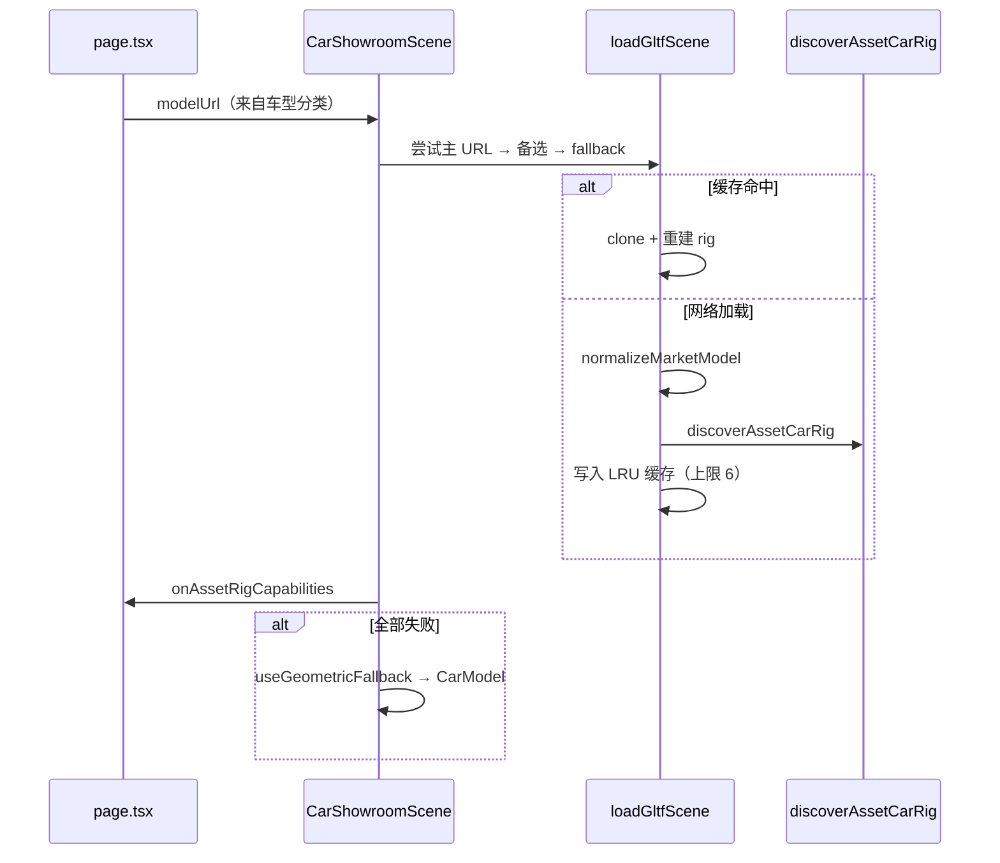

# 浏览器端 3D 看车：从 GLB 到可交互展厅的技术实践

> 发布日期：2026-06-22  
> 本文基于开源项目 [3d-car-viewing](https://github.com/jiaxiantao/3d-car-viewing)，记录如何用 **Next.js + React Three Fiber + Three.js** 在浏览器中搭建一套可切换车型、可交互部件、可分享深链的 3D 看车体验。重点放在实现过程中的**重难点**与对应解法，而非 API 罗列。

***

[项目预览: https://jiaxiantao.github.io/3d-car-viewing/](https://jiaxiantao.github.io/3d-car-viewing/)

## 一、项目概览

### 1.1 要解决什么问题

传统 2D 图片看车无法展示空间关系；而直接使用第三方 GLB 车模又面临命名混乱、部件合并、无骨骼动画等现实问题。本项目的目标是：

*   在浏览器中加载主流 GLB 车模（SUV / 轿车 / 越野），提供接近展厅的交互体验；
*   对**命名不规范、网格合并**的模型尽量「能识别多少做多少」，识别不了的按钮明确禁用并提示原因；
*   加载失败时自动回退到内置几何体车模，保证演示不白屏；
*   支持车漆、多机位、场景模式、截图、全屏，以及 URL 深链分享。

### 1.2 技术栈

| 层级      | 选型                                                |
| ------- | ------------------------------------------------- |
| 应用框架    | Next.js 16 · React 19                             |
| 3D 渲染   | three.js · @react-three/fiber · @react-three/drei |
| 语言 / 样式 | TypeScript 5 · Tailwind CSS 4                     |

**状态分层原则：**

*   `page.tsx` 持有所有用户可见状态（车门、灯光、车漆、车型等），通过 props 下发给 Canvas；
*   `car-showroom-scene.tsx` 负责 WebGL 生命周期：GLTF 加载、rig 绑定、每帧动画、相机过渡；
*   交互按钮是否可用，由 `onAssetRigCapabilities` 回调上报的 **capabilities** 决定，避免「点了没反应」。

***

## 二、效果预览


### 2.1 主界面 — 整车 WebGL 展示


### 2.2 车身交互 — 车门 / 灯光 / 车漆


### 2.3 驾驶动态 — 启动 / 制动 / 环车巡检


### 2.4 多机位视角


### 2.5 场景模式切换


### 2.6 开发调试 — GLB 部件识别面板


***

## 三、重难点一：第三方 GLB 的「部件 Rig 自动发现」

### 3.1 难点描述

Sketchfab、Forza 导出等渠道的 GLB 车模**没有统一的命名规范**，也**通常不含 glTF 骨骼动画**。不同车型的差异极大：

| 车型                                    | mesh 规模 | 拆分方式                    | 实际能力                     |
| ------------------------------------- | ------- | ----------------------- | ------------------------ |
| `suv-mainstream.glb`（奥迪 Q3）           | \~253   | 按部件拆分                   | 门 / 后备箱 / 天窗可动；路面四轮与车身合并 |
| `sedan-mainstream.glb`（宝马 M2）         | \~1200  | 节点名 `Object_*`，靠材质识别灯/漆 | 灯发光、改色、怠速振动；门与轮为合并网格     |
| `offroad-mainstream.glb`（Brabus G900） | \~109   | 路面轮焊在车身                 | 车灯 / 振动；备胎不转             |

若简单用正则匹配 `door` 关键字，很容易把**横跨半个车身的合并网格**误判为车门，旋转时整块车身跟着转——体验灾难。

### 3.2 解法：启发式发现 + 车型 Profile 覆盖

核心逻辑在 `src/lib/asset-car-rig.ts` 的 `discoverAssetCarRig()`：

1.  **遍历所有 Mesh**，收集名称、材质名、包围盒中心与尺寸；
2.  **空间分区**：根据整车 AABB 计算前/后、左/右阈值，车门必须落在对应象限；
3.  **局部面板校验**：`isLocalizedPanel()` 拒绝 footprint 覆盖大部分车身的 mesh；
4.  **排除规则**：`DOOR_EXCLUDE` 等正则过滤尾灯、内饰、风挡等误匹配；
5.  **Profile 覆盖**：`market-rig-profiles.ts` 为特定 URL 提供精确正则，弥补自动发现的盲区。

```ts
// market-rig-profiles.ts — 按 URL 匹配车型规则
const suvQ3Profile: MarketRigProfile = {
  id: "suv-q3",
  urlPattern: /suv-mainstream/i,
  leftDoor: [/polySurface5638/i, /Door_Soft_Black_Plastic_Q3/i],
  rightDoor: [/polySurface5634/i, /polySurface5632/i],
  trunk: [/Boot_ext2_Mesh_049_Carpaint/i, /Boot_ext17/i],
  headLight: [/\bHL\d_Mesh/i, /Hl_Projection_lamp/i],
  bakedWheels: true, // 路面轮与车身合并，不尝试旋转
};
```

发现完成后输出 `AssetCarRig` 结构体，包含：

*   车门 / 后备箱的 **pivot 组**（运行时挂接 mesh）；
*   大灯 / 尾灯 / 双闪的 **材质引用列表**；
*   车漆材质、天窗节点、车轮节点；
*   `capabilities` 标志位，驱动 UI 按钮启用/禁用。

### 3.3 交互热区

GLB 模型本身没有可点击的 DOM，因此在 `AssetInteractionZones` 中为每个 pivot 生成**透明 Box 碰撞体**，绑定 `onClick` 与 `pointer` 样式，实现 3D 场景内直接点门开门。

***

## 四、重难点二：无 glTF 动画的「伪骨骼」驱动

### 4.1 难点描述

没有厂商级开门动画时，只能对识别出的 mesh 组做**程序化变换**。难点在于：

*   车门需要绕铰链旋转，但 GLB 里没有铰链节点；
*   车轮需要原地自转 + 前轮转向，但不能往场景图里塞额外 pivot（会破坏原有层级）；
*   发动机启动、制动、双闪需要多通道动画叠加且互不打架。

### 4.2 解法：Pivot 组 + useFrame 阻尼插值

**车门 / 后备箱**：发现阶段将相关 mesh 挂到 `THREE.Group` pivot 上，设置铰链位置；每帧用 `THREE.MathUtils.damp` 平滑插值目标角度：

```ts
// car-showroom-scene.tsx — AssetModel useFrame 片段
if (rig.leftDoorPivot) {
  const target = state.leftDoorOpen ? -ASSET_DOOR_MAX_OPEN_RADIANS : 0;
  rig.leftDoorPivot.rotation.y = THREE.MathUtils.damp(
    rig.leftDoorPivot.rotation.y, target, 8, delta,
  );
}
```

**车轮**：`applyWheelMotion()` 每帧从 `userData.showroomWheel.base` 矩阵重建变换，绕自轴滚动、绕转向轴偏转，**不引入额外 helper 节点**：

```ts
// asset-car-rig.ts
export function applyWheelMotion(node, spinAngle, steerAngle) {
  // pivot → steer → spin → 还原 base 矩阵
  WHEEL_MATRIX.makeTranslation(pivot.x, pivot.y, pivot.z);
  if (steerAxis && steerAngle !== 0) {
    WHEEL_MATRIX.multiply(WHEEL_ROTATION.makeRotationAxis(steerAxis, steerAngle));
  }
  WHEEL_MATRIX.multiply(WHEEL_ROTATION.makeRotationAxis(spinAxis, spinAngle));
  // ...
  WHEEL_MATRIX.decompose(node.position, node.quaternion, node.scale);
}
```

**驾驶体感叠加**（同一 `useFrame` 内）：

| 状态                     | 表现                        |
| ---------------------- | ------------------------- |
| `engineOn`             | 车身 Y 轴微振（`sin(t*8)*0.02`） |
| 点火瞬间                   | `ignitionPulse` 抬升 + 俯仰   |
| `speedKph` + `braking` | 速度阻尼、轮速角速度、制动俯仰           |
| `hazardOn`             | `sin(t*8)` 方波驱动尾灯闪烁       |
| `braking`              | 尾灯额外红色 emissive 叠加        |

### 4.3 车灯发光：材质 emissive 而非额外 Mesh

大灯 / 尾灯通过 `boostShowroomMaterialEmissive()` 动态调节材质的 `emissive` 与 `emissiveIntensity`，并针对头灯镜片设置 `toneMapped: false` 以获得 HDR 辉光感。尾灯刻意限制 `tailMax`，避免高亮度过曝成白色。

***

## 五、重难点三：异构 GLB 的统一归一化

### 5.1 难点描述

不同来源的 GLB 尺度差异巨大（FBX 导出常见 `scale=0.01`），朝向也不一致（多数 Z 轴朝前，而展厅相机预设假设 **-X 为车头**）。若不做归一化，切换车型时机位、地面接触、orbit 距离全部失效。

### 5.2 解法：`normalizeMarketModel()`

```ts
// normalize-market-model.ts 核心步骤
export function normalizeMarketModel(root, targetLength = 4, groundY = -0.22) {
  hideHelperMeshes(root);           // 隐藏 camera / gizmo 等辅助 mesh
  root.position.sub(center);        // 几何中心对齐原点
  root.scale.multiplyScalar(scale); // 最长轴缩放到 ~4m
  root.rotation.y = -Math.PI / 2;   // Z-forward → -X-forward
  root.position.y += groundY - groundedBounds.min.y; // 轮胎落地
  return getVisibleMeshBounds(root);
}
```

关键点：

*   使用**世界空间包围盒**（`updateWorldMatrix` 后计算），正确包含父级 scale；
*   **先旋转再落地**，避免旋转前 AABB 导致的悬浮或穿地；
*   返回的 bounds 供相机、orbit 限制、头灯聚光灯锚点复用。

***

## 六、重难点四：自适应相机与环车巡检

### 6.1 难点描述

六种预设机位（全景 / 前脸 / 侧视 / 车尾 / 驾舱）若写死坐标，换车型后必然构图失调；自动环车巡检又需要在手动 orbit 与程序化路径之间平滑切换。

### 6.2 解法：包围盒驱动 + 过渡插值

`showroom-camera.ts` 中 `getBoundsCameraPose()` 根据 `bounds` 的 `size` 与 `center` 按比例计算机位：

```ts
const span = Math.max(size.x, size.y, size.z, 1e-3);
const dist = span * 1.28;
// front: 相机位于 bounds.min.x 前方 dist*0.9 ...
```

`CameraRig` 在 preset 或 bounds 变化时触发 `beginTransitionToPreset()`，用 `transitionProgressRef` 做 ease 插值；开启 `autoTour` 时改由 `sampleAutoTourPose()` 沿椭圆轨道采样，带轻微上下起伏。

`getOrbitDistanceLimits()` 同样基于 span 动态计算 `minDistance` / `maxDistance`，保证大小车型都能合理缩放。

***

## 七、重难点五：离线 IBL 与多场景氛围

### 7.1 难点描述

`@react-three/drei` 的 `<Environment preset="city" />` 会从 CDN 拉 HDR，内网 / 离线部署易失败导致画面全黑。同时需要影棚 / 白天 / 夜晚三套差异明显的灯光与地面表现。

### 7.2 解法：RoomEnvironment + 场景模式配置表

`ShowroomImageBasedLighting` 使用 Three.js 内置 `RoomEnvironment` + `PMREMGenerator` 在本地生成环境贴图，**零外部 CDN 依赖**。

`showroom-scene-modes.ts` 将三套模式的背景色、雾效、环境光强度、地面金属度/粗糙度、头灯聚光强度等收敛为 `SHOWROOM_SCENE_MODES` 配置对象，`CarShowroomScene` 与 `ShowroomReflectiveFloor` 统一消费，避免灯光与地板不一致。

夜晚模式配合 `MeshReflectorMaterial`（`@react-three/drei`）实现湿地反射；根据 `performanceTier` 动态降低反射贴图分辨率，兼顾移动端。

***

## 八、重难点六：GLB 加载管线与健壮性

### 8.1 加载流程



### 8.2 关键工程细节

| 机制                             | 作用                                                    |
| ------------------------------ | ----------------------------------------------------- |
| `gltfSceneCache`（LRU, limit=6） | 二次切换车型秒开；`clone(true)` 后重建 rig（`Box3` 方法在 clone 后会丢失） |
| 切换车型时保留旧模型                     | 新资源就绪前旧车仍可见，上层 `Html` overlay 显示进度                    |
| `MIN_LOADING_OVERLAY_MS = 480` | 本地缓存命中时 overlay 仍短暂展示，避免闪烁                            |
| 候选 URL 链式重试                    | 主模型 → alternates → fallback，全失败才切几何体                  |
| `dynamic(..., { ssr: false })` | Canvas 仅客户端挂载，避免 SSR 报错                               |

### 8.3 几何体回退车模

`CarModel` 用纯 Three.js 几何体拼装整车（车身、车门 pivot、轮毂、内饰等），与 GLB 路径共用同一套 `useFrame` 动画逻辑。回退时 capabilities 全开，保证演示功能完整。

***

## 九、重难点七：URL 深链与 Hydration 安全

### 9.1 难点描述

希望 `?model=suv&paint=midnight&camera=front&mode=night` 可分享、可刷新还原；但 Next.js SSR 首屏不能读 `window.location`，否则 hydration 不一致。

### 9.2 解法

```ts
// page.tsx — 客户端 mount 后一次性 hydrate
useEffect(() => {
  const initial = readShowroomUrlState();
  if (initial.category) setSelectedCategory(initial.category);
  // ...
}, []);

// use-showroom-url-state.ts — 状态变化写回 URL
useEffect(() => {
  const params = new URLSearchParams();
  params.set("model", state.category);
  params.set("paint", state.paintId);
  // ...
  window.history.replaceState(null, "", nextUrl); // 不污染历史栈
}, [state.category, state.paintId, ...]);
```

`replaceState` 而非 `pushState`：用户频繁调色 / 切视角时，浏览器「后退」不会一步步回退每个中间状态。

***

## 十、性能优化清单

| 手段                                 | 位置                        | 说明                            |
| ---------------------------------- | ------------------------- | ----------------------------- |
| `AdaptiveDpr` / `AdaptiveEvents`   | Canvas 内                  | 帧率下降时自动降 DPR、减少事件频率           |
| `dpr={[1, 1.75]}`                  | Canvas props              | 限制最大像素比                       |
| `performanceTier` 降低 Reflector 分辨率 | `ShowroomReflectiveFloor` | 移动端湿地反射降采样                    |
| GLTF 内存 LRU                        | `loadGltfScene`           | 限制缓存车型数量，淘汰时 `dispose` 几何体与材质 |
| `preserveDrawingBuffer: true`      | Canvas gl 配置              | 截图需保留帧缓冲，略有 GPU 开销            |
| 阴影贴图 1024²                         | 头灯 SpotLight              | 平衡质量与性能                       |

***

## 十一、扩展指南

### 11.1 接入新车型

1.  将 GLB 放入 `public/models/market/`；
2.  在 `src/lib/car-categories.ts` 注册 URL；
3.  用 [gltf.report](https://gltf.report/) 或 Blender 查看 mesh / 材质命名；
4.  若自动发现不准，在 `market-rig-profiles.ts` 增加 `MarketRigProfile`；
5.  刷新页面，开发环境下检查 Debug 面板的部件识别结果。

详细命名约定见 [market-glb-rig.md](https://github.com/jiaxiantao/3d-car-viewing/blob/main/docs/market-glb-rig.md)。

### 11.2 新增交互能力

1.  在 `asset-car-rig.ts` 扩展 `AssetCarRig` 与 `discoverAssetCarRig` 扫描逻辑；
2.  在 `AssetModel` 的 `useFrame` 中驱动动画；
3.  在 `page.tsx` 增加状态字段与按钮，通过 `supportsInteraction()` 门控。

***

## 十二、已知限制与取舍

1.  **无 glTF 动画的模型**只能做近似开合，无法达到 CAD 级精度；
2.  **合并网格的车身**（如宝马 M2 车门）无法拆分，按钮会禁用——这是模型结构限制，不是代码 bug；
3.  **车身喷漆**只改 `paintMaterials`，不会影响灯罩玻璃材质；
4.  仓库内 GLB 体积约 120MB，首次 clone 较慢；生产环境建议 CDN + 压缩纹理；
5.  截图功能依赖 `preserveDrawingBuffer`，极高分辨率下移动端可能 OOM。

***

## 十三、总结

本项目的核心工程价值在于：**用一套可扩展的 Rig 发现层，把不可控的第三方 GLB 翻译成可控的交互能力**，并在发现失败时优雅降级。技术路径可归纳为：

    GLB 加载 → 归一化 → Rig 发现（启发式 + Profile）→ capabilities 上报
        → useFrame 多通道动画 → 包围盒驱动相机 → 离线 IBL 场景
        → URL 深链分享 → 性能自适应

如果你正在做类似的 3D 商品展示、房产漫游或工业可视化，这套「**发现层 + 降级层 + 配置层**」的分层思路可以直接复用；差异主要在 Profile 规则与动画表现，而不在 R3F 基础搭建。

***

## 附录：关键文件索引

| 文件                                        | 职责                                   |
| ----------------------------------------- | ------------------------------------ |
| `src/app/page.tsx`                        | 页面状态、交互 UI、URL hydrate               |
| `src/components/car-showroom-scene.tsx`   | Canvas、GLTF 加载、AssetModel / CarModel |
| `src/lib/asset-car-rig.ts`                | 部件自动发现、车轮运动、灯光 emissive              |
| `src/lib/market-rig-profiles.ts`          | 车型级正则覆盖                              |
| `src/lib/normalize-market-model.ts`       | GLB 缩放 / 朝向 / 落地                     |
| `src/lib/showroom-camera.ts`              | 机位 / 环车 / orbit 限制                   |
| `src/lib/showroom-scene-modes.ts`         | 影棚 / 白天 / 夜晚配置                       |
| `src/components/showroom-environment.tsx` | IBL、地面反射、头灯聚光                        |
| `src/lib/use-showroom-url-state.ts`       | 深链读写                                 |
| `docs/ARCHITECTURE.md`                    | 贡献者向架构说明                             |
| `docs/market-glb-rig.md`                  | GLB 建模与命名要求                          |

## 项目地址

| 项          | 链接                                                    |
| ---------- | ----------------------------------------------------- |
| 预览地址       | <https://jiaxiantao.github.io/3d-car-viewing/>        |
| GitHub 仓库  | <https://github.com/jiaxiantao/3d-car-viewing>        |
| Clone 地址   | `https://github.com/jiaxiantao/3d-car-viewing.git`    |
| Issue / 讨论 | <https://github.com/jiaxiantao/3d-car-viewing/issues> |

***

## 参考文章

| 主题                | 标题                                       | 链接                                                                   |
| ----------------- | ---------------------------------------- | -------------------------------------------------------------------- |
| Three.js 官方手册     | Three.js Manual                          | <https://threejs.org/manual/>                                        |
| React Three Fiber | R3F 文档（Getting Started / API）            | <https://docs.pmnd.rs/react-three-fiber>                             |
| drei 辅助库          | @react-three/drei 文档与示例                  | <https://github.com/pmndrs/drei>                                     |
| glTF 规范           | Khronos glTF 2.0 Specification           | <https://registry.khronos.org/glTF/specs/2.0/glTF-2.0.html>          |
| GLB 调试            | gltf.report — 在线查看 mesh / 材质结构           | <https://gltf.report/>                                               |
| 环境光照              | Three.js RoomEnvironment 示例（PMREM / IBL） | <https://threejs.org/docs/#examples/en/environments/RoomEnvironment> |
| Next.js           | Next.js App Router 文档                    | <https://nextjs.org/docs/app>                                        |
| 性能                | R3F Performance pitfalls                 | <https://docs.pmnd.rs/react-three-fiber/advanced/pitfalls>           |

***

## 参考书籍

| 书名                                                                     | 作者                      | 说明                                                                            |
| ---------------------------------------------------------------------- | ----------------------- | ----------------------------------------------------------------------------- |
| *Discover Three.js*                                                    | Jos Dirksen             | 面向 Web 的 Three.js 入门与进阶，涵盖场景图、光照、加载与动画；[在线免费阅读](https://discoverthreejs.com/) |
| *Real-Time 3D Graphics with WebGL 2*（第 2 版）                            | Faruna, Lipchak, et al. | WebGL 2 与实时渲染管线，适合理解 PBR、阴影、后处理等底层概念                                          |
| *Fundamentals of Computer Graphics*（第 5 版）                             | Marschner, Shirley      | 计算机图形学经典教材，相机、变换、光照模型等理论基础                                                    |
| *Interactive Computer Graphics: A Top-Down Approach with WebGL*（第 8 版） | Angel, Shreiner         | 以 WebGL 为载体的交互式图形学课程用书，与 Three.js 抽象层互补                                       |
| *WebGL Insights*                                                       | Patrick Cozzi (ed.)     | WebGL 工程实践合集，含性能优化、资源管理与渲染技巧                                                  |

***
