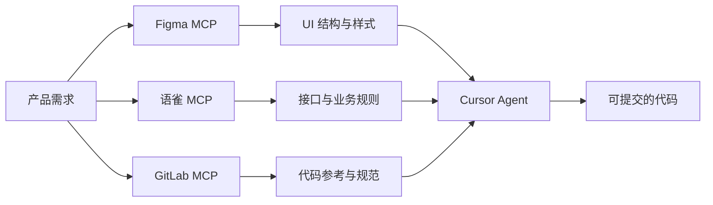

# 用 MCP 把 Figma、语雀、GitLab 串成一条前端工作流

> 发布日期：2026-07-01  
> 标签：前端 / MCP / Cursor / Figma / 语雀 / GitLab / 工程效率

接一个新需求，你的屏幕通常是这样的：

左边 Figma 看设计稿，中间语雀翻接口文档，右边 GitLab 查上次类似需求的 MR 讨论——然后把这些信息 **复制粘贴** 到 Cursor Chat 里，祈祷 AI 别理解错。

我在 [Cursor 一年使用复盘](https://juejin.cn/post/7656751882112565275) 里提过：2026 年 Q1 接入 Figma、语雀、GitLab 的 MCP 之后，这个流程被彻底改写了。Agent 不再依赖你人肉搬运 Context，而是 **自己去读设计标注、拉接口文档、对照仓库里的既有实现**。

这篇文章不是 MCP 协议教程，而是一份 **前端工程师可照抄的工作流指南**：三个 MCP 各自解决什么、怎么配、怎么在一次真实需求里串起来用，以及我踩过的坑。

---

## 一、先搞清楚：MCP 在前端工作流里扮演什么角色？

MCP（Model Context Protocol）可以理解为 **AI 和外部工具之间的 USB 接口**。Cursor Agent 通过 MCP Server 调用工具，读取你平时散落在各个系统里的信息。

对前端来说，核心价值只有一句话：

```
把 Context 从「人脑 + 剪贴板」搬到「工具链自动拉取」
```

没有 MCP 时，你给 Agent 的上下文质量，取决于你复制粘贴的耐心；有了 MCP 后，Agent 可以在执行任务的过程中 **按需查询**——就像新同事自己会去翻文档，而不是每件事都跑来问你。

### 三个系统，三种 Context

| 系统 | 前端需要的 Context | 没有 MCP 时的痛点 |
|------|-------------------|------------------|
| **Figma** | 布局、间距、颜色、字号、组件结构 | 目测 + 截图，AI 靠猜 |
| **语雀** | 接口定义、业务规则、字段枚举、异常码 | 手动复制，容易漏字段 |
| **GitLab** | 类似实现、MR 讨论、代码规范、Issue 背景 | 切窗口搜索，上下文断裂 |

三者串联起来，覆盖前端需求从 **「长什么样」** 到 **「数据从哪来」** 再到 **「代码怎么写」** 的完整链路。



---

## 二、每个 MCP 能做什么、不能做什么

在配之前，先建立合理预期——MCP 不是魔法，而是 **有边界的工具调用**。

### Figma MCP

典型能力：

- **`get_figma_data`**：读取 Figma 文件的节点树，包括布局、尺寸、颜色、文字内容、组件信息
- **`download_figma_images`**：把图标、插图导出为 SVG / PNG，直接落到项目目录

**擅长**：还原静态布局、提取设计 Token（颜色、字号、间距）、导出切图。

**不擅长**：复杂动效、交互状态机、设计意图的「为什么这样排」——这些仍需人和设计稿对齐。

**关键参数**：Figma URL 里的 `fileKey` 和 `node-id`（对应 `nodeId`）。给 Agent 设计稿链接时，务必带 `node-id`，否则它会遍历整个文件，Token 爆炸。

```
https://www.figma.com/design/AbCdEf123/My-Project?node-id=1234-5678
                              ↑ fileKey              ↑ nodeId: 1234:5678
```

### 语雀 MCP

典型能力：

- **`yuque_search`**：按关键词搜索文档或知识库
- **`yuque_get_doc`**：获取文档全文（支持 Markdown / Lake 格式）
- **`yuque_list_docs`** / **`yuque_get_toc`**：浏览知识库目录结构

**擅长**：拉接口文档、业务规则、团队规范；Agent 自己搜索「订单导出接口」并读取完整参数表。

**不擅长**：实时数据查询——语雀是文档，不是 API Gateway。动态数据仍需联调环境验证。

**技巧**：搜索时给 Agent 明确的知识库范围（如 `repo_id: "frontend-team/api-docs"`），避免搜到过期文档。

### GitLab MCP

典型能力（节选前端最高频的）：

- **`get_file_contents`**：读取仓库中指定文件
- **`get_merge_request`** / **`list_merge_request_diffs`**：查看 MR 详情与 diff
- **`mr_discussions`** / **`get_merge_request_notes`**：读取 Review 意见
- **`list_issues`** / **`get_issue`**：查需求背景与关联 Issue
- **`search_repositories`**：跨项目搜索

**擅长**：找「项目里有没有类似实现」、对齐 Code Review 意见、理解需求来龙去脉。

**不擅长**：替代本地 `git` 操作——提交、推送、解决冲突仍建议在终端人工确认。

---

## 三、配置指南：从零到可用

### 3.1 在 Cursor 中启用 MCP

Cursor Settings → MCP → 添加 Server。每个 MCP 对应一段 JSON 配置，核心要素是：

1. **启动命令**（`npx` / `node` / `uvx` 等）
2. **鉴权信息**（Token / PAT），通过环境变量注入，**不要写进仓库**

示意结构（具体命令因 MCP 实现而异）：

```json
{
  "mcpServers": {
    "figma": {
      "command": "npx",
      "args": ["-y", "figma-developer-mcp", "--stdio"],
      "env": {
        "FIGMA_API_KEY": "your-figma-personal-access-token"
      }
    },
    "yuque": {
      "command": "npx",
      "args": ["-y", "@your-org/yuque-mcp", "--stdio"],
      "env": {
        "YUQUE_TOKEN": "your-yuque-token"
      }
    },
    "gitlab": {
      "command": "npx",
      "args": ["-y", "@your-org/gitlab-mcp", "--stdio"],
      "env": {
        "GITLAB_PERSONAL_ACCESS_TOKEN": "your-gitlab-pat",
        "GITLAB_API_URL": "https://gitlab.example.com/api/v4"
      }
    }
  }
}
```

### 3.2 各平台 Token 获取要点

| 平台 | Token 类型 | 权限建议 | 注意 |
|------|-----------|---------|------|
| Figma | Personal Access Token | `File content: read` | 只需读权限；Token 泄露可被读所有可访问文件 |
| 语雀 | User Token | 读团队知识库 | 确认 Token 绑定账号有目标知识库权限 |
| GitLab | Personal Access Token | `read_api`、`read_repository` | 自建 GitLab 需配 `GITLAB_API_URL` |

### 3.3 验证 MCP 是否生效

配置完成后，在 Cursor Agent 对话中测试：

```
请列出当前可用的 MCP 工具，确认 figma、yuque、gitlab 是否在线。
```

或做一次最小调用：

```
用语雀搜索「订单列表」相关接口文档，告诉我找到了几篇。
```

如果返回鉴权错误，检查 Token 权限和环境变量拼写——**90% 的配置问题出在鉴权**。

### 3.4 和 Rules 配合：让 MCP 输出更可控

MCP 解决的是「能读到什么」；`.cursor/rules/` 解决的是「读到了怎么用」。建议加一条全局 Rule：

```markdown
## MCP 使用规范

- 读 Figma 时必须有 node-id，禁止拉取整个文件
- 读语雀接口文档后，先输出字段摘要让我确认，再写代码
- 读 GitLab 代码时限定目录范围，优先参考 src/features/ 下的既有实现
- 涉及权限、支付、用户数据的接口，必须标注文档出处
```

这和 [Cursor 复盘](https://juejin.cn/post/7656751882112565275) 里说的 Rules 是同一套逻辑：**MCP 是眼睛，Rules 是操作手册**。

---

## 四、一条完整工作流：从需求到 MR

下面用一个真实场景走完全流程：**订单列表页新增「批量导出 Excel」**。

### 阶段 0：开工前——Ask 模式摸清背景

**不要上来就让 Agent 写代码。** 先用 Ask 模式（只读）串联三个 MCP：

```
【Ask 模式，不要改代码】

需求：订单列表页新增批量导出 Excel 功能。

请依次完成：
1. 读 Figma 设计稿（链接如下），梳理导出按钮的位置、状态（默认/加载中/禁用）和交互
2. 在语雀搜索「订单导出」相关接口文档，整理请求参数、响应格式、权限要求、异步任务规则
3. 在 GitLab 项目 xxx/order-frontend 中，查找是否已有导出或下载相关的实现可复用

最后输出一份「实现前摘要」，列出待确认问题。
```

**Figma 链接示例**：

```
https://www.figma.com/design/AbCdEf123/Order-Module?node-id=2201-8840
```

**Agent 的典型输出**：

| 维度 | 摘要 |
|------|------|
| UI | 导出按钮在筛选栏右侧，主色 `#1677FF`，禁用态 opacity 0.4；超过 1000 条弹确认框 |
| 接口 | `POST /api/orders/export`，body: `{ orderIds: string[] }`；超量走异步，返回 `taskId` |
| 权限 | 需要 `order:export` 权限，无权限时按钮不渲染（不是 disabled） |
| 可复用 | `src/features/report/hooks/useAsyncDownload.ts` 已有异步下载轮询逻辑 |

这一步通常 **3～5 分钟**。以前我自己翻三个系统要 20 分钟以上，还容易漏字段。

### 阶段 1：Plan 模式——对齐方案

确认摘要无误后，切 Plan 模式：

```
基于刚才的调研结果，给出实现方案，不要写代码。

要求：
- 组件拆分建议
- 需要新增/修改的文件清单
- API 层类型定义要点
- 边界情况：空选中、超 1000 条、权限不足、导出失败、用户取消
- 参考 GitLab 中 useAsyncDownload 的复用方式
```

Plan 的价值在于 **把 MCP 拉来的信息转化为可评审的方案**。这时候你来判断：

- 设计稿里的「确认框」用现有 Modal 还是新写？
- 接口文档说异步，但产品 PRD 没提——要不要现在找产品确认？

**这一步是人不可替代的判断力**，也是 [不可替代竞争力](https://juejin.cn/post/7656751882112630811) 里说的「知道什么不该做」。

### 阶段 2：Agent 模式——分步执行

方案对齐后，分步执行比「一把梭」稳得多：

**Step 1：API 层**

```
根据语雀订单导出接口文档，在 src/api/order.ts 中：
1. 补充 ExportOrderRequest / ExportOrderResponse 类型
2. 实现 exportOrders 请求函数
3. 错误处理 follow @src/api/base.ts 的既有模式

先只改 api 层，不要动组件。
```

**Step 2：UI 组件**

```
读 Figma node 2201:8840 的导出按钮样式：
1. 在 OrderListToolbar 中添加 ExportButton 组件
2. 间距和颜色严格按 Figma 标注
3. 实现 default / loading / disabled 三态
4. 图标从 Figma 导出到 src/assets/icons/export.svg

@src/features/order/components/OrderListToolbar.tsx
@src/features/report/hooks/useAsyncDownload.ts
```

**Step 3：联调与验证**

```
1. 运行 pnpm typecheck && pnpm lint
2. 检查导出流程：选中 0 条、选中 5 条、选中 1001 条的边界处理
3. 对照语雀文档，确认请求参数和文档一致
```

### 阶段 3：提交前——GitLab MCP 辅助 Review

MR 创建前后，用 GitLab MCP 做自查：

```
查看当前分支与 main 的 diff，检查：
1. 是否有硬编码的颜色值（应该用 CSS 变量或 Token）
2. 是否有遗漏的错误处理
3. 类型定义是否和语雀文档一致

再搜索项目中其他 export 实现，确认风格统一。
```

如果 Reviewer 提了意见，可以把 MR 讨论喂回 Agent：

```
读 GitLab MR !128 的讨论，按 Reviewer 的意见修改：
- 异步轮询间隔改为 2s
- 导出文件名加上日期后缀
```

---

## 五、五个高频场景的 Prompt 模板

把下面的模板存成 Snippet 或写进 Skills，日常效率翻倍。

### 场景 1：设计稿还原

```
读 Figma [链接] 中 node-id=[id] 的页面：
1. 输出布局结构（flex/grid、间距、字号）对照表
2. 提取颜色 Token，映射到项目 CSS 变量
3. 列出需要导出的图片资源
4. 然后按 @src/pages/UserList.tsx 的代码风格实现

先输出对照表，我确认后再写代码。
```

### 场景 2：接口联调

```
在语雀搜索「[模块名]」接口文档：
1. 找到 [接口名] 的完整定义
2. 和 @src/api/[module].ts 现有类型对比，列出差异
3. 补充缺失的类型和请求函数

字段不确定的标注「待确认」，不要猜。
```

### 场景 3：找参考实现

```
在 GitLab 项目 [project] 中搜索：
1. 有没有类似 [功能] 的实现
2. 优先看 src/features/ 目录
3. 总结可复用的 Hook / 组件 / 工具函数

不要复制粘贴，分析后给出复用建议。
```

### 场景 4：MR Review 自查

```
读 GitLab MR ![iid] 的 diff 和讨论：
1. 总结 Reviewer 的核心关注点
2. 检查当前代码是否已 address 所有 thread
3. 列出可能遗漏的边界情况
```

### 场景 5：需求变更对齐

```
产品更新了导出功能需求（见语雀文档 [链接]）：
1. 拉取最新文档，和当前实现 @src/features/order 对比
2. 列出需要改动的文件和逻辑
3. 评估改动风险

不要直接改代码，先出 diff 计划。
```

---

## 六、踩坑指南：我真实亏过时间的地方

### 坑 1：Figma 不带 node-id，Token 爆炸

**现象**：Agent 调用 `get_figma_data` 拉了整个文件，上下文超长，响应变慢，还夹杂无关页面。

**对策**：永远给 **带 node-id 的链接**；Rules 里写死「禁止无 node-id 调用」；大型设计文件按页面/frame 分批处理。

### 坑 2：语雀搜到过期文档

**现象**：Agent 按旧版接口文档生成了代码，联调 404。

**对策**：

- 搜索时限定知识库 `repo_id`
- 文档标题或正文里标注版本号和更新日期
- 生成代码后让 Agent **回读文档核对关键字段**，不要一次写完

### 坑 3：GitLab 读到别的分支的代码

**现象**：Agent 参考了已合但是已重构的旧实现。

**对策**：`get_file_contents` 时指定 `ref: "main"` 或当前功能分支；让 Agent 优先看 **最近一次相关 MR** 而非随意搜文件。

### 坑 4：三个 MCP 信息冲突

**现象**：设计稿有「导出」按钮，语雀文档说一期不做，GitLab 里有个 WIP 分支已经写了半成品。

**对策**：**人来裁决优先级**。MCP 负责呈现事实，不负责产品决策。把冲突点写进 Plan，找产品/后端确认后再执行。

### 坑 5：过度依赖 MCP，跳过联调

**现象**：类型、字段名和文档一致，但后端实际返回多套了一层 `data`。

**对策**：MCP 读的是 **文档**，不是 **真实响应**。API 层写完后，用 Mock 或 dev 环境验证一次；关键接口把真实响应贴给 Agent 修正类型。

### 坑 6：鉴权 Token 泄露

**现象**：把 MCP 配置截图发群、或 Token 写进仓库。

**对策**：

- Token 只放本地环境变量或 Cursor 私密配置
- `.cursorignore` 排除含 Token 的文件
- 团队统一 **只读权限** 的 Service Account Token，而非个人全权 Token

---

## 七、和「不用 MCP」相比，实际省了多少？

主观复盘（因人而异，但方向一致）：

| 环节 | 以前 | 接入 MCP 后 |
|------|------|------------|
| 读设计稿写布局 | 30～60 min 目测 + 截图 | 10～15 min，Agent 出对照表 + 人审 |
| 写 API 层 | 15 min 复制文档 + 手写类型 | 5 min Agent 拉文档 + 人审字段 |
| 找参考实现 | 10～20 min 搜仓库 | 2～5 min Agent 搜索 + 总结 |
| MR 自查 | 全靠记忆 | 5 min 对照 Review 意见清单 |

**合计一个中等需求的前置调研 + 基础实现，大约省 30%～50% 的机械时间。**

但省下的时间不会自动变成下班——它通常变成了 **更高质量的 Review、更充分的边界处理、和更少的信息遗漏**。这和「AI 压缩机械劳动，不压缩判断」是同一回事。

---

## 八、进阶：把三条 MCP 写进团队规范

个人用起来爽是一回事；团队推广需要 **可复制的规范**：

### 8.1 需求模板里加 MCP 入口

```markdown
## 开发资源
- Figma（带 node-id）：[链接]
- 语雀接口文档：[链接]
- 参考 MR：![iid]
- GitLab Issue：#[id]
```

### 8.2 统一知识库结构

语雀按「模块 / 接口 / 变更记录」组织，方便 `yuque_search` 命中。接口文档必备：

- 版本号 + 更新日期
- 请求/响应 JSON 示例
- 错误码表
- 权限要求

### 8.3 MR Description 模板

```markdown
## 设计稿
[Figma 链接 + node-id]

## 接口文档
[语雀链接]

## 测试要点
- [ ] 对照 Figma 标注检查间距和颜色
- [ ] 对照语雀文档检查请求参数
- [ ] 边界：[列举]
```

### 8.4 从消费者到生产者

当你熟悉了 MCP 消费方（在 Cursor 里调用），可以进一步学 [MCP Server 开发](https://juejin.cn/post/7656300675648585737)——把你们内部的组件文档、Storybook、设计 Token 也暴露为 MCP，让 Agent 直接读 **你们自己的上下文**，而不是泛泛的互联网知识。

---

## 九、行动清单：今天就可以开始

1. **申请三个 Token**：Figma（读）、语雀（读）、GitLab（`read_api` + `read_repository`）
2. **在 Cursor 配好三个 MCP**，各做一次最小验证调用
3. **写一条 MCP Rule** 放进 `.cursor/rules/`，约束调用边界
4. **拿手头一个真实需求**，用 Ask → Plan → Agent 三阶段走一遍
5. **存 2～3 个 Prompt 模板**（设计还原 / 接口联调 / 找参考实现）
6. **复盘**：哪一步 Agent 理解错了？是 MCP 返回的问题，还是 Prompt 不够精确？

---

## 结语

Figma、语雀、GitLab 分别承载了前端开发三种最核心的外部 Context：**长什么样、数据是什么、代码怎么写**。MCP 的价值，不是再给你一个聊天窗口，而是让 Agent 在写代码的时候 **自己去看**——就像你会做的那样。

对前端工程师来说，这套工作流还有一层更深的意义：你已经在实践 [AI Agent 工程师](https://juejin.cn/post/7656300675648585737) 路径里的 **阶段 3（MCP Server）** 的消费者视角。你设计 Prompt 约束、裁决冲突信息、审核输出质量——这正是「AI 编排力」的日常训练。

工具链可以一天配好；但 **「什么该让 Agent 自己查，什么必须人来拍板」** 的判断，需要在一次次真实需求里磨出来。

先从下一个需求开始，把 Figma 链接里的 `node-id` 交给 Agent 吧。

---

*本文基于 Cursor + Figma / 语雀 / GitLab MCP 的 2026 年工程实践整理，各 MCP Server 的实现与配置以你所用版本为准。*
